# Journal technique — abassurance-bigdata

Ce document détaille les choix techniques, leurs justifications, les problèmes rencontrés et leur résolution, ainsi que l'avancement des User Stories du projet. Pour les instructions d'installation et d'exécution, voir le [`README.md`](./README.md).

## Choix du framework Python

Le projet utilise **PySpark** comme framework Python principal.

PySpark a été choisi car il permet d'utiliser Apache Spark depuis Python pour effectuer des traitements distribués sur de grands volumes de données. Il est particulièrement adapté à l'architecture du projet, qui repose sur Hadoop pour le stockage et Spark pour le traitement des données.

La version de Python 3.14 est supportée par PySpark 4.2.0 et donc par Apache Spark.

### Validation initiale de l'installation

Test de PySpark dans un container Docker afin de vérifier son installation et son exécution (voir README pour les commandes). Ce test a permis de confirmer que l'environnement Docker était correctement configuré avant de commencer le développement du pipeline.

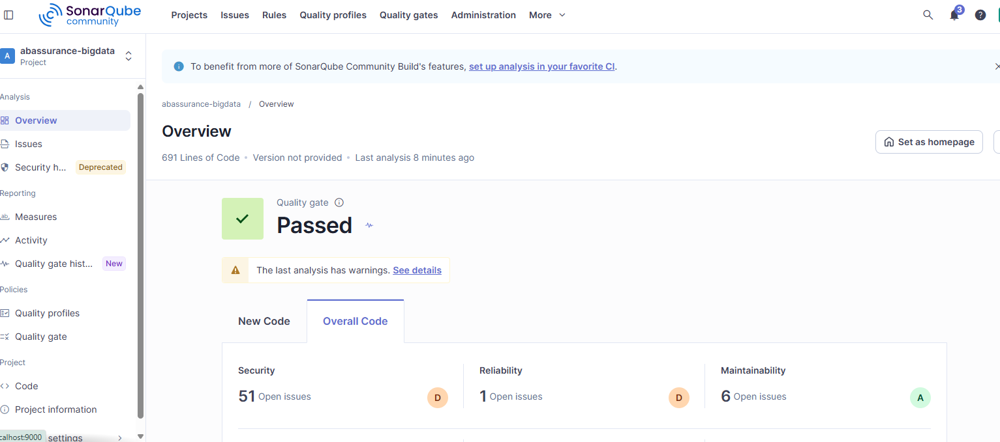

## Les modèles conceptuels de données (MCD) de AssurePlus et AbAssurance

### AbAssurance


> AB_CLIENT ( ab_client_id, ab_nom, ab_prenom, ab_date_naissance, ab_email, ab_telephone, ab_adresse, ab_code_postal, ab_num_fiscal, ab_date_creation, ab_statut_client )
> Le champ ab_client_id constitue la clé primaire de la table. C'était déjà un identifiant de l'entité AB_CLIENT.
> Les champs ab_nom, ab_prenom, ab_date_naissance, ab_email, ab_telephone, ab_adresse, ab_code_postal, ab_num_fiscal, ab_date_creation et ab_statut_client étaient déjà de simples attributs de l'entité AB_CLIENT.

> AB_CONTRAT ( ab_policy_number, ab_type_assurance, ab_date_debut, ab_date_fin, ab_prime_annuelle, ab_statut_contrat, ab_agence_id, #ab_client_id )
> Le champ ab_policy_number constitue la clé primaire de la table. C'était déjà un identifiant de l'entité AB_CONTRAT.
> Les champs ab_type_assurance, ab_date_debut, ab_date_fin, ab_prime_annuelle, ab_statut_contrat et ab_agence_id étaient déjà de simples attributs de l'entité AB_CONTRAT.
> Le champ ab_client_id est une clé étrangère. Il a migré par l'association de dépendance fonctionnelle SOUSCRIRE à partir de l'entité AB_CLIENT en perdant son caractère identifiant.

> AB_PAIEMENT ( ab_payment_id, ab_date_paiement, ab_montant, ab_mode_paiement, #ab_policy_number )
> Le champ ab_payment_id constitue la clé primaire de la table. C'était déjà un identifiant de l'entité AB_PAIEMENT.
> Les champs ab_date_paiement, ab_montant, ab_mode_paiement étaient déjà de simples attributs de l'entité AB_PAIEMENT.
> Le champ ab_policy_number est une clé étrangère. Il a migré par l'association de dépendance fonctionnelle REGLER à partir de l'entité AB_CONTRAT en perdant son caractère identifiant.

> AB_SINISTRE ( ab_claim_id, ab_date_sinistre, ab_montant_estime, ab_statut_sinistre, ab_description, #ab_policy_number )
> Le champ ab_claim_id constitue la clé primaire de la table. C'était déjà un identifiant de l'entité AB_SINISTRE.
> Les champs ab_date_sinistre, ab_montant_estime, ab_statut_sinistre, ab_description étaient déjà de simples attributs de l'entité AB_SINISTRE.
> Le champ ab_policy_number est une clé étrangère. Il a migré par l'association de dépendance fonctionnelle DECLARER à partir de l'entité AB_CONTRAT en perdant son caractère identifiant.

### AssurePlus


> AP_CLAIMS ( AP_SINISTRE_NUM, AP_INCIDENT_DATE, AP_ESTIMATED_AMOUNT, AP_CLAIM_STATUS, AP_CLAIM_COMMENT, AP_FRAUD_SCORE, AP_CONTRACT_REF 1, #AP_CONTRACT_REF 2 )
> Le champ AP_SINISTRE_NUM constitue la clé primaire de la table. C'était déjà un identifiant de l'entité AP_CLAIMS.
> Les champs AP_INCIDENT_DATE, AP_ESTIMATED_AMOUNT, AP_CLAIM_STATUS, AP_CLAIM_COMMENT, AP_FRAUD_SCORE et AP_CONTRACT_REF 1 étaient déjà de simples attributs de l'entité AP_CLAIMS.
> Le champ AP_CONTRACT_REF 2 est une clé étrangère. Il a migré par l'association de dépendance fonctionnelle DECLARER à partir de l'entité AP_CONTRACTS en perdant son caractère identifiant.

> AP_CONTRACTS ( AP_CONTRACT_REF, AP_PRODUCT_CODE, AP_START_DATE, AP_END_DATE, AP_MONTHLY_PREMIUM, AP_CONTRACT_STATE, AP_BROKER_CODE, AP_USER_ID 1, #AP_USER_ID 2 )
> Le champ AP_CONTRACT_REF constitue la clé primaire de la table. C'était déjà un identifiant de l'entité AP_CONTRACTS.
> Les champs AP_PRODUCT_CODE, AP_START_DATE, AP_END_DATE, AP_MONTHLY_PREMIUM, AP_CONTRACT_STATE, AP_BROKER_CODE et AP_USER_ID 1 étaient déjà de simples attributs de l'entité AP_CONTRACTS.
> Le champ AP_USER_ID 2 est une clé étrangère. Il a migré par l'association de dépendance fonctionnelle SOUSCRIRE à partir de l'entité AP_USERS en perdant son caractère identifiant.

> AP_PAYMENTS ( AP_PAYMENT_REF, AP_PAYMENT_DATETIME, AP_AMOUNT_PAID, AP_PAYMENT_CHANNEL, AP_TRANSACTION_STATUS, AP_CONTRACT_REF 1, #AP_CONTRACT_REF 2 )
> Le champ AP_PAYMENT_REF constitue la clé primaire de la table. C'était déjà un identifiant de l'entité AP_PAYMENTS.
> Les champs AP_PAYMENT_DATETIME, AP_AMOUNT_PAID, AP_PAYMENT_CHANNEL, AP_TRANSACTION_STATUS et AP_CONTRACT_REF 1 étaient déjà de simples attributs de l'entité AP_PAYMENTS.
> Le champ AP_CONTRACT_REF 2 est une clé étrangère. Il a migré par l'association de dépendance fonctionnelle REGLER à partir de l'entité AP_CONTRACTS en perdant son caractère identifiant.

> AP_USERS ( AP_USER_ID, AP_FULL_NAME, AP_BIRTH_DATE, AP_MAIL_ADDRESS, AP_PHONE_NUMBER, AP_STREET_ADDRESS, AP_ZIP_CODE, AP_CREATED_AT, AP_CUSTOMER_STATUS, AP_LOYALTY_SCORE )
> Le champ AP_USER_ID constitue la clé primaire de la table. C'était déjà un identifiant de l'entité AP_USERS.
> Les champs AP_FULL_NAME, AP_BIRTH_DATE, AP_MAIL_ADDRESS, AP_PHONE_NUMBER, AP_STREET_ADDRESS, AP_ZIP_CODE, AP_CREATED_AT, AP_CUSTOMER_STATUS et AP_LOYALTY_SCORE étaient déjà de simples attributs de l'entité AP_USERS.

### Mapping des deux modèles

Le mapping complet est dans le fichier `mapping_donnees.md`.

Exemple de mapping des données :

| Base AbAssurance    | Base AssurePlus       | Modèle cible     |
| ------------------- | --------------------- | ---------------- |
| `AB_CLIENT`         | `AP_USERS`            | `CLIENT`         |
| `AB_CONTRAT`        | `AP_CONTRACTS`        | `CONTRAT`        |
| `AB_SINISTRE`       | `AP_CLAIMS`           | `SINISTRE`       |
| `AB_PAIEMENT`       | `AP_PAYMENTS`         | `PAIEMENT`       |
| `ab_nom`            | `AP_FULL_NAME`        | `nom / prenom`   |
| `ab_email`          | `AP_MAIL_ADDRESS`     | `email`          |
| `ab_telephone`      | `AP_PHONE_NUMBER`     | `telephone`      |
| `ab_date_naissance` | `AP_BIRTH_DATE`       | `date_naissance` |
| `ab_date_debut`     | `AP_START_DATE`       | `date_debut`     |
| `ab_date_fin`       | `AP_END_DATE`         | `date_fin`       |
| `ab_montant_estime` | `AP_ESTIMATED_AMOUNT` | `montant_estime` |
| `ab_date_paiement`  | `AP_PAYMENT_DATETIME` | `date_paiement`  |
| `ab_montant`        | `AP_AMOUNT_PAID`      | `montant`        |

### Justification du modèle cible

Pour construire le modèle cible, je me suis basé sur les deux modèles de données fournis en annexe, AbAssurance et AssurePlus. Comme les deux bases contiennent des informations qui correspondent aux mêmes éléments métier, j'ai regroupé les entités similaires afin d'obtenir un modèle commun.

Par exemple, AB_CLIENT et AP_USERS ont été regroupées dans l'entité CLIENT. De la même manière, AB_CONTRAT et AP_CONTRACTS correspondent à CONTRAT, AB_SINISTRE et AP_CLAIMS à SINISTRE, et AB_PAIEMENT et AP_PAYMENTS à PAIEMENT.

Pour les attributs, j'ai regroupé ceux qui étaient communs aux deux systèmes et j'ai conservé les attributs spécifiques lorsqu'ils apportaient des informations supplémentaires. Les différentes relations entre les entités ont également été conservées afin de garder la logique métier présente dans les deux bases de données.

### MCD final après fusion


> CLIENT ( client_id, nom, prenom, date_naissance, email, telephone, adresse, code_postal, num_fiscal, date_creation, statut_client, loyalty_score )
> Le champ client_id constitue la clé primaire de la table. C'était déjà un identifiant de l'entité CLIENT.
> Les champs nom, prenom, date_naissance, email, telephone, adresse, code_postal, num_fiscal, date_creation, statut_client et loyalty_score étaient déjà de simples attributs de l'entité CLIENT.

> CONTRAT ( contrat_id, type_assurance, code_produit, date_debut, date_fin, prime_annuelle, prime_mensuelle, statut_contrat, etat_contrat, agence_id, code_courtier, client_id 1, #client_id 2 )
> Le champ contrat_id constitue la clé primaire de la table. C'était déjà un identifiant de l'entité CONTRAT.
> Les champs type_assurance, code_produit, date_debut, date_fin, prime_annuelle, prime_mensuelle, statut_contrat, etat_contrat, agence_id, code_courtier et client_id 1 étaient déjà de simples attributs de l'entité CONTRAT.
> Le champ client_id 2 est une clé étrangère. Il a migré par l'association de dépendance fonctionnelle SOUSCRIRE à partir de l'entité CLIENT en perdant son caractère identifiant.

> PAIEMENT ( paiement_id, date_paiement, montant, mode_paiement, statut_transaction, contrat_id 1, #contrat_id 2 )
> Le champ paiement_id constitue la clé primaire de la table. C'était déjà un identifiant de l'entité PAIEMENT.
> Les champs date_paiement, montant, mode_paiement, statut_transaction et contrat_id 1 étaient déjà de simples attributs de l'entité PAIEMENT.
> Le champ contrat_id 2 est une clé étrangère. Il a migré par l'association de dépendance fonctionnelle REGLER à partir de l'entité CONTRAT en perdant son caractère identifiant.

> SINISTRE ( sinistre_id, date_sinistre, montant_estime, statut_sinistre, description, fraud_score, contrat_id 1, #contrat_id 2 )
> Le champ sinistre_id constitue la clé primaire de la table. C'était déjà un identifiant de l'entité SINISTRE.
> Les champs date_sinistre, montant_estime, statut_sinistre, description, fraud_score et contrat_id 1 étaient déjà de simples attributs de l'entité SINISTRE.
> Le champ contrat_id 2 est une clé étrangère. Il a migré par l'association de dépendance fonctionnelle DECLARER à partir de l'entité CONTRAT en perdant son caractère identifiant.

### Relations entre les entités

Le modèle de données final comporte trois relations principales :

* CLIENT — SOUSCRIRE — CONTRAT : relation 1:N. Un client peut souscrire plusieurs contrats, tandis qu'un contrat est rattaché à un seul client.
* CONTRAT — DECLARER — SINISTRE : relation 1:N. Un contrat peut être associé à plusieurs sinistres, tandis qu'un sinistre est rattaché à un seul contrat.
* CONTRAT — REGLER — PAIEMENT : relation 1:N. Un contrat peut être associé à plusieurs paiements, tandis qu'un paiement est rattaché à un seul contrat.

## Choix des outils

### Talend → Talaxie

Talend Open Studio ayant été discontinué par Qlik le 31/01/2024 (plus de distribution officielle gratuite), le projet utilise Talaxie, fork communautaire open source (licence Apache 2.0) assurant la continuité fonctionnelle de l'outil, avec pleine compatibilité des jobs Talend existants.

Preuve de fonctionnement du job de test :

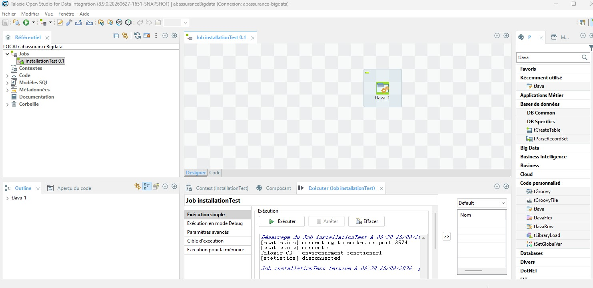

### Kafka et Hadoop

Afin de faciliter l'installation, l'environnement a été mis en place via un container Docker (fichier `docker-compose.yaml` avec les images de Kafka et Hadoop).

Preuve de fonctionnement — containers up :

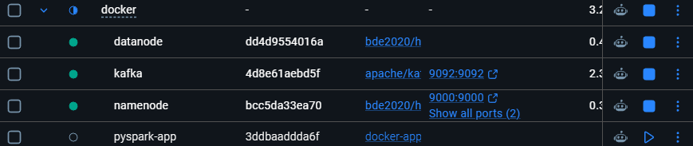

Preuve de fonctionnement — Hadoop accessible :

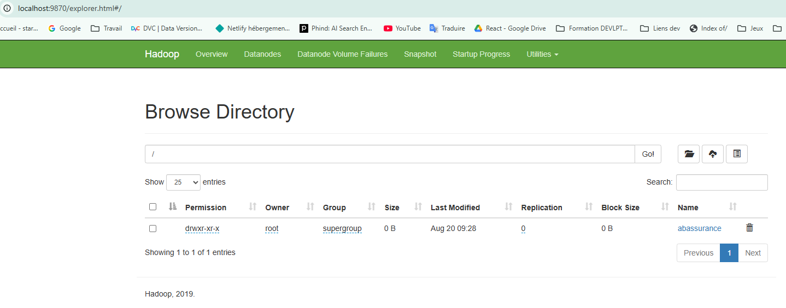

Le dossier nommé `abassurance` créé via la commande de mkdir HDFS est bien visible, confirmant que le NameNode fonctionne correctement.

Preuve de fonctionnement — flux Kafka (production/consommation d'un message) :

```shell
# Terminal 1 — producteur
(.venv) PS C:\xampp\htdocs\Projets\abassurance-bigdata\Docker> docker exec -it kafka /opt/kafka/bin/kafka-console-producer.sh --topic test-abassurance --bootstrap-server localhost:9092
>test_sinistre_001
>test_sinistre_002

# Terminal 2 — consommateur
(.venv) PS C:\xampp\htdocs\Projets\abassurance-bigdata> docker exec -it kafka /opt/kafka/bin/kafka-console-consumer.sh --topic test-abassurance --bootstrap-server localhost:9092 --from-beginning
test_sinistre_001
test_sinistre_002
```

### Test Spark ↔ Hadoop

Création d'un script pour tester la connexion Spark ↔ Hadoop :

* Il définit l'adresse de l'entrepôt HDFS (`hdfs://namenode:9000`) — comme une adresse postale que Spark va utiliser pour trouver le service Hadoop sur le réseau Docker.
* Il démarre Spark en lui disant « par défaut, va stocker/chercher tes fichiers sur cet entrepôt HDFS » (la ligne `spark.hadoop.fs.defaultFS`).
* Il écrit un petit tableau de données factices (2 clients) au format Parquet sur HDFS.
* Il relit ce même fichier depuis HDFS et l'affiche — si ça marche, ça prouve que Spark et Hadoop communiquent bien dans les deux sens.

Résultat du test :

```shell
(.venv) PS C:\xampp\htdocs\Projets\abassurance-bigdata\Docker> docker compose run --rm app python test_hadoop_spark.py
[+] Running 3/3
 ✔ Container namenode Running
 ✔ Container kafka    Running
 ✔ Container datanode Running
Container docker-app-run-dc0ee55e32a1 Creating
Container docker-app-run-dc0ee55e32a1 Created
WARNING: Using incubator modules: jdk.incubator.vector
Using Spark's default log4j profile: org/apache/spark/log4j2-defaults.properties
Setting default log level to "WARN".
26/08/20 08:02:51 WARN NativeCodeLoader: Unable to load native-hadoop library for your platform... using builtin-java classes where applicable
>>> Ecriture d'un DataFrame de test sur HDFS...
>>> Ecriture terminee sur hdfs://namenode:9000/abassurance/test/spark_test.parquet
>>> Relecture depuis HDFS...
+---+-------------+-------+
| id|   client_ref| statut|
+---+-------------+-------+
|  2|AB_CLIENT_002|resilie|
|  1|AB_CLIENT_001|  actif|
+---+-------------+-------+

>>> TEST SPARK <-> HADOOP REUSSI
```

## Problèmes rencontrés & résolutions

Cette section documente les principaux incidents rencontrés lors de la mise en place de l'environnement, la démarche de diagnostic suivie, et la correction apportée — dans une logique d'amélioration continue.

### 1. Talaxie : caractères accentués dans le chemin d'installation

**Symptôme** : erreur au démarrage `Cannot read the array length because "jetFiles" is null`.

**Diagnostic** : le moteur Eclipse/Equinox sur lequel repose Talaxie ne supporte pas les caractères accentués dans le chemin d'installation lors de l'énumération de ses plugins internes.

**Cause identifiée** : le dossier d'installation contenait un accent (`E:\Important Aurélie\...`).

**Correction** : déplacement de l'installation vers un chemin sans accent ni espace (`C:\Talaxie\`).

### 2. Talaxie : incompatibilité avec le JDK système (Java 25)

**Symptôme** : `Exception in thread "org.talend.sdk.component.studio.ProcessManager-server"` puis `InaccessibleObjectException: Unable to make java.lang.invoke.MethodHandles$Lookup(...) accessible`.

**Diagnostic** : le « Component Server » interne de Talaxie utilise la réflexion Java pour charger dynamiquement ses composants. Le système de modules strict introduit par les versions récentes de Java (25) bloque ces accès par défaut.

**Correction** :
- Installation d'un JDK 21 (Eclipse Temurin) dédié, sans modifier le JDK système.
- Configuration du fichier `.ini` de Talaxie pour forcer l'utilisation de ce JDK 21 via l'option `-vm`.
- Ajout d'options `--add-opens` (`java.lang`, `java.lang.invoke`, `java.util`, `java.io`, `java.net`, `sun.nio.ch`) dans les `-vmargs` du fichier `.ini`, pour autoriser explicitement les accès par réflexion nécessaires au moteur de génération de code (JET).

### 3. Talaxie : build Maven en mode hors-ligne

**Symptôme** : `Cannot access central (https://repo1.maven.org/maven2/) in offline mode`, lors de l'exécution d'un job.

**Diagnostic** : Talaxie utilise Maven en interne pour compiler chaque job en code Java exécutable. Le mode « Work offline » de Maven, activé par défaut, empêchait le téléchargement du plugin `maven-jar-plugin` nécessaire à la compilation.

**Correction** : désactivation du mode hors-ligne dans **Window → Preferences → Maven → décocher « Work offline »**.

### 4. Hadoop : namenode et datanode ne démarrent pas dans Docker

**Symptôme** : `Invalid URI for NameNode address (check fs.defaultFS): file:/// has no authority`, puis le datanode échoue avec `No services to connect, missing NameNode address`.

**Diagnostic** : l'image Docker officielle `apache/hadoop:3` démarre avec une configuration minimale par défaut (`fs.defaultFS=file:///`), sans configuration réseau HDFS. Le namenode refuse donc de démarrer, et le datanode n'a personne à qui se connecter.

**Correction** : remplacement par les images `bde2020/hadoop-namenode` et `bde2020/hadoop-datanode`, qui acceptent une configuration simplifiée par variables d'environnement (`CORE_CONF_fs_defaultFS=hdfs://namenode:9000`), sans avoir à écrire manuellement les fichiers XML de configuration Hadoop.

### 5. Docker : fichier introuvable dans le conteneur après ajout

**Symptôme** : `python: can't open file '/app/test_hadoop_spark.py': [Errno 2] No such file or directory`, alors que le fichier existait bien sur le poste.

**Diagnostic** : l'image Docker n'est pas synchronisée en continu avec le système de fichiers local — elle capture un instantané des fichiers uniquement au moment du `docker build` (instruction `COPY . .`). Le fichier avait été ajouté après le dernier build.

**Correction** : rebuild explicite de l'image (`docker compose build app`) après chaque ajout de fichier nécessaire à l'exécution.

## Création d'un dataset

La création du dataset servira à la fois pour tester le pipeline et pour illustrer concrètement les bonnes pratiques de data cleaning. Les données sont générées avec Faker (voir README pour les commandes d'installation et de lancement de `generate_dataset.py`).

### Inventaire des bases de données

**Structure de tableau proposée** — une ligne par table, groupée par système source :

| Système source | Table | Nb colonnes | Clé primaire | Clés étrangères / relations | Volume réel estimé (prod) | Volume jeu de dev |
|---|---|---|---|---|---|---|
| AbAssurance (Oracle) | AB_CLIENT | 10 | AB_CLIENT_ID | — (entité racine) | ~12 M lignes | 200 lignes |
| AbAssurance (Oracle) | AB_CONTRAT | 7 | AB_POLICY_NUMBER | AB_CLIENT_ID → AB_CLIENT | à estimer (~1,3 contrat/client) | 300 lignes |
| AbAssurance (Oracle) | AB_SINISTRE | 5 | AB_CLAIM_ID | AB_POLICY_NUMBER → AB_CONTRAT | à estimer | 62 lignes |
| AbAssurance (Oracle) | AB_PAIEMENT | 5 | AB_PAYMENT_ID | AB_POLICY_NUMBER → AB_CONTRAT | à estimer | 1 051 lignes |
| AssurePlus (SQL Server) | AP_USERS | 10 | AP_USER_ID | — (entité racine) | ~5 M lignes | 100 lignes |
| AssurePlus (SQL Server) | AP_CONTRACTS | 8 | AP_CONTRACT_REF | AP_USER_ID → AP_USERS | à estimer | 148 lignes |
| AssurePlus (SQL Server) | AP_CLAIMS | 7 | AP_SINISTRE_NUM | AP_CONTRACT_REF → AP_CONTRACTS | à estimer | 38 lignes |
| AssurePlus (SQL Server) | AP_PAYMENTS | 6 | AP_PAYMENT_REF | AP_CONTRACT_REF → AP_CONTRACTS | à estimer | 527 lignes |

Les volumes de production sont estimés à partir de la présentation de l'entreprise. Les tables filles (contrats, sinistres, paiements) sont estimées par un ratio moyen [x contrats/client], en l'absence de données réelles disponibles.

Les relations entre les tables sont définies dans la section « Les modèles conceptuels de données (MCD) de AssurePlus et AbAssurance ».

## US 1.2 Extraction Oracle

Les données du dataset ont été générées par un script avec Faker afin de simuler une extraction.

Étapes de création du job dans Talaxie :

1. **Lire le CSV source (`tFileInputDelimited`)** : création d'un nouveau job `extraction_ab_client` dans Talaxie (correspond à la branche `feature/US1.2-extraction-oracle`). Glisser un composant `tFileInputDelimited` depuis la palette, et le pointer vers le fichier `ab_client.csv` généré par `generate_dataset.py`. Définir le schéma des colonnes (`ab_client_id`, `ab_nom`, `ab_prenom`, etc.) manuellement.

2. **Écrire le résultat standardisé (`tFileOutputDelimited`)** : un `tFileOutputDelimited` écrit le résultat standardisé dans `output/ab_assurance_extract_talaxie/ab_assurance_extract_client.csv`. Relier `tFileInputDelimited_1` vers ce composant (clic droit → Ligne → Main → clic sur `tFileOutputDelimited`). Définir le chemin de sortie en zone de staging. Cocher « Inclure l'en-tête » pour que le fichier garde les noms de colonnes `ab_*` — utile pour la lisibilité et pour que l'US suivante (nettoyage) puisse relire ce fichier facilement. Vérifier que l'encodage est bien UTF-8.

3. **Exécuter et valider** : exécution du job, puis ouverture du fichier généré pour confirmer le nombre de lignes pour chaque table extraite, avec les accents corrects.

Capture d'écran des jobs :


## US 1.3 Extraction SQL Server

Le processus reste le même en utilisant les CSV de AssurePlus.

Capture d'écran des jobs :


Talaxie a repéré des anomalies dans les formats de date de l'export CSV de la table `users`. Le format était `jj/mm/YYYY` au lieu de `YYYY-mm-dd`.

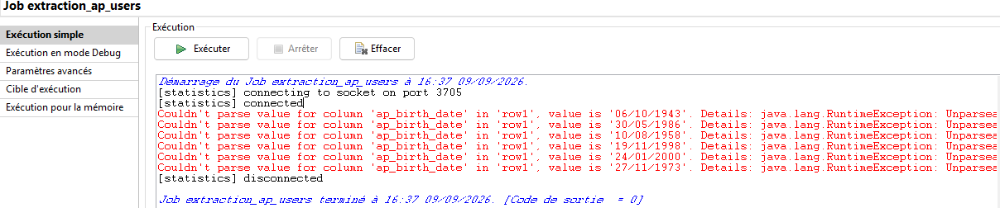

## US 1.4 Contrôle du nombre d'enregistrements

Le journal d'extraction se trouve dans `/data/logs/controle_extraction.csv`.

Pour AssurePlus, la table Users contient une anomalie : six lignes ont été ignorées à cause du format de date non conforme.

Pour que l'extraction soit sans perte, j'ai modifié le schéma : pour le champ `ap_birth_date`, j'ai mis le type `string` au lieu de `date`, avec un modèle `YYYY-mm-dd`.

Après avoir relancé le contrôle, le résultat est le suivant :

```shell
2026-09-11 10:37:50,AssurePlus,AP_USERS,100,100,0,OK
```

## US 2.1 Nettoyage des données

### Règle de nettoyage :

Les règles sont définis dans le fichier [`regles_nettoyage.md`](./regles_nettoyage.md).

### Configuration de Talaxie pour le nettoyage de données

#### Doublons

1. Configurer tUniqRow sur ab_client_id
Dans le job nettoyage_ab_client, placer un tUniqRow juste après le tFileInputDelimited.
Dans ses paramètres, cocher uniquement ab_client_id comme clé de comparaison (les autres colonnes restent décochées) — c'est la clé primaire, deux lignes avec le même ab_client_id sont par définition un doublon technique, quel que soit le contenu des autres champs.

2. Brancher les deux sorties (Uniques / Doublons)
tUniqRow expose deux sorties distinctes visibles quand on tire une ligne depuis le composant : 'Uniques' (lignes gardées, une par clé) et 'Doublons' (lignes rejetées).
Relier 'Uniques' vers la suite du pipeline (le futur tMap), et 'Doublons' vers un tFileOutputDelimited séparé : data/rejects/oracle/ab_client_doublons.csv.
Rien ne doit disparaître sans laisser de trace, même les doublons rejetés.

3. Tester avec un doublon injecté volontairement
Sur les jeux de données générés par Faker, il est probable qu'il n'y ait aucun vrai doublon (Faker génère des ID séquentiels propres).
Pour valider concrètement que tUniqRow fonctionne (et pas juste 'zéro doublon car aucun test réel'), il faut dupliquer manuellement une ligne dans une copie de test du CSV, relancer le job sur ce fichier de test, et vérifier que le doublon atterrit bien dans ab_client_doublons.csv et pas dans le fichier propre.

 ---

Exemple avec le nettoyage de la table client pour abassurance avec l'ajout de 2 doublons (Id 1 et 5) afin de s'assurer que le nettoyage fonctionne.
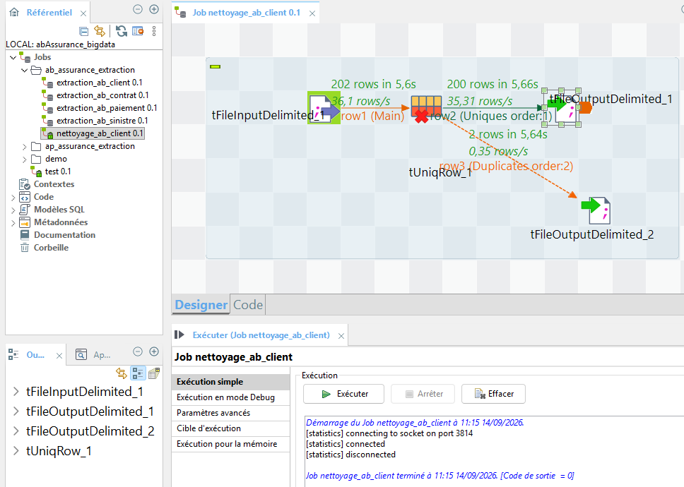

Les fichiers d'exctration sont dans ./data/output/ab_assurance_extract_talaxie/ab_assurance_nettoye/ab_assurance_extract_client_clean
Et pour l'extraction des doublons : ./data\output\doublons\ab_client_doublons.

Pour l'exemple, j'ai fais de même pour AssurePlus. Il y a deux doublons, un pour la table users (ID 1) et l'autre pour la table contracts (ID : AP-AP-000147).

#### Routine data Cleaning

Afin de nettoyer les anomalies des données : format de date, format d'email,téléphone maquant.

J'utilise un composant tJavaRow pour appliquer ma routine Java à chaque ligne. La routine centralise les règles de nettoyage. Une fois les données nettoyées, je passe par tUniqRow pour supprimer les doublons, puis j'exporte le résultat dans un nouveau fichier CSV.

Je developpe le code routine afin de nettoyer les données.

```java
package routines;

import java.text.SimpleDateFormat;
import java.util.Date;

public class DataCleaning {

	/**
     * Nettoie une chaîne de caractères.
     * Supprime les espaces inutiles.
     * Transforme une valeur vide en null.
     */
    public static String nettoyerTexte(String valeur) {

        if (valeur == null) {
            return null;
        }

        valeur = valeur.trim();

        if (valeur.isEmpty()) {
            return null;
        }

        return valeur;
    }

    /**
     * Nettoie une adresse email.
     * Vérifie qu'elle contient bien un @ et un point.
     */
    public static String nettoyerEmail(String email) {

        if (email == null) {
            return null;
        }

        email = email.trim().toLowerCase();

        // Email vide
        if (email.isEmpty()) {
            return null;
        }

        
        // Correction d'un email mal écrit 
        if (email.contains("_at_")) { 
        	email = email.replace("_at_", "@"); 
        }

        // Vérification simple de l'email
        if (!email.contains("@") || !email.contains(".")) {
            return null;
        }

        return email;
    }

    /**
     * Nettoie un numéro de téléphone.
     * Supprime les espaces au début et à la fin.
     * Une valeur vide devient null.
     */
    public static String nettoyerTelephone(String telephone) {

        if (telephone == null) {
            return null;
        }

        telephone = telephone.trim();

        if (telephone.isEmpty()) {
            return null;
        }

        return telephone;
    }


    /**
     * Nettoie et uniformise une date, avec un format de sortie choisi.
     *
     * Formats d'entrée acceptés :
     * - yyyy-MM-dd
     * - dd/MM/yyyy
     * - yyyy-MM-dd HH:mm:ss
     *
     * @param date la date brute à nettoyer
     * @param formatSortie le format souhaité en sortie (ex: "yyyy-MM-dd" ou "yyyy-MM-dd HH:mm:ss")
     */
    public static String normaliserDate(String date, String formatSortie) {

        if (date == null) {
            return null;
        }

        date = date.trim();

        if (date.isEmpty()) {
            return null;
        }

        String[] formats = {
            "yyyy-MM-dd HH:mm:ss",
            "yyyy-MM-dd",
            "dd/MM/yyyy"
        };

        for (String format : formats) {

            try {

                SimpleDateFormat formatEntree =
                    new SimpleDateFormat(format);

                formatEntree.setLenient(false);

                Date dateConvertie =
                    formatEntree.parse(date);

                SimpleDateFormat formatSortieFinal =
                    new SimpleDateFormat(formatSortie);

                return formatSortieFinal.format(dateConvertie);

            } catch (Exception e) {
                // Format suivant testé automatiquement
            }
        }

        return null;
    }


    /**
     * Nettoie un montant.
     * Une valeur vide ou incorrecte devient null.
     */
    public static Double nettoyerMontant(String montant) {

        if (montant == null) {
            return null;
        }

        montant = montant.trim();

        if (montant.isEmpty()) {
            return null;
        }

        try {

            return Double.parseDouble(montant);

        } catch (NumberFormatException e) {

            return null;
        }
    }

    
    
}

```

Dans code de tJavaRow, j'appel pour les champs la méthode concernée.

```java
// Code générer selon le schéma client de AbAssurance
output_row.AB_CLIENT_ID = input_row.AB_CLIENT_ID;

output_row.AB_NOM =
    DataCleaning.nettoyerTexte(input_row.AB_NOM);

output_row.AB_PRENOM =
    DataCleaning.nettoyerTexte(input_row.AB_PRENOM);

output_row.AB_DATE_NAISSANCE =
    DataCleaning.normaliserDate(input_row.AB_DATE_NAISSANCE);

output_row.AB_EMAIL =
    DataCleaning.nettoyerEmail(input_row.AB_EMAIL);

output_row.AB_TELEPHONE =
    DataCleaning.nettoyerTelephone(input_row.AB_TELEPHONE);

output_row.AB_ADRESSE =
    DataCleaning.nettoyerTexte(input_row.AB_ADRESSE);

output_row.AB_CODE_POSTAL =
    DataCleaning.nettoyerTexte(input_row.AB_CODE_POSTAL);

output_row.AB_NUM_FISCAL =
    DataCleaning.nettoyerTexte(input_row.AB_NUM_FISCAL);

output_row.AB_DATE_CREATION =
DataCleaning.normaliserDate(input_row.AB_DATE_CREATION, "yyyy-MM-dd HH:mm:ss");

output_row.AB_STATUT_CLIENT =
    DataCleaning.nettoyerTexte(input_row.AB_STATUT_CLIENT);
```

```java
//Code généré selon les schémas d'entrée et de sortie pour AssurePlus
output_row.ap_user_id = input_row.ap_user_id;
output_row.ap_full_name = DataCleaning.nettoyerTexte(input_row.ap_full_name);

output_row.ap_birth_date = DataCleaning.normaliserDate(input_row.ap_birth_date);

output_row.ap_mail_address = DataCleaning.nettoyerEmail(input_row.ap_mail_address);

output_row.ap_phone_number = DataCleaning.nettoyerTelephone(input_row.ap_phone_number);

output_row.ap_street_address =  DataCleaning.nettoyerTexte(input_row.ap_street_address);

output_row.ap_zip_code = DataCleaning.nettoyerTexte(input_row.ap_zip_code);

output_row.ap_created_at = DataCleaning.normaliserDate(input_row.ap_created_at, "yyyy-MM-dd HH:mm:ss");

output_row.ap_customer_status = DataCleaning.nettoyerTexte(input_row.ap_customer_status);

output_row.ap_loyalty_score = input_row.ap_loyalty_score;

```

Le rapport d'anomalie, confirme que les seules lignes rejetées sont les doublons. Les données incorrectes ont été corrigés.

#### Fusionner les données

L'objectif est de transformer les données nettoyées AB_CLIENT (Oracle) et AP_USERS (SQL Server) vers le schéma cible commun client_commun, avec détection et fusion des doublons inter-systèmes (même client existant dans les deux bases)

Étapes de construction
1. Lecture des sources nettoyées : deux tFileInputDelimited, un par système, pointant vers les sorties d'US2.1 (ab_client_cleaned.csv, ap_users_cleaned.csv) — pas les fichiers bruts extraits.

2. Mapping vers le schéma commun : implémenté en tJavaRow (et non tMap, suite à une instabilité du tMap sur cette version de Talaxie — schéma/expressions réinitialisés silencieusement au clic sur OK). Un tJavaRow par source, assignant explicitement les 10 champs du schéma cible (client_id, nom_prenom, date_naissance, email, telephone, adresse, code_postal, num_fiscal, date_creation, statut_client, loyalty_score).

3. Fusion des deux flux : tUnite_1, avec le flux AbAssurance connecté en premier (l'ordre conditionne la priorité lors du dédoublonnage à l'étape 5).

4. Détection des doublons inter-systèmes : tUniqRow sur la clé email, appliqué uniquement aux lignes avec email présent.

5. Une sortie pour les données. Pour les clients, il y a deux sorties, une pour les donées correctses et sans doublons et une autre pour les doublons.

6. Journalisation : tJava déclenché en OnComponentOk, écrivant une ligne récapitulative dans journal_transformation.csv.

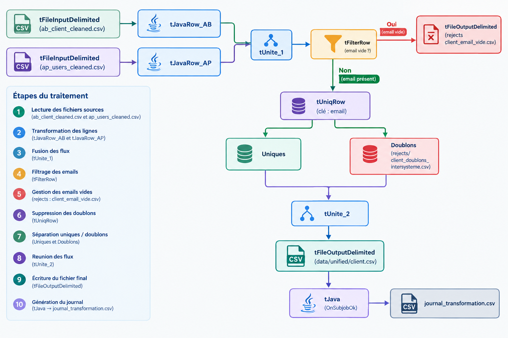

Le canvas Talaxie :

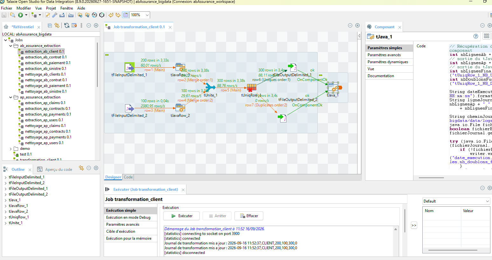

***Bugs rencontrés et corrections.***
tMap : schéma de sortie vidé au clic sur OK Version Talaxie snapshot (V8.9.0-SNAPSHOT) instable sur ce composant.
Diagnostic : Expressions perdues silencieusement sans message d'erreur.
Correction : Remplacement du tMap par un tJavaRow pour toute la transformation.

Décision client_id : String ("AB-"/"AP-") vs Integer.
Diagnostic : Le schéma officiel typait client_id en Integer, incompatible avec un préfixe texte.
Correction : Modification du type de client_id dans le schéma commun (Métadonnées) de Integer vers String, propagée aux jobs.

#### US 3.2 — Publication des données transformées vers Kafka

1. Télécharger le composant Kafka dans Talaxie. Il permet de réutiliser cette config Kafka dans tous les jobs sans la reconfigurer à chaque fois. Appelé ce composant via un tLibraryLoad.
2. Comme tKafkaOutput n'existe pas dans Talaxie, j'utilise le client Kafka Java directement (KafkaProducer) dans tJavaRow. Je créé un nouveau job avec le tLabraryLoad -> tInputDelimited->tJavaFlex->tOutputDelimieted à la fin de chacun des jobs afin d'aoir un fichier et pouvoir comparer le nombre de ligne avec le nombre de message dans Kafka pour chaque.
3. Format du message : comme évoqué dans la doc, il faut décider maintenant JSON ou Avro. Vu le contexte académique/projet, je pars sur JSON simple pour cette US — plus rapide à mettre en place, suffisant pour valider le flux.
4. Vérification du non-perte de données : compter les lignes en entrée (via tJavaRow + globalMap) et comparer avec le nombre de messages reçus côté consumer (kafka-console-consumer avec --from-beginning puis compter, ou via Kafka UI qui affiche le nombre de messages par topic/partition).
5. Mesure du temps de latence.

Exemple d'un job pour la transmission des messages dans kafka.

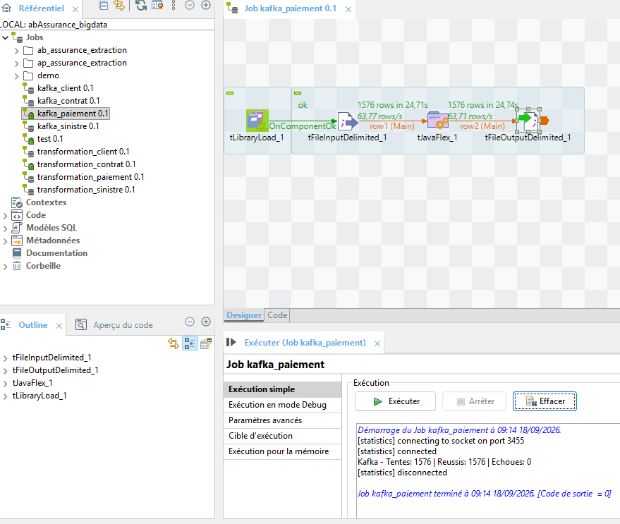

Exemple dans Kafka UI

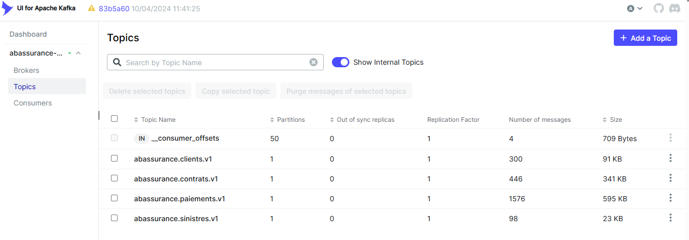

La documentation du nombre de ligne et le temps de transmission est dans le fichier [`transmission_kafka.csv`](../data/logs/transmission_kafka.csv).

#### US 3.3 — Synchronisation pendant la phase de transition

Les bases sources Oracle/SQL Server sont simulées via des jeux de données statiques (Faker), il n'existe pas de flux de modifications en direct à synchroniser — l'US3.3 ne peut donc pas être testée dans les conditions réelles décrites par les critères d'acceptation.

Théoriquement, il fadrait mettre en place des connecteurs entre les bases de données Oracle / Sql Server et Kafka Connect, pour capter les modifications au fil de l'eau plutôt qu'en extraction batch.


#### US 4.1 Installer l'espace de stockage centralisé

Mise en place du cluster Hadoop HDFS comme espace de stockage centralisé
pour les données AbAssurance/AssurePlus, avant intégration Kafka -> HDFS (US4.2).

1. Ajout d'un 2ᵉ conteneur datanode dans le docker-compose (le cluster n'en comptait qu'un seul), avec dfs.replication=2, pour permettre une réplication réelle des blocs sur plusieurs serveurs.
2. Retrait de l'exposition host des ports HDFS (9870, 9000) : le namenode/datanodes ne sont plus accessibles que depuis le réseau Docker interne
(conteneur "app" uniquement), pour restreindre l'accès aux seules composantes autorisées du pipeline.
3. Validation du cluster : ``docker exec namenode hdfs dfsadmin -report`` (2 datanodes "Live", cluster opérationnel).
4. Création de l'arborescence du data lake : /data/Kafka/{clients,contrats, paiements,sinistres} pour les données brutes issues de Kafka, /data/clean pour les données nettoyées destinées à l'analyse (US5.1).

```shell
docker exec -it namenode hdfs dfs -mkdir -p /data/kafka/clients
docker exec -it namenode hdfs dfs -mkdir -p /data/kafka/contrats
docker exec -it namenode hdfs dfs -mkdir -p /data/kafka/paiements
docker exec -it namenode hdfs dfs -mkdir -p /data/kafka/sinistres
docker exec -it namenode hdfs dfs -mkdir -p /data/clean
```

5.Test d'écriture/lecture Parquet sur cette arborescence via PySpark pour valider le bon fonctionnement du stockage.

```python
df = spark.createDataFrame([("test", 1)], ["nom", "valeur"])
df.write.mode("overwrite").parquet("hdfs://namenode:9000/data/raw/contrats/_test")
spark.read.parquet("hdfs://namenode:9000/data/raw/contrats/_test").show()
```

Critères d'acceptation :

1. Serveur Hadoop installé et fonctionnel -> OK (2 datanodes live, testé)

2. Duplication automatique multi-serveurs -> OK (2 datanodes, replication=2)

3. Espace prévu vs volumes estimés (US1.1) -> OK : dossier des extractions sources actuel = 1,05 Mo (1 106 712 octets), largement couvert par l'espace disque alloué aux volumes Docker (plusieurs Go disponibles)

4. Accès restreint aux personnes autorisées -> Partiellement couvert :

* ports HDFS non exposés au host (accès limité au réseau Docker interne).
* Une authentification forte (Kerberos + Apache Ranger) serait la solution de production, non implémentée ici par simplification.

#### US4.2 — Stocker les données reçues de Kafka dans (Hadoop)

Mise en place de 4 jobs Spark Structured Streaming (un par topic Kafka :
contrats, paiements, sinistres, clients) consommant en continu les messages
publiés par Talaxie et les écrivant au format Parquet dans HDFS.

* Développement de 4 scripts PySpark Structured Streaming (streaming_contrats.py, streaming_paiements.py, streaming_sinistres.py, streaming_clients.py), un par topic, avec un schéma JSON dédié par type de donnée (contrat, paiement, sinistre, client).
* Ajout du connecteur spark-sql-kafka-0-10 (et ses dépendances kafka-clients, spark-token-provider-kafka-0-10) téléchargés au build de l'image Docker via curl et chargés dans la SparkSession via spark.jars, la version pyspark installée ne l'incluant pas nativement.
* Organisation des dossiers HDFS en deux zones : /data/kafka/topic pour les données brutes reçues de Kafka, /data/clean pour les futures données nettoyées (répond au critère 2 : "dossiers organisés brutes/nettoyées").
* Gestion de checkpoints HDFS dédiés par topic (/data/checkpoints/topic`) pour permettre une reprise sans duplication en cas de redémarrage du job.

Incident traversé: un problème de permissions sur le volume Docker du broker Kafka (AccessDeniedException, utilisateur non-root du conteneur vs volume créé par root) a provoqué une perte des topics et de leur contenu ; corrigé via chown sur le volume, topics recréés, données republiées depuis Talaxie.

Le nombre de données stockées correspond au nombre de données extraites au départ (aucune perte) :

Capture d'écran pour client :

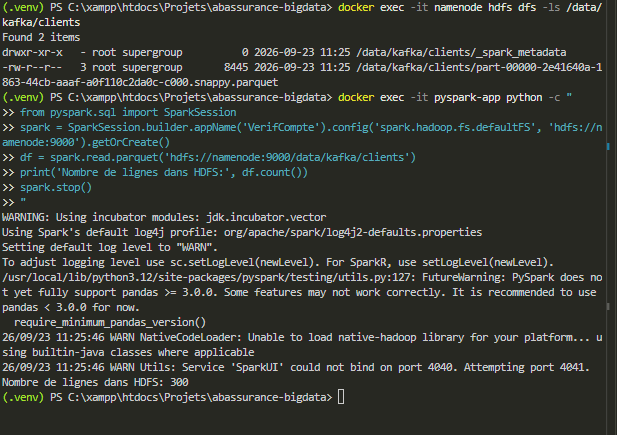

Dans Kafka, il a bien 

Capture d'écran pour contrats :

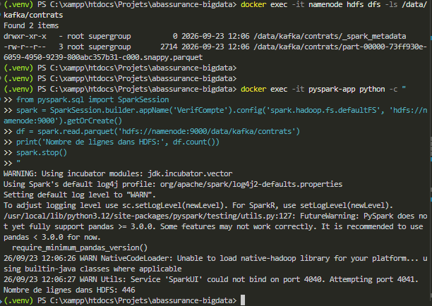

Capture d'écran pour paiements :

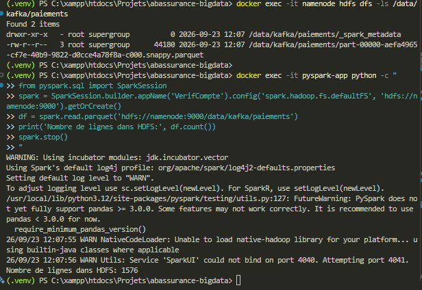

Capture d'écran pour sinistres :

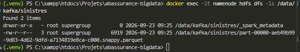
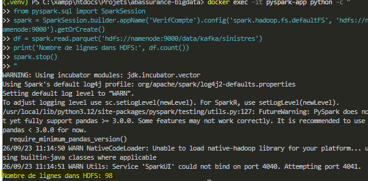

Pour chaque topics, le nombre de ligne correspond bien :

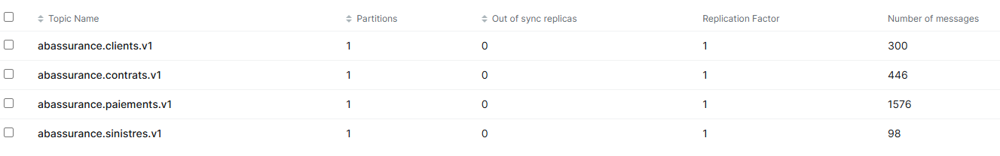

***Résultat dans Hadoop***

```shell
(.venv) PS C:\xampp\htdocs\Projets\abassurance-bigdata> docker exec -it namenode hdfs dfs -ls /data/kafka/clients
>> docker exec -it namenode hdfs dfs -ls /data/kafka/contrats
>> docker exec -it namenode hdfs dfs -ls /data/kafka/paiements
>> docker exec -it namenode hdfs dfs -ls /data/kafka/sinistres
Found 2 items
drwxr-xr-x   - root supergroup          0 2026-09-23 11:25 /data/kafka/clients/_spark_metadata
-rw-r--r--   3 root supergroup       8445 2026-09-23 11:25 /data/kafka/clients/part-00000-2e41640a-1863-44cb-aaaf-a0f110c2da0c-c000.snappy.parquet
Found 2 items
drwxr-xr-x   - root supergroup          0 2026-09-23 12:06 /data/kafka/contrats/_spark_metadata
-rw-r--r--   3 root supergroup       2714 2026-09-23 12:06 /data/kafka/contrats/part-00000-73ff930e-6059-4950-9239-800abc357b31-c000.snappy.parquet
Found 2 items
drwxr-xr-x   - root supergroup          0 2026-09-23 12:07 /data/kafka/paiements/_spark_metadata
-rw-r--r--   3 root supergroup      44180 2026-09-23 12:07 /data/kafka/paiements/part-00000-aefa4965-cf7e-40b9-9822-d0cce4a78f8a-c000.snappy.parquet
Found 2 items
drwxr-xr-x   - root supergroup          0 2026-09-23 09:25 /data/kafka/sinistres/_spark_metadata
-rw-r--r--   3 root supergroup       6919 2026-09-23 09:25 /data/kafka/sinistres/part-00000-aeb49b99-9d83-4d62-9dfd-a7134819e8ca-c000.snappy.parquet
```

Exemple du fichier sinistres :

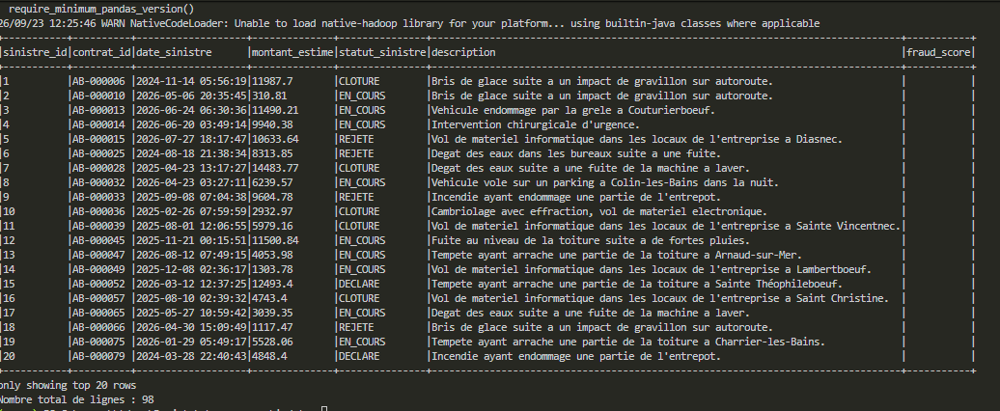

#### US 4.3 Protéger les données sensibles stockées

#### US 5.1 Analyser les données pour produire des rapports

Pour pouvoir facilité l'analyse, il faut développer un tableau de bord.
Pour cela j'ai choisi l'outils Streamlit. Il s'intègre bien avec PySpark pout lire du Parquet depuis Hadoop, et plus simple a mettre en place qu'un framework comme Flash ou Django.

##### Installation de Streamlit

```shell
python -m pip install streamlit

# Vérifier l'installation
streamlit --version

# Ajouter au requirements.txt
pip freeze > requirements.txt
```

Création d'une architercture :

abassurance-bigdata/
│
├── .venv/
├── data/
├── Documentations/
├── src/
│   ├── pipeline/
│   └── prediction/
│
├── app/
│   └── app.py
├── Docker/
│   ├── docker-compose.yml/
├   |──Dockerfile/
│   └──requirements.txt
|
└── README.md

Je modifie le Dockerfile afin qu'il lance Strealit : 

```dockerfile
CMD ["streamlit", "run", "app/app.py", "--server.address=0.0.0.0", "--server.port=8501"]
```

J'ajoute le port dans le docker-compose.yml

```yaml
  app:
    build:
      context: ..
      dockerfile: Docker/Dockerfile
    container_name: pyspark-app
    ports:
      - "8501:8501"
    depends_on:
      - namenode
      - datanode
      - datanode2
      - kafka
    environment:
      - SPARK_LOCAL_IP=127.0.0.1
    networks:
      - bigdata
```

