# Journal technique — abassurance-bigdata

Ce document détaille les choix techniques, leurs justifications, les problèmes rencontrés et leur résolution, ainsi que l'avancement des User Stories du projet. Pour les instructions d'installation et d'exécution, voir le [`README.md`](./README.md).

## Choix du framework Python

Le projet utilise **PySpark** comme framework Python principal.

PySpark a été choisi car il permet d'utiliser Apache Spark depuis Python pour effectuer des traitements distribués sur de grands volumes de données. Il est particulièrement adapté à l'architecture du projet, qui repose sur Hadoop pour le stockage et Spark pour le traitement des données.

La version de Python 3.14 est supportée par PySpark 4.2.0 et donc par Apache Spark.

### Validation initiale de l'installation

Test de PySpark dans un container Docker afin de vérifier son installation et son exécution (voir README pour les commandes). Ce test a permis de confirmer que l'environnement Docker était correctement configuré avant de commencer le développement du pipeline.

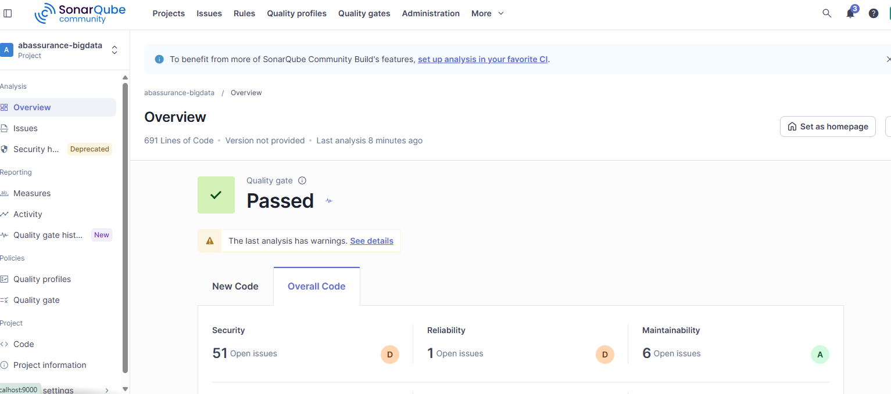

## Les modèles conceptuels de données (MCD) de AssurePlus et AbAssurance

### AbAssurance


> AB_CLIENT ( ab_client_id, ab_nom, ab_prenom, ab_date_naissance, ab_email, ab_telephone, ab_adresse, ab_code_postal, ab_num_fiscal, ab_date_creation, ab_statut_client )
> Le champ ab_client_id constitue la clé primaire de la table. C'était déjà un identifiant de l'entité AB_CLIENT.
> Les champs ab_nom, ab_prenom, ab_date_naissance, ab_email, ab_telephone, ab_adresse, ab_code_postal, ab_num_fiscal, ab_date_creation et ab_statut_client étaient déjà de simples attributs de l'entité AB_CLIENT.

> AB_CONTRAT ( ab_policy_number, ab_type_assurance, ab_date_debut, ab_date_fin, ab_prime_annuelle, ab_statut_contrat, ab_agence_id, #ab_client_id )
> Le champ ab_policy_number constitue la clé primaire de la table. C'était déjà un identifiant de l'entité AB_CONTRAT.
> Les champs ab_type_assurance, ab_date_debut, ab_date_fin, ab_prime_annuelle, ab_statut_contrat et ab_agence_id étaient déjà de simples attributs de l'entité AB_CONTRAT.
> Le champ ab_client_id est une clé étrangère. Il a migré par l'association de dépendance fonctionnelle SOUSCRIRE à partir de l'entité AB_CLIENT en perdant son caractère identifiant.

> AB_PAIEMENT ( ab_payment_id, ab_date_paiement, ab_montant, ab_mode_paiement, #ab_policy_number )
> Le champ ab_payment_id constitue la clé primaire de la table. C'était déjà un identifiant de l'entité AB_PAIEMENT.
> Les champs ab_date_paiement, ab_montant, ab_mode_paiement étaient déjà de simples attributs de l'entité AB_PAIEMENT.
> Le champ ab_policy_number est une clé étrangère. Il a migré par l'association de dépendance fonctionnelle REGLER à partir de l'entité AB_CONTRAT en perdant son caractère identifiant.

> AB_SINISTRE ( ab_claim_id, ab_date_sinistre, ab_montant_estime, ab_statut_sinistre, ab_description, #ab_policy_number )
> Le champ ab_claim_id constitue la clé primaire de la table. C'était déjà un identifiant de l'entité AB_SINISTRE.
> Les champs ab_date_sinistre, ab_montant_estime, ab_statut_sinistre, ab_description étaient déjà de simples attributs de l'entité AB_SINISTRE.
> Le champ ab_policy_number est une clé étrangère. Il a migré par l'association de dépendance fonctionnelle DECLARER à partir de l'entité AB_CONTRAT en perdant son caractère identifiant.

### AssurePlus


> AP_CLAIMS ( AP_SINISTRE_NUM, AP_INCIDENT_DATE, AP_ESTIMATED_AMOUNT, AP_CLAIM_STATUS, AP_CLAIM_COMMENT, AP_FRAUD_SCORE, AP_CONTRACT_REF 1, #AP_CONTRACT_REF 2 )
> Le champ AP_SINISTRE_NUM constitue la clé primaire de la table. C'était déjà un identifiant de l'entité AP_CLAIMS.
> Les champs AP_INCIDENT_DATE, AP_ESTIMATED_AMOUNT, AP_CLAIM_STATUS, AP_CLAIM_COMMENT, AP_FRAUD_SCORE et AP_CONTRACT_REF 1 étaient déjà de simples attributs de l'entité AP_CLAIMS.
> Le champ AP_CONTRACT_REF 2 est une clé étrangère. Il a migré par l'association de dépendance fonctionnelle DECLARER à partir de l'entité AP_CONTRACTS en perdant son caractère identifiant.

> AP_CONTRACTS ( AP_CONTRACT_REF, AP_PRODUCT_CODE, AP_START_DATE, AP_END_DATE, AP_MONTHLY_PREMIUM, AP_CONTRACT_STATE, AP_BROKER_CODE, AP_USER_ID 1, #AP_USER_ID 2 )
> Le champ AP_CONTRACT_REF constitue la clé primaire de la table. C'était déjà un identifiant de l'entité AP_CONTRACTS.
> Les champs AP_PRODUCT_CODE, AP_START_DATE, AP_END_DATE, AP_MONTHLY_PREMIUM, AP_CONTRACT_STATE, AP_BROKER_CODE et AP_USER_ID 1 étaient déjà de simples attributs de l'entité AP_CONTRACTS.
> Le champ AP_USER_ID 2 est une clé étrangère. Il a migré par l'association de dépendance fonctionnelle SOUSCRIRE à partir de l'entité AP_USERS en perdant son caractère identifiant.

> AP_PAYMENTS ( AP_PAYMENT_REF, AP_PAYMENT_DATETIME, AP_AMOUNT_PAID, AP_PAYMENT_CHANNEL, AP_TRANSACTION_STATUS, AP_CONTRACT_REF 1, #AP_CONTRACT_REF 2 )
> Le champ AP_PAYMENT_REF constitue la clé primaire de la table. C'était déjà un identifiant de l'entité AP_PAYMENTS.
> Les champs AP_PAYMENT_DATETIME, AP_AMOUNT_PAID, AP_PAYMENT_CHANNEL, AP_TRANSACTION_STATUS et AP_CONTRACT_REF 1 étaient déjà de simples attributs de l'entité AP_PAYMENTS.
> Le champ AP_CONTRACT_REF 2 est une clé étrangère. Il a migré par l'association de dépendance fonctionnelle REGLER à partir de l'entité AP_CONTRACTS en perdant son caractère identifiant.

> AP_USERS ( AP_USER_ID, AP_FULL_NAME, AP_BIRTH_DATE, AP_MAIL_ADDRESS, AP_PHONE_NUMBER, AP_STREET_ADDRESS, AP_ZIP_CODE, AP_CREATED_AT, AP_CUSTOMER_STATUS, AP_LOYALTY_SCORE )
> Le champ AP_USER_ID constitue la clé primaire de la table. C'était déjà un identifiant de l'entité AP_USERS.
> Les champs AP_FULL_NAME, AP_BIRTH_DATE, AP_MAIL_ADDRESS, AP_PHONE_NUMBER, AP_STREET_ADDRESS, AP_ZIP_CODE, AP_CREATED_AT, AP_CUSTOMER_STATUS et AP_LOYALTY_SCORE étaient déjà de simples attributs de l'entité AP_USERS.

### Mapping des deux modèles

Le mapping complet est dans le fichier `mapping_donnees.md`.

Exemple de mapping des données :

| Base AbAssurance    | Base AssurePlus       | Modèle cible     |
| ------------------- | --------------------- | ---------------- |
| `AB_CLIENT`         | `AP_USERS`            | `CLIENT`         |
| `AB_CONTRAT`        | `AP_CONTRACTS`        | `CONTRAT`        |
| `AB_SINISTRE`       | `AP_CLAIMS`           | `SINISTRE`       |
| `AB_PAIEMENT`       | `AP_PAYMENTS`         | `PAIEMENT`       |
| `ab_nom`            | `AP_FULL_NAME`        | `nom / prenom`   |
| `ab_email`          | `AP_MAIL_ADDRESS`     | `email`          |
| `ab_telephone`      | `AP_PHONE_NUMBER`     | `telephone`      |
| `ab_date_naissance` | `AP_BIRTH_DATE`       | `date_naissance` |
| `ab_date_debut`     | `AP_START_DATE`       | `date_debut`     |
| `ab_date_fin`       | `AP_END_DATE`         | `date_fin`       |
| `ab_montant_estime` | `AP_ESTIMATED_AMOUNT` | `montant_estime` |
| `ab_date_paiement`  | `AP_PAYMENT_DATETIME` | `date_paiement`  |
| `ab_montant`        | `AP_AMOUNT_PAID`      | `montant`        |

### Justification du modèle cible

Pour construire le modèle cible, je me suis basé sur les deux modèles de données fournis en annexe, AbAssurance et AssurePlus. Comme les deux bases contiennent des informations qui correspondent aux mêmes éléments métier, j'ai regroupé les entités similaires afin d'obtenir un modèle commun.

Par exemple, AB_CLIENT et AP_USERS ont été regroupées dans l'entité CLIENT. De la même manière, AB_CONTRAT et AP_CONTRACTS correspondent à CONTRAT, AB_SINISTRE et AP_CLAIMS à SINISTRE, et AB_PAIEMENT et AP_PAYMENTS à PAIEMENT.

Pour les attributs, j'ai regroupé ceux qui étaient communs aux deux systèmes et j'ai conservé les attributs spécifiques lorsqu'ils apportaient des informations supplémentaires. Les différentes relations entre les entités ont également été conservées afin de garder la logique métier présente dans les deux bases de données.

### MCD final après fusion


> CLIENT ( client_id, nom, prenom, date_naissance, email, telephone, adresse, code_postal, num_fiscal, date_creation, statut_client, loyalty_score )
> Le champ client_id constitue la clé primaire de la table. C'était déjà un identifiant de l'entité CLIENT.
> Les champs nom, prenom, date_naissance, email, telephone, adresse, code_postal, num_fiscal, date_creation, statut_client et loyalty_score étaient déjà de simples attributs de l'entité CLIENT.

> CONTRAT ( contrat_id, type_assurance, code_produit, date_debut, date_fin, prime_annuelle, prime_mensuelle, statut_contrat, etat_contrat, agence_id, code_courtier, client_id 1, #client_id 2 )
> Le champ contrat_id constitue la clé primaire de la table. C'était déjà un identifiant de l'entité CONTRAT.
> Les champs type_assurance, code_produit, date_debut, date_fin, prime_annuelle, prime_mensuelle, statut_contrat, etat_contrat, agence_id, code_courtier et client_id 1 étaient déjà de simples attributs de l'entité CONTRAT.
> Le champ client_id 2 est une clé étrangère. Il a migré par l'association de dépendance fonctionnelle SOUSCRIRE à partir de l'entité CLIENT en perdant son caractère identifiant.

> PAIEMENT ( paiement_id, date_paiement, montant, mode_paiement, statut_transaction, contrat_id 1, #contrat_id 2 )
> Le champ paiement_id constitue la clé primaire de la table. C'était déjà un identifiant de l'entité PAIEMENT.
> Les champs date_paiement, montant, mode_paiement, statut_transaction et contrat_id 1 étaient déjà de simples attributs de l'entité PAIEMENT.
> Le champ contrat_id 2 est une clé étrangère. Il a migré par l'association de dépendance fonctionnelle REGLER à partir de l'entité CONTRAT en perdant son caractère identifiant.

> SINISTRE ( sinistre_id, date_sinistre, montant_estime, statut_sinistre, description, fraud_score, contrat_id 1, #contrat_id 2 )
> Le champ sinistre_id constitue la clé primaire de la table. C'était déjà un identifiant de l'entité SINISTRE.
> Les champs date_sinistre, montant_estime, statut_sinistre, description, fraud_score et contrat_id 1 étaient déjà de simples attributs de l'entité SINISTRE.
> Le champ contrat_id 2 est une clé étrangère. Il a migré par l'association de dépendance fonctionnelle DECLARER à partir de l'entité CONTRAT en perdant son caractère identifiant.

### Relations entre les entités

Le modèle de données final comporte trois relations principales :

* CLIENT — SOUSCRIRE — CONTRAT : relation 1:N. Un client peut souscrire plusieurs contrats, tandis qu'un contrat est rattaché à un seul client.
* CONTRAT — DECLARER — SINISTRE : relation 1:N. Un contrat peut être associé à plusieurs sinistres, tandis qu'un sinistre est rattaché à un seul contrat.
* CONTRAT — REGLER — PAIEMENT : relation 1:N. Un contrat peut être associé à plusieurs paiements, tandis qu'un paiement est rattaché à un seul contrat.

## Choix des outils

### Talend → Talaxie

Talend Open Studio ayant été discontinué par Qlik le 31/01/2024 (plus de distribution officielle gratuite), le projet utilise Talaxie, fork communautaire open source (licence Apache 2.0) assurant la continuité fonctionnelle de l'outil, avec pleine compatibilité des jobs Talend existants.

Preuve de fonctionnement du job de test :

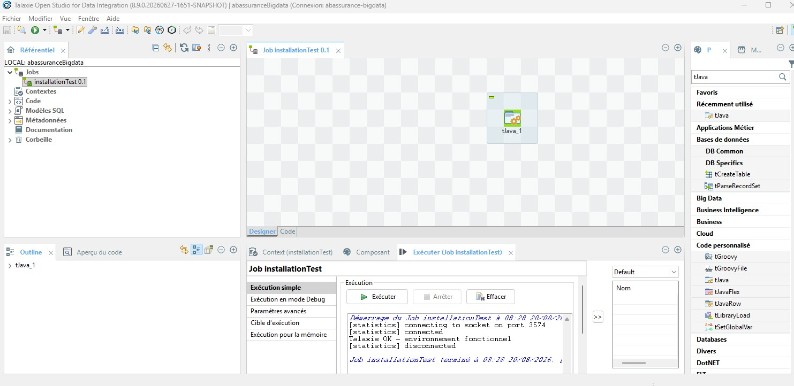

### Kafka et Hadoop

Afin de faciliter l'installation, l'environnement a été mis en place via un container Docker (fichier `docker-compose.yaml` avec les images de Kafka et Hadoop).

Preuve de fonctionnement — containers up :

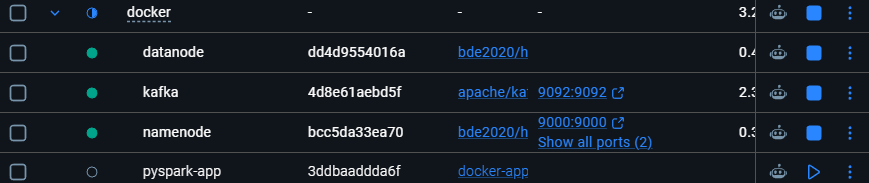

Preuve de fonctionnement — Hadoop accessible :

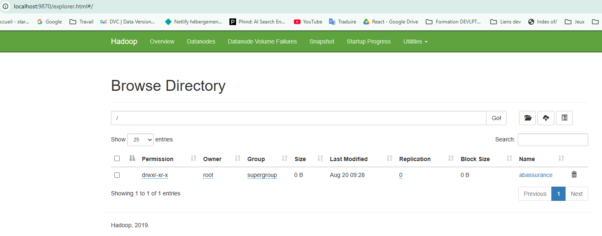

Le dossier nommé `abassurance` créé via la commande de mkdir HDFS est bien visible, confirmant que le NameNode fonctionne correctement.

Preuve de fonctionnement — flux Kafka (production/consommation d'un message) :

```shell
# Terminal 1 — producteur
(.venv) PS C:\xampp\htdocs\Projets\abassurance-bigdata\Docker> docker exec -it kafka /opt/kafka/bin/kafka-console-producer.sh --topic test-abassurance --bootstrap-server localhost:9092
>test_sinistre_001
>test_sinistre_002

# Terminal 2 — consommateur
(.venv) PS C:\xampp\htdocs\Projets\abassurance-bigdata> docker exec -it kafka /opt/kafka/bin/kafka-console-consumer.sh --topic test-abassurance --bootstrap-server localhost:9092 --from-beginning
test_sinistre_001
test_sinistre_002
```

### Test Spark ↔ Hadoop

Création d'un script pour tester la connexion Spark ↔ Hadoop :

* Il définit l'adresse de l'entrepôt HDFS (`hdfs://namenode:9000`) — comme une adresse postale que Spark va utiliser pour trouver le service Hadoop sur le réseau Docker.
* Il démarre Spark en lui disant « par défaut, va stocker/chercher tes fichiers sur cet entrepôt HDFS » (la ligne `spark.hadoop.fs.defaultFS`).
* Il écrit un petit tableau de données factices (2 clients) au format Parquet sur HDFS.
* Il relit ce même fichier depuis HDFS et l'affiche — si ça marche, ça prouve que Spark et Hadoop communiquent bien dans les deux sens.

Résultat du test :

```shell
(.venv) PS C:\xampp\htdocs\Projets\abassurance-bigdata\Docker> docker compose run --rm app python test_hadoop_spark.py
[+] Running 3/3
 ✔ Container namenode Running
 ✔ Container kafka    Running
 ✔ Container datanode Running
Container docker-app-run-dc0ee55e32a1 Creating
Container docker-app-run-dc0ee55e32a1 Created
WARNING: Using incubator modules: jdk.incubator.vector
Using Spark's default log4j profile: org/apache/spark/log4j2-defaults.properties
Setting default log level to "WARN".
26/08/20 08:02:51 WARN NativeCodeLoader: Unable to load native-hadoop library for your platform... using builtin-java classes where applicable
>>> Ecriture d'un DataFrame de test sur HDFS...
>>> Ecriture terminee sur hdfs://namenode:9000/abassurance/test/spark_test.parquet
>>> Relecture depuis HDFS...
+---+-------------+-------+
| id|   client_ref| statut|
+---+-------------+-------+
|  2|AB_CLIENT_002|resilie|
|  1|AB_CLIENT_001|  actif|
+---+-------------+-------+

>>> TEST SPARK <-> HADOOP REUSSI
```

## Problèmes rencontrés & résolutions

Cette section documente les principaux incidents rencontrés lors de la mise en place de l'environnement, la démarche de diagnostic suivie, et la correction apportée — dans une logique d'amélioration continue.

### 1. Talaxie : caractères accentués dans le chemin d'installation

**Symptôme** : erreur au démarrage `Cannot read the array length because "jetFiles" is null`.

**Diagnostic** : le moteur Eclipse/Equinox sur lequel repose Talaxie ne supporte pas les caractères accentués dans le chemin d'installation lors de l'énumération de ses plugins internes.

**Cause identifiée** : le dossier d'installation contenait un accent (`E:\Important Aurélie\...`).

**Correction** : déplacement de l'installation vers un chemin sans accent ni espace (`C:\Talaxie\`).

### 2. Talaxie : incompatibilité avec le JDK système (Java 25)

**Symptôme** : `Exception in thread "org.talend.sdk.component.studio.ProcessManager-server"` puis `InaccessibleObjectException: Unable to make java.lang.invoke.MethodHandles$Lookup(...) accessible`.

**Diagnostic** : le « Component Server » interne de Talaxie utilise la réflexion Java pour charger dynamiquement ses composants. Le système de modules strict introduit par les versions récentes de Java (25) bloque ces accès par défaut.

**Correction** :
- Installation d'un JDK 21 (Eclipse Temurin) dédié, sans modifier le JDK système.
- Configuration du fichier `.ini` de Talaxie pour forcer l'utilisation de ce JDK 21 via l'option `-vm`.
- Ajout d'options `--add-opens` (`java.lang`, `java.lang.invoke`, `java.util`, `java.io`, `java.net`, `sun.nio.ch`) dans les `-vmargs` du fichier `.ini`, pour autoriser explicitement les accès par réflexion nécessaires au moteur de génération de code (JET).

### 3. Talaxie : build Maven en mode hors-ligne

**Symptôme** : `Cannot access central (https://repo1.maven.org/maven2/) in offline mode`, lors de l'exécution d'un job.

**Diagnostic** : Talaxie utilise Maven en interne pour compiler chaque job en code Java exécutable. Le mode « Work offline » de Maven, activé par défaut, empêchait le téléchargement du plugin `maven-jar-plugin` nécessaire à la compilation.

**Correction** : désactivation du mode hors-ligne dans **Window → Preferences → Maven → décocher « Work offline »**.

### 4. Hadoop : namenode et datanode ne démarrent pas dans Docker

**Symptôme** : `Invalid URI for NameNode address (check fs.defaultFS): file:/// has no authority`, puis le datanode échoue avec `No services to connect, missing NameNode address`.

**Diagnostic** : l'image Docker officielle `apache/hadoop:3` démarre avec une configuration minimale par défaut (`fs.defaultFS=file:///`), sans configuration réseau HDFS. Le namenode refuse donc de démarrer, et le datanode n'a personne à qui se connecter.

**Correction** : remplacement par les images `bde2020/hadoop-namenode` et `bde2020/hadoop-datanode`, qui acceptent une configuration simplifiée par variables d'environnement (`CORE_CONF_fs_defaultFS=hdfs://namenode:9000`), sans avoir à écrire manuellement les fichiers XML de configuration Hadoop.

### 5. Docker : fichier introuvable dans le conteneur après ajout

**Symptôme** : `python: can't open file '/app/test_hadoop_spark.py': [Errno 2] No such file or directory`, alors que le fichier existait bien sur le poste.

**Diagnostic** : l'image Docker n'est pas synchronisée en continu avec le système de fichiers local — elle capture un instantané des fichiers uniquement au moment du `docker build` (instruction `COPY . .`). Le fichier avait été ajouté après le dernier build.

**Correction** : rebuild explicite de l'image (`docker compose build app`) après chaque ajout de fichier nécessaire à l'exécution.

## Création d'un dataset

La création du dataset servira à la fois pour tester le pipeline et pour illustrer concrètement les bonnes pratiques de data cleaning. Les données sont générées avec Faker (voir README pour les commandes d'installation et de lancement de `generate_dataset.py`).

### Inventaire des bases de données

**Structure de tableau proposée** — une ligne par table, groupée par système source :

| Système source | Table | Nb colonnes | Clé primaire | Clés étrangères / relations | Volume réel estimé (prod) | Volume jeu de dev |
|---|---|---|---|---|---|---|
| AbAssurance (Oracle) | AB_CLIENT | 10 | AB_CLIENT_ID | — (entité racine) | ~12 M lignes | 200 lignes |
| AbAssurance (Oracle) | AB_CONTRAT | 7 | AB_POLICY_NUMBER | AB_CLIENT_ID → AB_CLIENT | à estimer (~1,3 contrat/client) | 300 lignes |
| AbAssurance (Oracle) | AB_SINISTRE | 5 | AB_CLAIM_ID | AB_POLICY_NUMBER → AB_CONTRAT | à estimer | 62 lignes |
| AbAssurance (Oracle) | AB_PAIEMENT | 5 | AB_PAYMENT_ID | AB_POLICY_NUMBER → AB_CONTRAT | à estimer | 1 051 lignes |
| AssurePlus (SQL Server) | AP_USERS | 10 | AP_USER_ID | — (entité racine) | ~5 M lignes | 100 lignes |
| AssurePlus (SQL Server) | AP_CONTRACTS | 8 | AP_CONTRACT_REF | AP_USER_ID → AP_USERS | à estimer | 148 lignes |
| AssurePlus (SQL Server) | AP_CLAIMS | 7 | AP_SINISTRE_NUM | AP_CONTRACT_REF → AP_CONTRACTS | à estimer | 38 lignes |
| AssurePlus (SQL Server) | AP_PAYMENTS | 6 | AP_PAYMENT_REF | AP_CONTRACT_REF → AP_CONTRACTS | à estimer | 527 lignes |

Les volumes de production sont estimés à partir de la présentation de l'entreprise. Les tables filles (contrats, sinistres, paiements) sont estimées par un ratio moyen [x contrats/client], en l'absence de données réelles disponibles.

Les relations entre les tables sont définies dans la section « Les modèles conceptuels de données (MCD) de AssurePlus et AbAssurance ».

## US 1.2 Extraction Oracle

Les données du dataset ont été générées par un script avec Faker afin de simuler une extraction.

Étapes de création du job dans Talaxie :

1. **Lire le CSV source (`tFileInputDelimited`)** : création d'un nouveau job `extraction_ab_client` dans Talaxie (correspond à la branche `feature/US1.2-extraction-oracle`). Glisser un composant `tFileInputDelimited` depuis la palette, et le pointer vers le fichier `ab_client.csv` généré par `generate_dataset.py`. Définir le schéma des colonnes (`ab_client_id`, `ab_nom`, `ab_prenom`, etc.) manuellement.

2. **Écrire le résultat standardisé (`tFileOutputDelimited`)** : un `tFileOutputDelimited` écrit le résultat standardisé dans `output/ab_assurance_extract_talaxie/ab_assurance_extract_client.csv`. Relier `tFileInputDelimited_1` vers ce composant (clic droit → Ligne → Main → clic sur `tFileOutputDelimited`). Définir le chemin de sortie en zone de staging. Cocher « Inclure l'en-tête » pour que le fichier garde les noms de colonnes `ab_*` — utile pour la lisibilité et pour que l'US suivante (nettoyage) puisse relire ce fichier facilement. Vérifier que l'encodage est bien UTF-8.

3. **Exécuter et valider** : exécution du job, puis ouverture du fichier généré pour confirmer le nombre de lignes pour chaque table extraite, avec les accents corrects.

Capture d'écran des jobs :


## US 1.3 Extraction SQL Server

Le processus reste le même en utilisant les CSV de AssurePlus.

Capture d'écran des jobs :


Talaxie a repéré des anomalies dans les formats de date de l'export CSV de la table `users`. Le format était `jj/mm/YYYY` au lieu de `YYYY-mm-dd`.

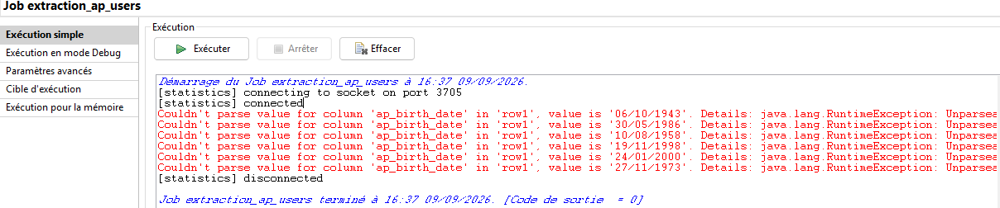

## US 1.4 Contrôle du nombre d'enregistrements

Le journal d'extraction se trouve dans `/data/logs/controle_extraction.csv`.

Pour AssurePlus, la table Users contient une anomalie : six lignes ont été ignorées à cause du format de date non conforme.

Pour que l'extraction soit sans perte, j'ai modifié le schéma : pour le champ `ap_birth_date`, j'ai mis le type `string` au lieu de `date`, avec un modèle `YYYY-mm-dd`.

Après avoir relancé le contrôle, le résultat est le suivant :

```shell
2026-09-11 10:37:50,AssurePlus,AP_USERS,100,100,0,OK
```

## US 2.1 Nettoyage des données

### Règle de nettoyage :

Les règles sont définis dans le fichier [`regles_nettoyage.md`](./regles_nettoyage.md).

### Configuration de Talaxie pour le nettoyage de données

#### Doublons

1. Configurer tUniqRow sur ab_client_id
Dans le job nettoyage_ab_client, placer un tUniqRow juste après le tFileInputDelimited.
Dans ses paramètres, cocher uniquement ab_client_id comme clé de comparaison (les autres colonnes restent décochées) — c'est la clé primaire, deux lignes avec le même ab_client_id sont par définition un doublon technique, quel que soit le contenu des autres champs.

2. Brancher les deux sorties (Uniques / Doublons)
tUniqRow expose deux sorties distinctes visibles quand on tire une ligne depuis le composant : 'Uniques' (lignes gardées, une par clé) et 'Doublons' (lignes rejetées).
Relier 'Uniques' vers la suite du pipeline (le futur tMap), et 'Doublons' vers un tFileOutputDelimited séparé : data/rejects/oracle/ab_client_doublons.csv.
Rien ne doit disparaître sans laisser de trace, même les doublons rejetés.

3. Tester avec un doublon injecté volontairement
Sur les jeux de données générés par Faker, il est probable qu'il n'y ait aucun vrai doublon (Faker génère des ID séquentiels propres).
Pour valider concrètement que tUniqRow fonctionne (et pas juste 'zéro doublon car aucun test réel'), il faut dupliquer manuellement une ligne dans une copie de test du CSV, relancer le job sur ce fichier de test, et vérifier que le doublon atterrit bien dans ab_client_doublons.csv et pas dans le fichier propre.

 ---

Exemple avec le nettoyage de la table client pour abassurance avec l'ajout de 2 doublons (Id 1 et 5) afin de s'assurer que le nettoyage fonctionne.
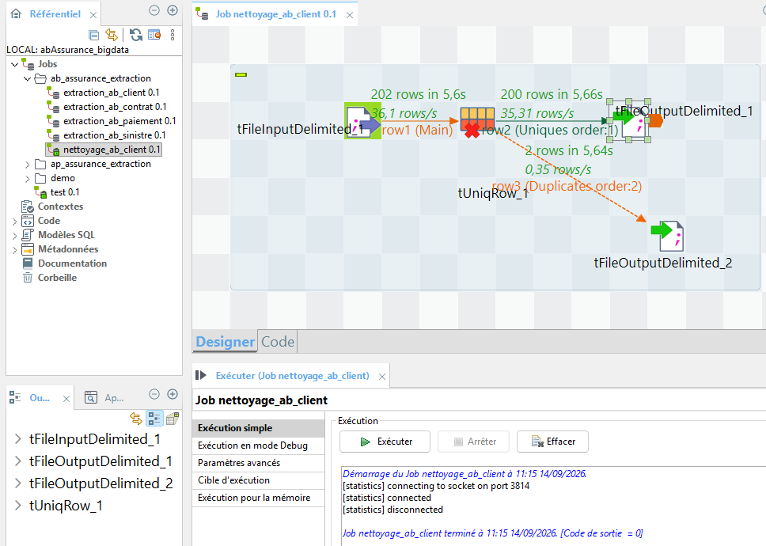

Les fichiers d'exctration sont dans ./data/output/ab_assurance_extract_talaxie/ab_assurance_nettoye/ab_assurance_extract_client_clean
Et pour l'extraction des doublons : ./data\output\doublons\ab_client_doublons.

Pour l'exemple, j'ai fais de même pour AssurePlus. Il y a deux doublons, un pour la table users (ID 1) et l'autre pour la table contracts (ID : AP-AP-000147).

#### Routine data Cleaning

Afin de nettoyer les anomalies des données : format de date, format d'email,téléphone maquant.

J'utilise un composant tJavaRow pour appliquer ma routine Java à chaque ligne. La routine centralise les règles de nettoyage. Une fois les données nettoyées, je passe par tUniqRow pour supprimer les doublons, puis j'exporte le résultat dans un nouveau fichier CSV.

Je developpe le code routine afin de nettoyer les données.

```java
package routines;

import java.text.SimpleDateFormat;
import java.util.Date;

public class DataCleaning {

	/**
     * Nettoie une chaîne de caractères.
     * Supprime les espaces inutiles.
     * Transforme une valeur vide en null.
     */
    public static String nettoyerTexte(String valeur) {

        if (valeur == null) {
            return null;
        }

        valeur = valeur.trim();

        if (valeur.isEmpty()) {
            return null;
        }

        return valeur;
    }

    /**
     * Nettoie une adresse email.
     * Vérifie qu'elle contient bien un @ et un point.
     */
    public static String nettoyerEmail(String email) {

        if (email == null) {
            return null;
        }

        email = email.trim().toLowerCase();

        // Email vide
        if (email.isEmpty()) {
            return null;
        }

        
        // Correction d'un email mal écrit 
        if (email.contains("_at_")) { 
        	email = email.replace("_at_", "@"); 
        }

        // Vérification simple de l'email
        if (!email.contains("@") || !email.contains(".")) {
            return null;
        }

        return email;
    }

    /**
     * Nettoie un numéro de téléphone.
     * Supprime les espaces au début et à la fin.
     * Une valeur vide devient null.
     */
    public static String nettoyerTelephone(String telephone) {

        if (telephone == null) {
            return null;
        }

        telephone = telephone.trim();

        if (telephone.isEmpty()) {
            return null;
        }

        return telephone;
    }


    /**
     * Nettoie et uniformise une date, avec un format de sortie choisi.
     *
     * Formats d'entrée acceptés :
     * - yyyy-MM-dd
     * - dd/MM/yyyy
     * - yyyy-MM-dd HH:mm:ss
     *
     * @param date la date brute à nettoyer
     * @param formatSortie le format souhaité en sortie (ex: "yyyy-MM-dd" ou "yyyy-MM-dd HH:mm:ss")
     */
    public static String normaliserDate(String date, String formatSortie) {

        if (date == null) {
            return null;
        }

        date = date.trim();

        if (date.isEmpty()) {
            return null;
        }

        String[] formats = {
            "yyyy-MM-dd HH:mm:ss",
            "yyyy-MM-dd",
            "dd/MM/yyyy"
        };

        for (String format : formats) {

            try {

                SimpleDateFormat formatEntree =
                    new SimpleDateFormat(format);

                formatEntree.setLenient(false);

                Date dateConvertie =
                    formatEntree.parse(date);

                SimpleDateFormat formatSortieFinal =
                    new SimpleDateFormat(formatSortie);

                return formatSortieFinal.format(dateConvertie);

            } catch (Exception e) {
                // Format suivant testé automatiquement
            }
        }

        return null;
    }


    /**
     * Nettoie un montant.
     * Une valeur vide ou incorrecte devient null.
     */
    public static Double nettoyerMontant(String montant) {

        if (montant == null) {
            return null;
        }

        montant = montant.trim();

        if (montant.isEmpty()) {
            return null;
        }

        try {

            return Double.parseDouble(montant);

        } catch (NumberFormatException e) {

            return null;
        }
    }

    
    
}

```

Dans code de tJavaRow, j'appel pour les champs la méthode concernée.

```java
// Code générer selon le schéma client de AbAssurance
output_row.AB_CLIENT_ID = input_row.AB_CLIENT_ID;

output_row.AB_NOM =
    DataCleaning.nettoyerTexte(input_row.AB_NOM);

output_row.AB_PRENOM =
    DataCleaning.nettoyerTexte(input_row.AB_PRENOM);

output_row.AB_DATE_NAISSANCE =
    DataCleaning.normaliserDate(input_row.AB_DATE_NAISSANCE);

output_row.AB_EMAIL =
    DataCleaning.nettoyerEmail(input_row.AB_EMAIL);

output_row.AB_TELEPHONE =
    DataCleaning.nettoyerTelephone(input_row.AB_TELEPHONE);

output_row.AB_ADRESSE =
    DataCleaning.nettoyerTexte(input_row.AB_ADRESSE);

output_row.AB_CODE_POSTAL =
    DataCleaning.nettoyerTexte(input_row.AB_CODE_POSTAL);

output_row.AB_NUM_FISCAL =
    DataCleaning.nettoyerTexte(input_row.AB_NUM_FISCAL);

output_row.AB_DATE_CREATION =
DataCleaning.normaliserDate(input_row.AB_DATE_CREATION, "yyyy-MM-dd HH:mm:ss");

output_row.AB_STATUT_CLIENT =
    DataCleaning.nettoyerTexte(input_row.AB_STATUT_CLIENT);
```

```java
//Code généré selon les schémas d'entrée et de sortie pour AssurePlus
output_row.ap_user_id = input_row.ap_user_id;
output_row.ap_full_name = DataCleaning.nettoyerTexte(input_row.ap_full_name);

output_row.ap_birth_date = DataCleaning.normaliserDate(input_row.ap_birth_date);

output_row.ap_mail_address = DataCleaning.nettoyerEmail(input_row.ap_mail_address);

output_row.ap_phone_number = DataCleaning.nettoyerTelephone(input_row.ap_phone_number);

output_row.ap_street_address =  DataCleaning.nettoyerTexte(input_row.ap_street_address);

output_row.ap_zip_code = DataCleaning.nettoyerTexte(input_row.ap_zip_code);

output_row.ap_created_at = DataCleaning.normaliserDate(input_row.ap_created_at, "yyyy-MM-dd HH:mm:ss");

output_row.ap_customer_status = DataCleaning.nettoyerTexte(input_row.ap_customer_status);

output_row.ap_loyalty_score = input_row.ap_loyalty_score;

```

Le rapport d'anomalie, confirme que les seules lignes rejetées sont les doublons. Les données incorrectes ont été corrigés.

#### Fusionner les données

L'objectif est de transformer les données nettoyées AB_CLIENT (Oracle) et AP_USERS (SQL Server) vers le schéma cible commun client_commun, avec détection et fusion des doublons inter-systèmes (même client existant dans les deux bases)

Étapes de construction
1. Lecture des sources nettoyées : deux tFileInputDelimited, un par système, pointant vers les sorties d'US2.1 (ab_client_cleaned.csv, ap_users_cleaned.csv) — pas les fichiers bruts extraits.

2. Mapping vers le schéma commun : implémenté en tJavaRow (et non tMap, suite à une instabilité du tMap sur cette version de Talaxie — schéma/expressions réinitialisés silencieusement au clic sur OK). Un tJavaRow par source, assignant explicitement les 10 champs du schéma cible (client_id, nom_prenom, date_naissance, email, telephone, adresse, code_postal, num_fiscal, date_creation, statut_client, loyalty_score).

3. Fusion des deux flux : tUnite_1, avec le flux AbAssurance connecté en premier (l'ordre conditionne la priorité lors du dédoublonnage à l'étape 5).

4. Détection des doublons inter-systèmes : tUniqRow sur la clé email, appliqué uniquement aux lignes avec email présent.

5. Une sortie pour les données. Pour les clients, il y a deux sorties, une pour les donées correctses et sans doublons et une autre pour les doublons.

6. Journalisation : tJava déclenché en OnComponentOk, écrivant une ligne récapitulative dans journal_transformation.csv.

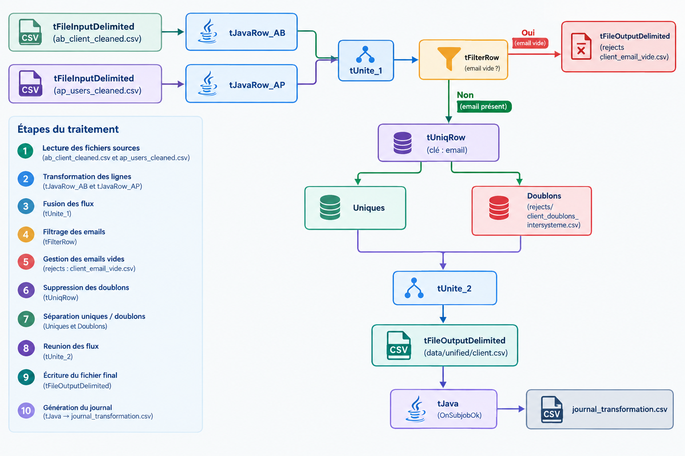

Le canvas Talaxie :

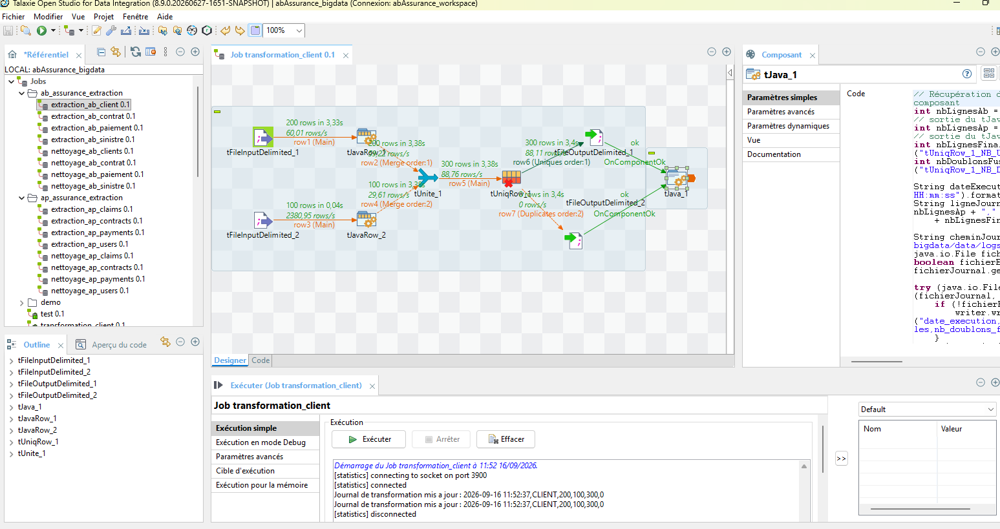

***Bugs rencontrés et corrections.***
tMap : schéma de sortie vidé au clic sur OK Version Talaxie snapshot (V8.9.0-SNAPSHOT) instable sur ce composant.
Diagnostic : Expressions perdues silencieusement sans message d'erreur.
Correction : Remplacement du tMap par un tJavaRow pour toute la transformation.

Décision client_id : String ("AB-"/"AP-") vs Integer.
Diagnostic : Le schéma officiel typait client_id en Integer, incompatible avec un préfixe texte.
Correction : Modification du type de client_id dans le schéma commun (Métadonnées) de Integer vers String, propagée aux jobs.

#### US 3.2 — Publication des données transformées vers Kafka

1. Télécharger le composant Kafka dans Talaxie. Il permet de réutiliser cette config Kafka dans tous les jobs sans la reconfigurer à chaque fois. Appelé ce composant via un tLibraryLoad.
2. Comme tKafkaOutput n'existe pas dans Talaxie, j'utilise le client Kafka Java directement (KafkaProducer) dans tJavaRow. Je créé un nouveau job avec le tLabraryLoad -> tInputDelimited->tJavaFlex->tOutputDelimieted à la fin de chacun des jobs afin d'aoir un fichier et pouvoir comparer le nombre de ligne avec le nombre de message dans Kafka pour chaque.
3. Format du message : comme évoqué dans la doc, il faut décider maintenant JSON ou Avro. Vu le contexte académique/projet, je pars sur JSON simple pour cette US — plus rapide à mettre en place, suffisant pour valider le flux.
4. Vérification du non-perte de données : compter les lignes en entrée (via tJavaRow + globalMap) et comparer avec le nombre de messages reçus côté consumer (kafka-console-consumer avec --from-beginning puis compter, ou via Kafka UI qui affiche le nombre de messages par topic/partition).
5. Mesure du temps de latence.

Exemple d'un job pour la transmission des messages dans kafka.

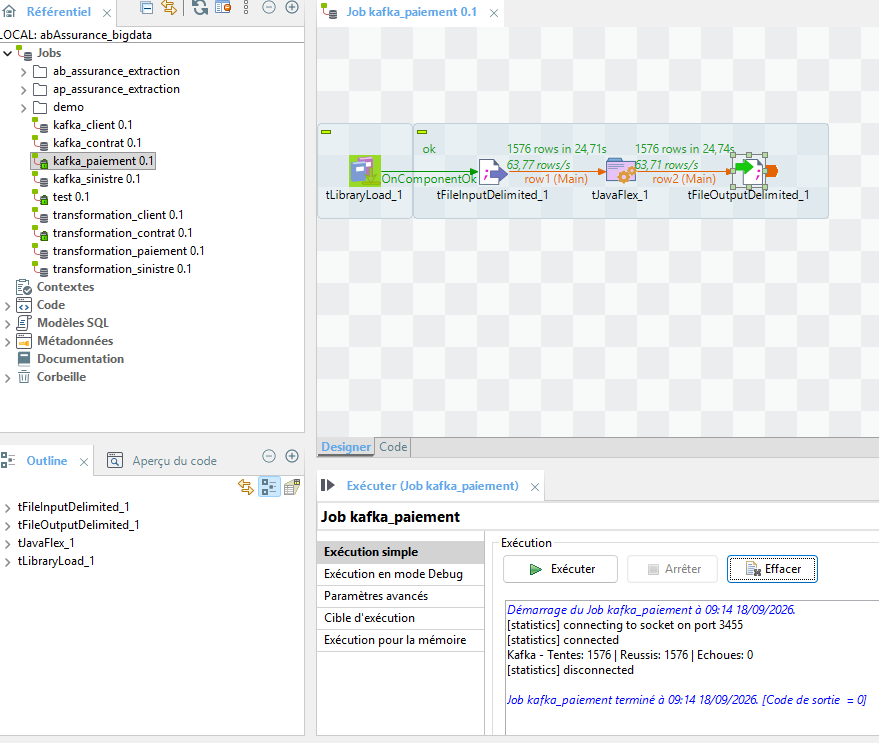

Exemple dans Kafka UI

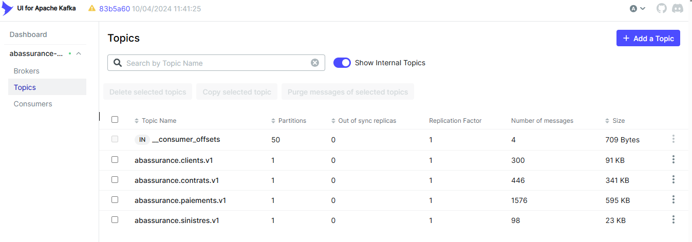

La documentation du nombre de ligne et le temps de transmission est dans le fichier [`transmission_kafka.csv`](../data/logs/transmission_kafka.csv).

#### US 3.3 — Synchronisation pendant la phase de transition

Les bases sources Oracle/SQL Server sont simulées via des jeux de données statiques (Faker), il n'existe pas de flux de modifications en direct à synchroniser — l'US3.3 ne peut donc pas être testée dans les conditions réelles décrites par les critères d'acceptation.

Théoriquement, il fadrait mettre en place des connecteurs entre les bases de données Oracle / Sql Server et Kafka Connect, pour capter les modifications au fil de l'eau plutôt qu'en extraction batch.


#### US 4.1 Installer l'espace de stockage centralisé

Mise en place du cluster Hadoop HDFS comme espace de stockage centralisé
pour les données AbAssurance/AssurePlus, avant intégration Kafka -> HDFS (US4.2).

1. Ajout d'un 2ᵉ conteneur datanode dans le docker-compose (le cluster n'en comptait qu'un seul), avec dfs.replication=2, pour permettre une réplication réelle des blocs sur plusieurs serveurs.
2. Retrait de l'exposition host des ports HDFS (9870, 9000) : le namenode/datanodes ne sont plus accessibles que depuis le réseau Docker interne
(conteneur "app" uniquement), pour restreindre l'accès aux seules composantes autorisées du pipeline.
3. Validation du cluster : ``docker exec namenode hdfs dfsadmin -report`` (2 datanodes "Live", cluster opérationnel).
4. Création de l'arborescence du data lake : /data/Kafka/{clients,contrats, paiements,sinistres} pour les données brutes issues de Kafka, /data/clean pour les données nettoyées destinées à l'analyse (US5.1).

```shell
docker exec -it namenode hdfs dfs -mkdir -p /data/kafka/clients
docker exec -it namenode hdfs dfs -mkdir -p /data/kafka/contrats
docker exec -it namenode hdfs dfs -mkdir -p /data/kafka/paiements
docker exec -it namenode hdfs dfs -mkdir -p /data/kafka/sinistres
docker exec -it namenode hdfs dfs -mkdir -p /data/clean
```

5.Test d'écriture/lecture Parquet sur cette arborescence via PySpark pour valider le bon fonctionnement du stockage.

```python
df = spark.createDataFrame([("test", 1)], ["nom", "valeur"])
df.write.mode("overwrite").parquet("hdfs://namenode:9000/data/raw/contrats/_test")
spark.read.parquet("hdfs://namenode:9000/data/raw/contrats/_test").show()
```

Critères d'acceptation :

1. Serveur Hadoop installé et fonctionnel -> OK (2 datanodes live, testé)

2. Duplication automatique multi-serveurs -> OK (2 datanodes, replication=2)

3. Espace prévu vs volumes estimés (US1.1) -> OK : dossier des extractions sources actuel = 1,05 Mo (1 106 712 octets), largement couvert par l'espace disque alloué aux volumes Docker (plusieurs Go disponibles)

4. Accès restreint aux personnes autorisées -> Partiellement couvert :

* ports HDFS non exposés au host (accès limité au réseau Docker interne).
* Une authentification forte (Kerberos + Apache Ranger) serait la solution de production, non implémentée ici par simplification.

#### US4.2 — Stocker les données reçues de Kafka dans (Hadoop)

Mise en place de 4 jobs Spark Structured Streaming (un par topic Kafka :
contrats, paiements, sinistres, clients) consommant en continu les messages
publiés par Talaxie et les écrivant au format Parquet dans HDFS.

* Développement de 4 scripts PySpark Structured Streaming (streaming_contrats.py, streaming_paiements.py, streaming_sinistres.py, streaming_clients.py), un par topic, avec un schéma JSON dédié par type de donnée (contrat, paiement, sinistre, client).
* Ajout du connecteur spark-sql-kafka-0-10 (et ses dépendances kafka-clients, spark-token-provider-kafka-0-10) téléchargés au build de l'image Docker via curl et chargés dans la SparkSession via spark.jars, la version pyspark installée ne l'incluant pas nativement.
* Organisation des dossiers HDFS en deux zones : /data/kafka/topic pour les données brutes reçues de Kafka, /data/clean pour les futures données nettoyées (répond au critère 2 : "dossiers organisés brutes/nettoyées").
* Gestion de checkpoints HDFS dédiés par topic (/data/checkpoints/topic`) pour permettre une reprise sans duplication en cas de redémarrage du job.

Incident traversé: un problème de permissions sur le volume Docker du broker Kafka (AccessDeniedException, utilisateur non-root du conteneur vs volume créé par root) a provoqué une perte des topics et de leur contenu ; corrigé via chown sur le volume, topics recréés, données republiées depuis Talaxie.

Le nombre de données stockées correspond au nombre de données extraites au départ (aucune perte) :

Capture d'écran pour client :

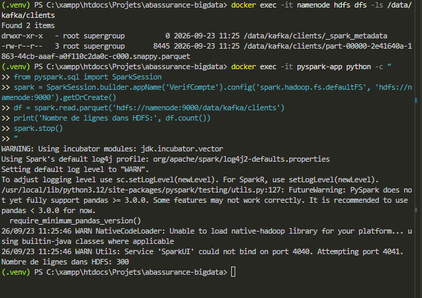

Dans Kafka, il a bien 

Capture d'écran pour contrats :

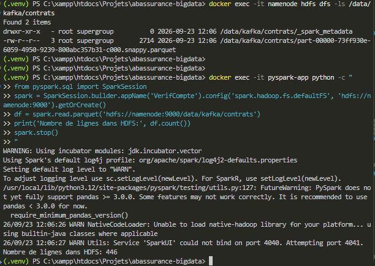

Capture d'écran pour paiements :

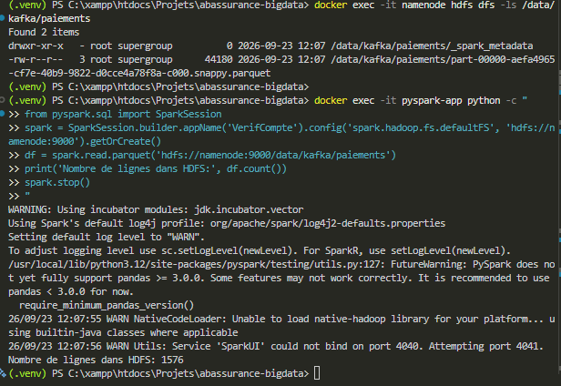

Capture d'écran pour sinistres :

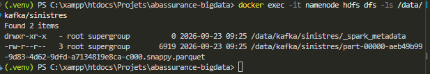
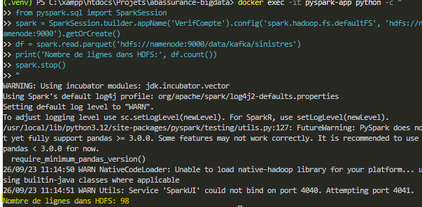

Pour chaque topics, le nombre de ligne correspond bien :

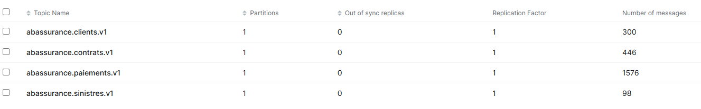

***Résultat dans Hadoop***

```shell
(.venv) PS C:\xampp\htdocs\Projets\abassurance-bigdata> docker exec -it namenode hdfs dfs -ls /data/kafka/clients
>> docker exec -it namenode hdfs dfs -ls /data/kafka/contrats
>> docker exec -it namenode hdfs dfs -ls /data/kafka/paiements
>> docker exec -it namenode hdfs dfs -ls /data/kafka/sinistres
Found 2 items
drwxr-xr-x   - root supergroup          0 2026-09-23 11:25 /data/kafka/clients/_spark_metadata
-rw-r--r--   3 root supergroup       8445 2026-09-23 11:25 /data/kafka/clients/part-00000-2e41640a-1863-44cb-aaaf-a0f110c2da0c-c000.snappy.parquet
Found 2 items
drwxr-xr-x   - root supergroup          0 2026-09-23 12:06 /data/kafka/contrats/_spark_metadata
-rw-r--r--   3 root supergroup       2714 2026-09-23 12:06 /data/kafka/contrats/part-00000-73ff930e-6059-4950-9239-800abc357b31-c000.snappy.parquet
Found 2 items
drwxr-xr-x   - root supergroup          0 2026-09-23 12:07 /data/kafka/paiements/_spark_metadata
-rw-r--r--   3 root supergroup      44180 2026-09-23 12:07 /data/kafka/paiements/part-00000-aefa4965-cf7e-40b9-9822-d0cce4a78f8a-c000.snappy.parquet
Found 2 items
drwxr-xr-x   - root supergroup          0 2026-09-23 09:25 /data/kafka/sinistres/_spark_metadata
-rw-r--r--   3 root supergroup       6919 2026-09-23 09:25 /data/kafka/sinistres/part-00000-aeb49b99-9d83-4d62-9dfd-a7134819e8ca-c000.snappy.parquet
```

Exemple du fichier sinistres :

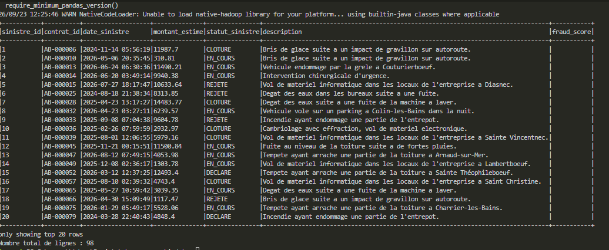


#### US4.3 Proteger les données  sensibles stockées

Ceci est une partie lourde et qui demande du temps. je vais lister ce qu'il faudrait faire.

>Ce qu'il faudrait implémenter :

*Critère 1* — chiffrer les champs les plus sensibles (num_fiscal, email, telephone, adresse du topic clients) avant écriture dans HDFS, plutôt que de configurer un chiffrement natif HDFS (Transparent Data Encryption) qui demande une gestion de clés KMS complexe. Ça se fait directement dans le script streaming_clients.py, avec une librairie de chiffrement symétrique simple :

```python
from cryptography.fernet import Fernet
# clé générée une fois et stockée en variable d'environnement
```

*Critère 2* — accès par rôle : un groupe Unix "dev" qui n'a pas accès en lecture au dossier /data/kafka/clients contenant les données sensibles, contre un groupe "analyste" qui y a accès. C'est un vrai mécanisme fonctionnel.

*Critère 3* — audit des connexions : HDFS dispose d'un audit log natif (hdfs-audit.log) censé tracer les opérations de lecture/écriture par utilisateur. Tentative d'activation réalisée : modification de
log4j.properties (NullAppender -> RFAAUDIT), config confirmée rechargée au démarrage du namenode. Cependant, le fichier généré reste vide malgré
des opérations de consultation réelles, sans cause identifiée dans le
temps imparti. En conditions de production, ce mécanisme serait de toute façon complété par une solution plus robuste.
(Apache Ranger avec ses plugins d'audit).

#### US 5.1 Analyser les données pour produire des rapports

Pour pouvoir facilité l'analyse, il faut développer un tableau de bord.
Pour cela j'ai choisi l'outils Streamlit. Il s'intègre bien avec PySpark pour lire du Parquet depuis Hadoop, et plus simple a mettre en place qu'un framework comme Flask ou Django.

##### Installation de Streamlit

```shell
python -m pip install streamlit

# Vérifier l'installation
streamlit --version

# Ajouter au requirements.txt
streamlit==1.64.0
```

Création d'une architecture :

abassurance-bigdata/
│
├── .venv/
├── data/
├── Documentations/
├── src/
│   ├── pipeline/
│   └── prediction/
│
├── app/
│   └── app.py
├── Docker/
│   ├── docker-compose.yml/
├   |──Dockerfile/
│   └──requirements.txt
|
└── README.md

Je modifie le Dockerfile afin qu'il lance Streamlit : 

```dockerfile
CMD ["streamlit", "run", "app/app.py", "--server.address=0.0.0.0", "--server.port=8501"]
```

J'ajoute le port dans le docker-compose.yml

```yaml
  app:
    build:
      context: ..
      dockerfile: Docker/Dockerfile
    container_name: pyspark-app
    ports:
      - "8501:8501"
    depends_on:
      - namenode
      - datanode
      - datanode2
      - kafka
    environment:
      - SPARK_LOCAL_IP=127.0.0.1
    networks:
      - bigdata
```


# Journal technique — abassurance-bigdata

Ce document détaille les choix techniques, leurs justifications, les problèmes rencontrés et leur résolution, ainsi que l'avancement des User Stories du projet. Pour les instructions d'installation et d'exécution, voir le [`README.md`](./README.md).

## Choix du framework Python

Le projet utilise **PySpark** comme framework Python principal.

PySpark a été choisi car il permet d'utiliser Apache Spark depuis Python pour effectuer des traitements distribués sur de grands volumes de données. Il est particulièrement adapté à l'architecture du projet, qui repose sur Hadoop pour le stockage et Spark pour le traitement des données.

La version de Python 3.14 est supportée par PySpark 4.2.0 et donc par Apache Spark.

### Validation initiale de l'installation

Test de PySpark dans un container Docker afin de vérifier son installation et son exécution (voir README pour les commandes). Ce test a permis de confirmer que l'environnement Docker était correctement configuré avant de commencer le développement du pipeline.


## Les modèles conceptuels de données (MCD) de AssurePlus et AbAssurance

### AbAssurance


> AB_CLIENT ( ab_client_id, ab_nom, ab_prenom, ab_date_naissance, ab_email, ab_telephone, ab_adresse, ab_code_postal, ab_num_fiscal, ab_date_creation, ab_statut_client )
> Le champ ab_client_id constitue la clé primaire de la table. C'était déjà un identifiant de l'entité AB_CLIENT.
> Les champs ab_nom, ab_prenom, ab_date_naissance, ab_email, ab_telephone, ab_adresse, ab_code_postal, ab_num_fiscal, ab_date_creation et ab_statut_client étaient déjà de simples attributs de l'entité AB_CLIENT.

> AB_CONTRAT ( ab_policy_number, ab_type_assurance, ab_date_debut, ab_date_fin, ab_prime_annuelle, ab_statut_contrat, ab_agence_id, #ab_client_id )
> Le champ ab_policy_number constitue la clé primaire de la table. C'était déjà un identifiant de l'entité AB_CONTRAT.
> Les champs ab_type_assurance, ab_date_debut, ab_date_fin, ab_prime_annuelle, ab_statut_contrat et ab_agence_id étaient déjà de simples attributs de l'entité AB_CONTRAT.
> Le champ ab_client_id est une clé étrangère. Il a migré par l'association de dépendance fonctionnelle SOUSCRIRE à partir de l'entité AB_CLIENT en perdant son caractère identifiant.

> AB_PAIEMENT ( ab_payment_id, ab_date_paiement, ab_montant, ab_mode_paiement, #ab_policy_number )
> Le champ ab_payment_id constitue la clé primaire de la table. C'était déjà un identifiant de l'entité AB_PAIEMENT.
> Les champs ab_date_paiement, ab_montant, ab_mode_paiement étaient déjà de simples attributs de l'entité AB_PAIEMENT.
> Le champ ab_policy_number est une clé étrangère. Il a migré par l'association de dépendance fonctionnelle REGLER à partir de l'entité AB_CONTRAT en perdant son caractère identifiant.

> AB_SINISTRE ( ab_claim_id, ab_date_sinistre, ab_montant_estime, ab_statut_sinistre, ab_description, #ab_policy_number )
> Le champ ab_claim_id constitue la clé primaire de la table. C'était déjà un identifiant de l'entité AB_SINISTRE.
> Les champs ab_date_sinistre, ab_montant_estime, ab_statut_sinistre, ab_description étaient déjà de simples attributs de l'entité AB_SINISTRE.
> Le champ ab_policy_number est une clé étrangère. Il a migré par l'association de dépendance fonctionnelle DECLARER à partir de l'entité AB_CONTRAT en perdant son caractère identifiant.

### AssurePlus


> AP_CLAIMS ( AP_SINISTRE_NUM, AP_INCIDENT_DATE, AP_ESTIMATED_AMOUNT, AP_CLAIM_STATUS, AP_CLAIM_COMMENT, AP_FRAUD_SCORE, AP_CONTRACT_REF 1, #AP_CONTRACT_REF 2 )
> Le champ AP_SINISTRE_NUM constitue la clé primaire de la table. C'était déjà un identifiant de l'entité AP_CLAIMS.
> Les champs AP_INCIDENT_DATE, AP_ESTIMATED_AMOUNT, AP_CLAIM_STATUS, AP_CLAIM_COMMENT, AP_FRAUD_SCORE et AP_CONTRACT_REF 1 étaient déjà de simples attributs de l'entité AP_CLAIMS.
> Le champ AP_CONTRACT_REF 2 est une clé étrangère. Il a migré par l'association de dépendance fonctionnelle DECLARER à partir de l'entité AP_CONTRACTS en perdant son caractère identifiant.

> AP_CONTRACTS ( AP_CONTRACT_REF, AP_PRODUCT_CODE, AP_START_DATE, AP_END_DATE, AP_MONTHLY_PREMIUM, AP_CONTRACT_STATE, AP_BROKER_CODE, AP_USER_ID 1, #AP_USER_ID 2 )
> Le champ AP_CONTRACT_REF constitue la clé primaire de la table. C'était déjà un identifiant de l'entité AP_CONTRACTS.
> Les champs AP_PRODUCT_CODE, AP_START_DATE, AP_END_DATE, AP_MONTHLY_PREMIUM, AP_CONTRACT_STATE, AP_BROKER_CODE et AP_USER_ID 1 étaient déjà de simples attributs de l'entité AP_CONTRACTS.
> Le champ AP_USER_ID 2 est une clé étrangère. Il a migré par l'association de dépendance fonctionnelle SOUSCRIRE à partir de l'entité AP_USERS en perdant son caractère identifiant.

> AP_PAYMENTS ( AP_PAYMENT_REF, AP_PAYMENT_DATETIME, AP_AMOUNT_PAID, AP_PAYMENT_CHANNEL, AP_TRANSACTION_STATUS, AP_CONTRACT_REF 1, #AP_CONTRACT_REF 2 )
> Le champ AP_PAYMENT_REF constitue la clé primaire de la table. C'était déjà un identifiant de l'entité AP_PAYMENTS.
> Les champs AP_PAYMENT_DATETIME, AP_AMOUNT_PAID, AP_PAYMENT_CHANNEL, AP_TRANSACTION_STATUS et AP_CONTRACT_REF 1 étaient déjà de simples attributs de l'entité AP_PAYMENTS.
> Le champ AP_CONTRACT_REF 2 est une clé étrangère. Il a migré par l'association de dépendance fonctionnelle REGLER à partir de l'entité AP_CONTRACTS en perdant son caractère identifiant.

> AP_USERS ( AP_USER_ID, AP_FULL_NAME, AP_BIRTH_DATE, AP_MAIL_ADDRESS, AP_PHONE_NUMBER, AP_STREET_ADDRESS, AP_ZIP_CODE, AP_CREATED_AT, AP_CUSTOMER_STATUS, AP_LOYALTY_SCORE )
> Le champ AP_USER_ID constitue la clé primaire de la table. C'était déjà un identifiant de l'entité AP_USERS.
> Les champs AP_FULL_NAME, AP_BIRTH_DATE, AP_MAIL_ADDRESS, AP_PHONE_NUMBER, AP_STREET_ADDRESS, AP_ZIP_CODE, AP_CREATED_AT, AP_CUSTOMER_STATUS et AP_LOYALTY_SCORE étaient déjà de simples attributs de l'entité AP_USERS.

### Mapping des deux modèles

Le mapping complet est dans le fichier `mapping_donnees.md`.

Exemple de mapping des données :

| Base AbAssurance    | Base AssurePlus       | Modèle cible     |
| ------------------- | --------------------- | ---------------- |
| `AB_CLIENT`         | `AP_USERS`            | `CLIENT`         |
| `AB_CONTRAT`        | `AP_CONTRACTS`        | `CONTRAT`        |
| `AB_SINISTRE`       | `AP_CLAIMS`           | `SINISTRE`       |
| `AB_PAIEMENT`       | `AP_PAYMENTS`         | `PAIEMENT`       |
| `ab_nom`            | `AP_FULL_NAME`        | `nom / prenom`   |
| `ab_email`          | `AP_MAIL_ADDRESS`     | `email`          |
| `ab_telephone`      | `AP_PHONE_NUMBER`     | `telephone`      |
| `ab_date_naissance` | `AP_BIRTH_DATE`       | `date_naissance` |
| `ab_date_debut`     | `AP_START_DATE`       | `date_debut`     |
| `ab_date_fin`       | `AP_END_DATE`         | `date_fin`       |
| `ab_montant_estime` | `AP_ESTIMATED_AMOUNT` | `montant_estime` |
| `ab_date_paiement`  | `AP_PAYMENT_DATETIME` | `date_paiement`  |
| `ab_montant`        | `AP_AMOUNT_PAID`      | `montant`        |

### Justification du modèle cible

Pour construire le modèle cible, je me suis basé sur les deux modèles de données fournis en annexe, AbAssurance et AssurePlus. Comme les deux bases contiennent des informations qui correspondent aux mêmes éléments métier, j'ai regroupé les entités similaires afin d'obtenir un modèle commun.

Par exemple, AB_CLIENT et AP_USERS ont été regroupées dans l'entité CLIENT. De la même manière, AB_CONTRAT et AP_CONTRACTS correspondent à CONTRAT, AB_SINISTRE et AP_CLAIMS à SINISTRE, et AB_PAIEMENT et AP_PAYMENTS à PAIEMENT.

Pour les attributs, j'ai regroupé ceux qui étaient communs aux deux systèmes et j'ai conservé les attributs spécifiques lorsqu'ils apportaient des informations supplémentaires. Les différentes relations entre les entités ont également été conservées afin de garder la logique métier présente dans les deux bases de données.

### MCD final après fusion


> CLIENT ( client_id, nom, prenom, date_naissance, email, telephone, adresse, code_postal, num_fiscal, date_creation, statut_client, loyalty_score )
> Le champ client_id constitue la clé primaire de la table. C'était déjà un identifiant de l'entité CLIENT.
> Les champs nom, prenom, date_naissance, email, telephone, adresse, code_postal, num_fiscal, date_creation, statut_client et loyalty_score étaient déjà de simples attributs de l'entité CLIENT.

> CONTRAT ( contrat_id, type_assurance, code_produit, date_debut, date_fin, prime_annuelle, prime_mensuelle, statut_contrat, etat_contrat, agence_id, code_courtier, client_id 1, #client_id 2 )
> Le champ contrat_id constitue la clé primaire de la table. C'était déjà un identifiant de l'entité CONTRAT.
> Les champs type_assurance, code_produit, date_debut, date_fin, prime_annuelle, prime_mensuelle, statut_contrat, etat_contrat, agence_id, code_courtier et client_id 1 étaient déjà de simples attributs de l'entité CONTRAT.
> Le champ client_id 2 est une clé étrangère. Il a migré par l'association de dépendance fonctionnelle SOUSCRIRE à partir de l'entité CLIENT en perdant son caractère identifiant.

> PAIEMENT ( paiement_id, date_paiement, montant, mode_paiement, statut_transaction, contrat_id 1, #contrat_id 2 )
> Le champ paiement_id constitue la clé primaire de la table. C'était déjà un identifiant de l'entité PAIEMENT.
> Les champs date_paiement, montant, mode_paiement, statut_transaction et contrat_id 1 étaient déjà de simples attributs de l'entité PAIEMENT.
> Le champ contrat_id 2 est une clé étrangère. Il a migré par l'association de dépendance fonctionnelle REGLER à partir de l'entité CONTRAT en perdant son caractère identifiant.

> SINISTRE ( sinistre_id, date_sinistre, montant_estime, statut_sinistre, description, fraud_score, contrat_id 1, #contrat_id 2 )
> Le champ sinistre_id constitue la clé primaire de la table. C'était déjà un identifiant de l'entité SINISTRE.
> Les champs date_sinistre, montant_estime, statut_sinistre, description, fraud_score et contrat_id 1 étaient déjà de simples attributs de l'entité SINISTRE.
> Le champ contrat_id 2 est une clé étrangère. Il a migré par l'association de dépendance fonctionnelle DECLARER à partir de l'entité CONTRAT en perdant son caractère identifiant.

### Relations entre les entités

Le modèle de données final comporte trois relations principales :

* CLIENT — SOUSCRIRE — CONTRAT : relation 1:N. Un client peut souscrire plusieurs contrats, tandis qu'un contrat est rattaché à un seul client.
* CONTRAT — DECLARER — SINISTRE : relation 1:N. Un contrat peut être associé à plusieurs sinistres, tandis qu'un sinistre est rattaché à un seul contrat.
* CONTRAT — REGLER — PAIEMENT : relation 1:N. Un contrat peut être associé à plusieurs paiements, tandis qu'un paiement est rattaché à un seul contrat.

## Choix des outils

### Talend → Talaxie

Talend Open Studio ayant été discontinué par Qlik le 31/01/2024 (plus de distribution officielle gratuite), le projet utilise Talaxie, fork communautaire open source (licence Apache 2.0) assurant la continuité fonctionnelle de l'outil, avec pleine compatibilité des jobs Talend existants.

Preuve de fonctionnement du job de test :


### Kafka et Hadoop

Afin de faciliter l'installation, l'environnement a été mis en place via un container Docker (fichier `docker-compose.yaml` avec les images de Kafka et Hadoop).

Preuve de fonctionnement — containers up :


Preuve de fonctionnement — Hadoop accessible :


Le dossier nommé `abassurance` créé via la commande de mkdir HDFS est bien visible, confirmant que le NameNode fonctionne correctement.

Preuve de fonctionnement — flux Kafka (production/consommation d'un message) :

```shell
# Terminal 1 — producteur
(.venv) PS C:\xampp\htdocs\Projets\abassurance-bigdata\Docker> docker exec -it kafka /opt/kafka/bin/kafka-console-producer.sh --topic test-abassurance --bootstrap-server localhost:9092
>test_sinistre_001
>test_sinistre_002

# Terminal 2 — consommateur
(.venv) PS C:\xampp\htdocs\Projets\abassurance-bigdata> docker exec -it kafka /opt/kafka/bin/kafka-console-consumer.sh --topic test-abassurance --bootstrap-server localhost:9092 --from-beginning
test_sinistre_001
test_sinistre_002
```

### Test Spark ↔ Hadoop

Création d'un script pour tester la connexion Spark ↔ Hadoop :

* Il définit l'adresse de l'entrepôt HDFS (`hdfs://namenode:9000`) — comme une adresse postale que Spark va utiliser pour trouver le service Hadoop sur le réseau Docker.
* Il démarre Spark en lui disant « par défaut, va stocker/chercher tes fichiers sur cet entrepôt HDFS » (la ligne `spark.hadoop.fs.defaultFS`).
* Il écrit un petit tableau de données factices (2 clients) au format Parquet sur HDFS.
* Il relit ce même fichier depuis HDFS et l'affiche — si ça marche, ça prouve que Spark et Hadoop communiquent bien dans les deux sens.

Résultat du test :

```shell
(.venv) PS C:\xampp\htdocs\Projets\abassurance-bigdata\Docker> docker compose run --rm app python test_hadoop_spark.py
[+] Running 3/3
 ✔ Container namenode Running
 ✔ Container kafka    Running
 ✔ Container datanode Running
Container docker-app-run-dc0ee55e32a1 Creating
Container docker-app-run-dc0ee55e32a1 Created
WARNING: Using incubator modules: jdk.incubator.vector
Using Spark's default log4j profile: org/apache/spark/log4j2-defaults.properties
Setting default log level to "WARN".
26/08/20 08:02:51 WARN NativeCodeLoader: Unable to load native-hadoop library for your platform... using builtin-java classes where applicable
>>> Ecriture d'un DataFrame de test sur HDFS...
>>> Ecriture terminee sur hdfs://namenode:9000/abassurance/test/spark_test.parquet
>>> Relecture depuis HDFS...
+---+-------------+-------+
| id|   client_ref| statut|
+---+-------------+-------+
|  2|AB_CLIENT_002|resilie|
|  1|AB_CLIENT_001|  actif|
+---+-------------+-------+

>>> TEST SPARK <-> HADOOP REUSSI
```

## Problèmes rencontrés & résolutions

Cette section documente les principaux incidents rencontrés lors de la mise en place de l'environnement, la démarche de diagnostic suivie, et la correction apportée — dans une logique d'amélioration continue.

### 1. Talaxie : caractères accentués dans le chemin d'installation

**Symptôme** : erreur au démarrage `Cannot read the array length because "jetFiles" is null`.

**Diagnostic** : le moteur Eclipse/Equinox sur lequel repose Talaxie ne supporte pas les caractères accentués dans le chemin d'installation lors de l'énumération de ses plugins internes.

**Cause identifiée** : le dossier d'installation contenait un accent (`E:\Important Aurélie\...`).

**Correction** : déplacement de l'installation vers un chemin sans accent ni espace (`C:\Talaxie\`).

### 2. Talaxie : incompatibilité avec le JDK système (Java 25)

**Symptôme** : `Exception in thread "org.talend.sdk.component.studio.ProcessManager-server"` puis `InaccessibleObjectException: Unable to make java.lang.invoke.MethodHandles$Lookup(...) accessible`.

**Diagnostic** : le « Component Server » interne de Talaxie utilise la réflexion Java pour charger dynamiquement ses composants. Le système de modules strict introduit par les versions récentes de Java (25) bloque ces accès par défaut.

**Correction** :
- Installation d'un JDK 21 (Eclipse Temurin) dédié, sans modifier le JDK système.
- Configuration du fichier `.ini` de Talaxie pour forcer l'utilisation de ce JDK 21 via l'option `-vm`.
- Ajout d'options `--add-opens` (`java.lang`, `java.lang.invoke`, `java.util`, `java.io`, `java.net`, `sun.nio.ch`) dans les `-vmargs` du fichier `.ini`, pour autoriser explicitement les accès par réflexion nécessaires au moteur de génération de code (JET).

### 3. Talaxie : build Maven en mode hors-ligne

**Symptôme** : `Cannot access central (https://repo1.maven.org/maven2/) in offline mode`, lors de l'exécution d'un job.

**Diagnostic** : Talaxie utilise Maven en interne pour compiler chaque job en code Java exécutable. Le mode « Work offline » de Maven, activé par défaut, empêchait le téléchargement du plugin `maven-jar-plugin` nécessaire à la compilation.

**Correction** : désactivation du mode hors-ligne dans **Window → Preferences → Maven → décocher « Work offline »**.

### 4. Hadoop : namenode et datanode ne démarrent pas dans Docker

**Symptôme** : `Invalid URI for NameNode address (check fs.defaultFS): file:/// has no authority`, puis le datanode échoue avec `No services to connect, missing NameNode address`.

**Diagnostic** : l'image Docker officielle `apache/hadoop:3` démarre avec une configuration minimale par défaut (`fs.defaultFS=file:///`), sans configuration réseau HDFS. Le namenode refuse donc de démarrer, et le datanode n'a personne à qui se connecter.

**Correction** : remplacement par les images `bde2020/hadoop-namenode` et `bde2020/hadoop-datanode`, qui acceptent une configuration simplifiée par variables d'environnement (`CORE_CONF_fs_defaultFS=hdfs://namenode:9000`), sans avoir à écrire manuellement les fichiers XML de configuration Hadoop.

### 5. Docker : fichier introuvable dans le conteneur après ajout

**Symptôme** : `python: can't open file '/app/test_hadoop_spark.py': [Errno 2] No such file or directory`, alors que le fichier existait bien sur le poste.

**Diagnostic** : l'image Docker n'est pas synchronisée en continu avec le système de fichiers local — elle capture un instantané des fichiers uniquement au moment du `docker build` (instruction `COPY . .`). Le fichier avait été ajouté après le dernier build.

**Correction** : rebuild explicite de l'image (`docker compose build app`) après chaque ajout de fichier nécessaire à l'exécution.

## Création d'un dataset

La création du dataset servira à la fois pour tester le pipeline et pour illustrer concrètement les bonnes pratiques de data cleaning. Les données sont générées avec Faker (voir README pour les commandes d'installation et de lancement de `generate_dataset.py`).

### Inventaire des bases de données

**Structure de tableau proposée** — une ligne par table, groupée par système source :

| Système source | Table | Nb colonnes | Clé primaire | Clés étrangères / relations | Volume réel estimé (prod) | Volume jeu de dev |
|---|---|---|---|---|---|---|
| AbAssurance (Oracle) | AB_CLIENT | 10 | AB_CLIENT_ID | — (entité racine) | ~12 M lignes | 200 lignes |
| AbAssurance (Oracle) | AB_CONTRAT | 7 | AB_POLICY_NUMBER | AB_CLIENT_ID → AB_CLIENT | à estimer (~1,3 contrat/client) | 300 lignes |
| AbAssurance (Oracle) | AB_SINISTRE | 5 | AB_CLAIM_ID | AB_POLICY_NUMBER → AB_CONTRAT | à estimer | 62 lignes |
| AbAssurance (Oracle) | AB_PAIEMENT | 5 | AB_PAYMENT_ID | AB_POLICY_NUMBER → AB_CONTRAT | à estimer | 1 051 lignes |
| AssurePlus (SQL Server) | AP_USERS | 10 | AP_USER_ID | — (entité racine) | ~5 M lignes | 100 lignes |
| AssurePlus (SQL Server) | AP_CONTRACTS | 8 | AP_CONTRACT_REF | AP_USER_ID → AP_USERS | à estimer | 148 lignes |
| AssurePlus (SQL Server) | AP_CLAIMS | 7 | AP_SINISTRE_NUM | AP_CONTRACT_REF → AP_CONTRACTS | à estimer | 38 lignes |
| AssurePlus (SQL Server) | AP_PAYMENTS | 6 | AP_PAYMENT_REF | AP_CONTRACT_REF → AP_CONTRACTS | à estimer | 527 lignes |

Les volumes de production sont estimés à partir de la présentation de l'entreprise. Les tables filles (contrats, sinistres, paiements) sont estimées par un ratio moyen [x contrats/client], en l'absence de données réelles disponibles.

Les relations entre les tables sont définies dans la section « Les modèles conceptuels de données (MCD) de AssurePlus et AbAssurance ».

## US 1.2 Extraction Oracle

Les données du dataset ont été générées par un script avec Faker afin de simuler une extraction.

Étapes de création du job dans Talaxie :

1. **Lire le CSV source (`tFileInputDelimited`)** : création d'un nouveau job `extraction_ab_client` dans Talaxie (correspond à la branche `feature/US1.2-extraction-oracle`). Glisser un composant `tFileInputDelimited` depuis la palette, et le pointer vers le fichier `ab_client.csv` généré par `generate_dataset.py`. Définir le schéma des colonnes (`ab_client_id`, `ab_nom`, `ab_prenom`, etc.) manuellement.

2. **Écrire le résultat standardisé (`tFileOutputDelimited`)** : un `tFileOutputDelimited` écrit le résultat standardisé dans `output/ab_assurance_extract_talaxie/ab_assurance_extract_client.csv`. Relier `tFileInputDelimited_1` vers ce composant (clic droit → Ligne → Main → clic sur `tFileOutputDelimited`). Définir le chemin de sortie en zone de staging. Cocher « Inclure l'en-tête » pour que le fichier garde les noms de colonnes `ab_*` — utile pour la lisibilité et pour que l'US suivante (nettoyage) puisse relire ce fichier facilement. Vérifier que l'encodage est bien UTF-8.

3. **Exécuter et valider** : exécution du job, puis ouverture du fichier généré pour confirmer le nombre de lignes pour chaque table extraite, avec les accents corrects.

Capture d'écran des jobs :


## US 1.3 Extraction SQL Server

Le processus reste le même en utilisant les CSV de AssurePlus.

Capture d'écran des jobs :


Talaxie a repéré des anomalies dans les formats de date de l'export CSV de la table `users`. Le format était `jj/mm/YYYY` au lieu de `YYYY-mm-dd`.


## US 1.4 Contrôle du nombre d'enregistrements

Le journal d'extraction se trouve dans `/data/logs/controle_extraction.csv`.

Pour AssurePlus, la table Users contient une anomalie : six lignes ont été ignorées à cause du format de date non conforme.

Pour que l'extraction soit sans perte, j'ai modifié le schéma : pour le champ `ap_birth_date`, j'ai mis le type `string` au lieu de `date`, avec un modèle `YYYY-mm-dd`.

Après avoir relancé le contrôle, le résultat est le suivant :

```shell
2026-09-11 10:37:50,AssurePlus,AP_USERS,100,100,0,OK
```

## US 2.1 Nettoyage des données

### Règle de nettoyage :

Les règles sont définis dans le fichier [`regles_nettoyage.md`](./regles_nettoyage.md).

### Configuration de Talaxie pour le nettoyage de données

#### Doublons

1. Configurer tUniqRow sur ab_client_id
Dans le job nettoyage_ab_client, placer un tUniqRow juste après le tFileInputDelimited.
Dans ses paramètres, cocher uniquement ab_client_id comme clé de comparaison (les autres colonnes restent décochées) — c'est la clé primaire, deux lignes avec le même ab_client_id sont par définition un doublon technique, quel que soit le contenu des autres champs.

2. Brancher les deux sorties (Uniques / Doublons)
tUniqRow expose deux sorties distinctes visibles quand on tire une ligne depuis le composant : 'Uniques' (lignes gardées, une par clé) et 'Doublons' (lignes rejetées).
Relier 'Uniques' vers la suite du pipeline (le futur tMap), et 'Doublons' vers un tFileOutputDelimited séparé : data/rejects/oracle/ab_client_doublons.csv.
Rien ne doit disparaître sans laisser de trace, même les doublons rejetés.

3. Tester avec un doublon injecté volontairement
Sur les jeux de données générés par Faker, il est probable qu'il n'y ait aucun vrai doublon (Faker génère des ID séquentiels propres).
Pour valider concrètement que tUniqRow fonctionne (et pas juste 'zéro doublon car aucun test réel'), il faut dupliquer manuellement une ligne dans une copie de test du CSV, relancer le job sur ce fichier de test, et vérifier que le doublon atterrit bien dans ab_client_doublons.csv et pas dans le fichier propre.

 ---

Exemple avec le nettoyage de la table client pour abassurance avec l'ajout de 2 doublons (Id 1 et 5) afin de s'assurer que le nettoyage fonctionne.


Les fichiers d'exctration sont dans ./data/output/ab_assurance_extract_talaxie/ab_assurance_nettoye/ab_assurance_extract_client_clean
Et pour l'extraction des doublons : ./data\output\doublons\ab_client_doublons.

Pour l'exemple, j'ai fais de même pour AssurePlus. Il y a deux doublons, un pour la table users (ID 1) et l'autre pour la table contracts (ID : AP-AP-000147).

#### Routine data Cleaning

Afin de nettoyer les anomalies des données : format de date, format d'email,téléphone maquant.

J'utilise un composant tJavaRow pour appliquer ma routine Java à chaque ligne. La routine centralise les règles de nettoyage. Une fois les données nettoyées, je passe par tUniqRow pour supprimer les doublons, puis j'exporte le résultat dans un nouveau fichier CSV.

Je developpe le code routine afin de nettoyer les données.

```java
package routines;

import java.text.SimpleDateFormat;
import java.util.Date;

public class DataCleaning {

	/**
     * Nettoie une chaîne de caractères.
     * Supprime les espaces inutiles.
     * Transforme une valeur vide en null.
     */
    public static String nettoyerTexte(String valeur) {

        if (valeur == null) {
            return null;
        }

        valeur = valeur.trim();

        if (valeur.isEmpty()) {
            return null;
        }

        return valeur;
    }

    /**
     * Nettoie une adresse email.
     * Vérifie qu'elle contient bien un @ et un point.
     */
    public static String nettoyerEmail(String email) {

        if (email == null) {
            return null;
        }

        email = email.trim().toLowerCase();

        // Email vide
        if (email.isEmpty()) {
            return null;
        }

        
        // Correction d'un email mal écrit 
        if (email.contains("_at_")) { 
        	email = email.replace("_at_", "@"); 
        }

        // Vérification simple de l'email
        if (!email.contains("@") || !email.contains(".")) {
            return null;
        }

        return email;
    }

    /**
     * Nettoie un numéro de téléphone.
     * Supprime les espaces au début et à la fin.
     * Une valeur vide devient null.
     */
    public static String nettoyerTelephone(String telephone) {

        if (telephone == null) {
            return null;
        }

        telephone = telephone.trim();

        if (telephone.isEmpty()) {
            return null;
        }

        return telephone;
    }


    /**
     * Nettoie et uniformise une date, avec un format de sortie choisi.
     *
     * Formats d'entrée acceptés :
     * - yyyy-MM-dd
     * - dd/MM/yyyy
     * - yyyy-MM-dd HH:mm:ss
     *
     * @param date la date brute à nettoyer
     * @param formatSortie le format souhaité en sortie (ex: "yyyy-MM-dd" ou "yyyy-MM-dd HH:mm:ss")
     */
    public static String normaliserDate(String date, String formatSortie) {

        if (date == null) {
            return null;
        }

        date = date.trim();

        if (date.isEmpty()) {
            return null;
        }

        String[] formats = {
            "yyyy-MM-dd HH:mm:ss",
            "yyyy-MM-dd",
            "dd/MM/yyyy"
        };

        for (String format : formats) {

            try {

                SimpleDateFormat formatEntree =
                    new SimpleDateFormat(format);

                formatEntree.setLenient(false);

                Date dateConvertie =
                    formatEntree.parse(date);

                SimpleDateFormat formatSortieFinal =
                    new SimpleDateFormat(formatSortie);

                return formatSortieFinal.format(dateConvertie);

            } catch (Exception e) {
                // Format suivant testé automatiquement
            }
        }

        return null;
    }


    /**
     * Nettoie un montant.
     * Une valeur vide ou incorrecte devient null.
     */
    public static Double nettoyerMontant(String montant) {

        if (montant == null) {
            return null;
        }

        montant = montant.trim();

        if (montant.isEmpty()) {
            return null;
        }

        try {

            return Double.parseDouble(montant);

        } catch (NumberFormatException e) {

            return null;
        }
    }

    
    
}

```

Dans code de tJavaRow, j'appel pour les champs la méthode concernée.

```java
// Code générer selon le schéma client de AbAssurance
output_row.AB_CLIENT_ID = input_row.AB_CLIENT_ID;

output_row.AB_NOM =
    DataCleaning.nettoyerTexte(input_row.AB_NOM);

output_row.AB_PRENOM =
    DataCleaning.nettoyerTexte(input_row.AB_PRENOM);

output_row.AB_DATE_NAISSANCE =
    DataCleaning.normaliserDate(input_row.AB_DATE_NAISSANCE);

output_row.AB_EMAIL =
    DataCleaning.nettoyerEmail(input_row.AB_EMAIL);

output_row.AB_TELEPHONE =
    DataCleaning.nettoyerTelephone(input_row.AB_TELEPHONE);

output_row.AB_ADRESSE =
    DataCleaning.nettoyerTexte(input_row.AB_ADRESSE);

output_row.AB_CODE_POSTAL =
    DataCleaning.nettoyerTexte(input_row.AB_CODE_POSTAL);

output_row.AB_NUM_FISCAL =
    DataCleaning.nettoyerTexte(input_row.AB_NUM_FISCAL);

output_row.AB_DATE_CREATION =
DataCleaning.normaliserDate(input_row.AB_DATE_CREATION, "yyyy-MM-dd HH:mm:ss");

output_row.AB_STATUT_CLIENT =
    DataCleaning.nettoyerTexte(input_row.AB_STATUT_CLIENT);
```

```java
//Code généré selon les schémas d'entrée et de sortie pour AssurePlus
output_row.ap_user_id = input_row.ap_user_id;
output_row.ap_full_name = DataCleaning.nettoyerTexte(input_row.ap_full_name);

output_row.ap_birth_date = DataCleaning.normaliserDate(input_row.ap_birth_date);

output_row.ap_mail_address = DataCleaning.nettoyerEmail(input_row.ap_mail_address);

output_row.ap_phone_number = DataCleaning.nettoyerTelephone(input_row.ap_phone_number);

output_row.ap_street_address =  DataCleaning.nettoyerTexte(input_row.ap_street_address);

output_row.ap_zip_code = DataCleaning.nettoyerTexte(input_row.ap_zip_code);

output_row.ap_created_at = DataCleaning.normaliserDate(input_row.ap_created_at, "yyyy-MM-dd HH:mm:ss");

output_row.ap_customer_status = DataCleaning.nettoyerTexte(input_row.ap_customer_status);

output_row.ap_loyalty_score = input_row.ap_loyalty_score;

```

Le rapport d'anomalie, confirme que les seules lignes rejetées sont les doublons. Les données incorrectes ont été corrigés.

#### Fusionner les données

L'objectif est de transformer les données nettoyées AB_CLIENT (Oracle) et AP_USERS (SQL Server) vers le schéma cible commun client_commun, avec détection et fusion des doublons inter-systèmes (même client existant dans les deux bases)

Étapes de construction
1. Lecture des sources nettoyées : deux tFileInputDelimited, un par système, pointant vers les sorties d'US2.1 (ab_client_cleaned.csv, ap_users_cleaned.csv) — pas les fichiers bruts extraits.

2. Mapping vers le schéma commun : implémenté en tJavaRow (et non tMap, suite à une instabilité du tMap sur cette version de Talaxie — schéma/expressions réinitialisés silencieusement au clic sur OK). Un tJavaRow par source, assignant explicitement les 10 champs du schéma cible (client_id, nom_prenom, date_naissance, email, telephone, adresse, code_postal, num_fiscal, date_creation, statut_client, loyalty_score).

3. Fusion des deux flux : tUnite_1, avec le flux AbAssurance connecté en premier (l'ordre conditionne la priorité lors du dédoublonnage à l'étape 5).

4. Détection des doublons inter-systèmes : tUniqRow sur la clé email, appliqué uniquement aux lignes avec email présent.

5. Une sortie pour les données. Pour les clients, il y a deux sorties, une pour les donées correctses et sans doublons et une autre pour les doublons.

6. Journalisation : tJava déclenché en OnComponentOk, écrivant une ligne récapitulative dans journal_transformation.csv.


Le canvas Talaxie :


***Bugs rencontrés et corrections.***
tMap : schéma de sortie vidé au clic sur OK Version Talaxie snapshot (V8.9.0-SNAPSHOT) instable sur ce composant.
Diagnostic : Expressions perdues silencieusement sans message d'erreur.
Correction : Remplacement du tMap par un tJavaRow pour toute la transformation.

Décision client_id : String ("AB-"/"AP-") vs Integer.
Diagnostic : Le schéma officiel typait client_id en Integer, incompatible avec un préfixe texte.
Correction : Modification du type de client_id dans le schéma commun (Métadonnées) de Integer vers String, propagée aux jobs.

#### US 3.2 — Publication des données transformées vers Kafka

1. Télécharger le composant Kafka dans Talaxie. Il permet de réutiliser cette config Kafka dans tous les jobs sans la reconfigurer à chaque fois. Appelé ce composant via un tLibraryLoad.
2. Comme tKafkaOutput n'existe pas dans Talaxie, j'utilise le client Kafka Java directement (KafkaProducer) dans tJavaRow. Je créé un nouveau job avec le tLabraryLoad -> tInputDelimited->tJavaFlex->tOutputDelimieted à la fin de chacun des jobs afin d'aoir un fichier et pouvoir comparer le nombre de ligne avec le nombre de message dans Kafka pour chaque.
3. Format du message : comme évoqué dans la doc, il faut décider maintenant JSON ou Avro. Vu le contexte académique/projet, je pars sur JSON simple pour cette US — plus rapide à mettre en place, suffisant pour valider le flux.
4. Vérification du non-perte de données : compter les lignes en entrée (via tJavaRow + globalMap) et comparer avec le nombre de messages reçus côté consumer (kafka-console-consumer avec --from-beginning puis compter, ou via Kafka UI qui affiche le nombre de messages par topic/partition).
5. Mesure du temps de latence.

Exemple d'un job pour la transmission des messages dans kafka.


Exemple dans Kafka UI


La documentation du nombre de ligne et le temps de transmission est dans le fichier [`transmission_kafka.csv`](../data/logs/transmission_kafka.csv).

#### US 3.3 — Synchronisation pendant la phase de transition

Les bases sources Oracle/SQL Server sont simulées via des jeux de données statiques (Faker), il n'existe pas de flux de modifications en direct à synchroniser — l'US3.3 ne peut donc pas être testée dans les conditions réelles décrites par les critères d'acceptation.

Théoriquement, il fadrait mettre en place des connecteurs entre les bases de données Oracle / Sql Server et Kafka Connect, pour capter les modifications au fil de l'eau plutôt qu'en extraction batch.


#### US 4.1 Installer l'espace de stockage centralisé

Mise en place du cluster Hadoop HDFS comme espace de stockage centralisé
pour les données AbAssurance/AssurePlus, avant intégration Kafka -> HDFS (US4.2).

1. Ajout d'un 2ᵉ conteneur datanode dans le docker-compose (le cluster n'en comptait qu'un seul), avec dfs.replication=2, pour permettre une réplication réelle des blocs sur plusieurs serveurs.
2. Retrait de l'exposition host des ports HDFS (9870, 9000) : le namenode/datanodes ne sont plus accessibles que depuis le réseau Docker interne
(conteneur "app" uniquement), pour restreindre l'accès aux seules composantes autorisées du pipeline.
3. Validation du cluster : ``docker exec namenode hdfs dfsadmin -report`` (2 datanodes "Live", cluster opérationnel).
4. Création de l'arborescence du data lake : /data/Kafka/{clients,contrats, paiements,sinistres} pour les données brutes issues de Kafka, /data/clean pour les données nettoyées destinées à l'analyse (US5.1).

```shell
docker exec -it namenode hdfs dfs -mkdir -p /data/kafka/clients
docker exec -it namenode hdfs dfs -mkdir -p /data/kafka/contrats
docker exec -it namenode hdfs dfs -mkdir -p /data/kafka/paiements
docker exec -it namenode hdfs dfs -mkdir -p /data/kafka/sinistres
docker exec -it namenode hdfs dfs -mkdir -p /data/clean
```

5.Test d'écriture/lecture Parquet sur cette arborescence via PySpark pour valider le bon fonctionnement du stockage.

```python
df = spark.createDataFrame([("test", 1)], ["nom", "valeur"])
df.write.mode("overwrite").parquet("hdfs://namenode:9000/data/raw/contrats/_test")
spark.read.parquet("hdfs://namenode:9000/data/raw/contrats/_test").show()
```

Critères d'acceptation :

1. Serveur Hadoop installé et fonctionnel -> OK (2 datanodes live, testé)

2. Duplication automatique multi-serveurs -> OK (2 datanodes, replication=2)

3. Espace prévu vs volumes estimés (US1.1) -> OK : dossier des extractions sources actuel = 1,05 Mo (1 106 712 octets), largement couvert par l'espace disque alloué aux volumes Docker (plusieurs Go disponibles)

4. Accès restreint aux personnes autorisées -> Partiellement couvert :

* ports HDFS non exposés au host (accès limité au réseau Docker interne).
* Une authentification forte (Kerberos + Apache Ranger) serait la solution de production, non implémentée ici par simplification.

#### US4.2 — Stocker les données reçues de Kafka dans (Hadoop)

Mise en place de 4 jobs Spark Structured Streaming (un par topic Kafka :
contrats, paiements, sinistres, clients) consommant en continu les messages
publiés par Talaxie et les écrivant au format Parquet dans HDFS.

* Développement de 4 scripts PySpark Structured Streaming (streaming_contrats.py, streaming_paiements.py, streaming_sinistres.py, streaming_clients.py), un par topic, avec un schéma JSON dédié par type de donnée (contrat, paiement, sinistre, client).
* Ajout du connecteur spark-sql-kafka-0-10 (et ses dépendances kafka-clients, spark-token-provider-kafka-0-10) téléchargés au build de l'image Docker via curl et chargés dans la SparkSession via spark.jars, la version pyspark installée ne l'incluant pas nativement.
* Organisation des dossiers HDFS en deux zones : /data/kafka/topic pour les données brutes reçues de Kafka, /data/clean pour les futures données nettoyées (répond au critère 2 : "dossiers organisés brutes/nettoyées").
* Gestion de checkpoints HDFS dédiés par topic (/data/checkpoints/topic`) pour permettre une reprise sans duplication en cas de redémarrage du job.

Incident traversé: un problème de permissions sur le volume Docker du broker Kafka (AccessDeniedException, utilisateur non-root du conteneur vs volume créé par root) a provoqué une perte des topics et de leur contenu ; corrigé via chown sur le volume, topics recréés, données republiées depuis Talaxie.

Le nombre de données stockées correspond au nombre de données extraites au départ (aucune perte) :

Capture d'écran pour client :


Dans Kafka, il a bien 

Capture d'écran pour contrats :


Capture d'écran pour paiements :


Capture d'écran pour sinistres :


Pour chaque topics, le nombre de ligne correspond bien :


***Résultat dans Hadoop***

```shell
(.venv) PS C:\xampp\htdocs\Projets\abassurance-bigdata> docker exec -it namenode hdfs dfs -ls /data/kafka/clients
>> docker exec -it namenode hdfs dfs -ls /data/kafka/contrats
>> docker exec -it namenode hdfs dfs -ls /data/kafka/paiements
>> docker exec -it namenode hdfs dfs -ls /data/kafka/sinistres
Found 2 items
drwxr-xr-x   - root supergroup          0 2026-09-23 11:25 /data/kafka/clients/_spark_metadata
-rw-r--r--   3 root supergroup       8445 2026-09-23 11:25 /data/kafka/clients/part-00000-2e41640a-1863-44cb-aaaf-a0f110c2da0c-c000.snappy.parquet
Found 2 items
drwxr-xr-x   - root supergroup          0 2026-09-23 12:06 /data/kafka/contrats/_spark_metadata
-rw-r--r--   3 root supergroup       2714 2026-09-23 12:06 /data/kafka/contrats/part-00000-73ff930e-6059-4950-9239-800abc357b31-c000.snappy.parquet
Found 2 items
drwxr-xr-x   - root supergroup          0 2026-09-23 12:07 /data/kafka/paiements/_spark_metadata
-rw-r--r--   3 root supergroup      44180 2026-09-23 12:07 /data/kafka/paiements/part-00000-aefa4965-cf7e-40b9-9822-d0cce4a78f8a-c000.snappy.parquet
Found 2 items
drwxr-xr-x   - root supergroup          0 2026-09-23 09:25 /data/kafka/sinistres/_spark_metadata
-rw-r--r--   3 root supergroup       6919 2026-09-23 09:25 /data/kafka/sinistres/part-00000-aeb49b99-9d83-4d62-9dfd-a7134819e8ca-c000.snappy.parquet
```

Exemple du fichier sinistres :


#### US4.3 Proteger les données  sensibles stockées

Ceci est une partie lourde et qui demande du temps. je vais lister ce qu'il faudrait faire.

>Ce qu'il faudrait implémenter :

*Critère 1* — chiffrer les champs les plus sensibles (num_fiscal, email, telephone, adresse du topic clients) avant écriture dans HDFS, plutôt que de configurer un chiffrement natif HDFS (Transparent Data Encryption) qui demande une gestion de clés KMS complexe. Ça se fait directement dans le script streaming_clients.py, avec une librairie de chiffrement symétrique simple :

```python
from cryptography.fernet import Fernet
# clé générée une fois et stockée en variable d'environnement
```

*Critère 2* — accès par rôle : un groupe Unix "dev" qui n'a pas accès en lecture au dossier /data/kafka/clients contenant les données sensibles, contre un groupe "analyste" qui y a accès. C'est un vrai mécanisme fonctionnel.

*Critère 3* — audit des connexions : HDFS dispose d'un audit log natif (hdfs-audit.log) censé tracer les opérations de lecture/écriture par utilisateur. Tentative d'activation réalisée : modification de
log4j.properties (NullAppender -> RFAAUDIT), config confirmée rechargée au démarrage du namenode. Cependant, le fichier généré reste vide malgré
des opérations de consultation réelles, sans cause identifiée dans le
temps imparti. En conditions de production, ce mécanisme serait de toute façon complété par une solution plus robuste.
(Apache Ranger avec ses plugins d'audit).

#### US 5.1 Analyser les données pour produire des rapports

Pour pouvoir facilité l'analyse, il faut développer un tableau de bord.
Pour cela j'ai choisi l'outils Streamlit. Il s'intègre bien avec PySpark pour lire du Parquet depuis Hadoop, et plus simple a mettre en place qu'un framework comme Flask ou Django.

##### Installation de Streamlit

```shell
python -m pip install streamlit

# Vérifier l'installation
streamlit --version

# Ajouter au requirements.txt
streamlit==1.64.0
```

Création d'une architecture :

abassurance-bigdata/
│
├── .venv/
├── data/
├── Documentations/
├── src/
│   ├── pipeline/
│   └── prediction/
│
├── app/
│   └── app.py
├── Docker/
│   ├── docker-compose.yml/
├   |──Dockerfile/
│   └──requirements.txt
|
└── README.md

Je modifie le Dockerfile afin qu'il lance Streamlit : 

```dockerfile
CMD ["streamlit", "run", "app/app.py", "--server.address=0.0.0.0", "--server.port=8501"]
```

J'ajoute le port dans le docker-compose.yml

```yaml
  app:
    build:
      context: ..
      dockerfile: Docker/Dockerfile
    container_name: pyspark-app
    ports:
      - "8501:8501"
    depends_on:
      - namenode
      - datanode
      - datanode2
      - kafka
    environment:
      - SPARK_LOCAL_IP=127.0.0.1
    networks:
      - bigdata
```

##### Écriture du tableau de bord (app.py)

Le script se lit en 3 grandes étapes : préparer les outils, calculer les chiffres avec Spark, puis les afficher avec Streamlit.

###### Étape 1 — Connexion à Spark et à Hadoop

```python
import time

import pandas as pd
import streamlit as st
from pyspark.sql import SparkSession
from pyspark.sql import functions as F

DOSSIER_HDFS = "hdfs://namenode:9000/data/kafka"

st.set_page_config(page_title="Tableau de bord AbAssurance", layout="wide")


@st.cache_resource
def demarrer_spark():
    spark = (
        SparkSession.builder.appName("DashboardAbAssurance")
        .master("local[2]")
        .config("spark.driver.memory", "1g")
        .config("spark.hadoop.fs.defaultFS", "hdfs://namenode:9000")
        .getOrCreate()
    )
    return spark


def lire(spark, nom_table):
    """Lire une table (clients, contrats...) dans Hadoop."""
    return spark.read.parquet(DOSSIER_HDFS + "/" + nom_table)
```

Le décorateur `@st.cache_resource` évite de redémarrer Spark à chaque clic
sur la page (démarrer Spark prend plusieurs secondes).

###### Étape 2 — Calcul des indicateurs avec Spark

```python
@st.cache_data(show_spinner="Spark calcule les chiffres à partir de Hadoop...")
def calculer():
    spark = demarrer_spark()
    debut = time.time()

    clients = lire(spark, "clients")
    contrats = lire(spark, "contrats")
    paiements = lire(spark, "paiements")
    sinistres = lire(spark, "sinistres")

    # Nombre de contrats pour chaque statut
    contrats_par_statut = {}
    for ligne in contrats.groupBy("statut_contrat").count().collect():
        statut = ligne["statut_contrat"]
        if statut is None:
            statut = "(vide)"
        contrats_par_statut[statut] = ligne["count"]

    # Montant total estimé des sinistres
    total_sinistres = sinistres.agg(F.sum("montant_estime")).first()[0]
    if total_sinistres is None:
        total_sinistres = 0

    duree = time.time() - debut

    return {
        "nb_clients": clients.count(),
        "nb_contrats": contrats.count(),
        "nb_paiements": paiements.count(),
        "nb_sinistres": sinistres.count(),
        "contrats_par_statut": contrats_par_statut,
        "total_sinistres": total_sinistres,
        "duree": duree,
    }
```

`@st.cache_data` garde le résultat en mémoire : tant qu'on ne demande pas
explicitement un recalcul, on ne relance pas Spark à chaque interaction.

###### Étape 3 — Affichage

```python
st.title("Tableau de bord AbAssurance / AssurePlus")

if st.sidebar.button("Recalculer depuis Hadoop"):
    st.cache_data.clear()

resultats = calculer()

st.subheader("Chiffres clés")
col1, col2, col3, col4 = st.columns(4)
col1.metric("Clients", resultats["nb_clients"])
col2.metric("Contrats", resultats["nb_contrats"])
col3.metric("Paiements", resultats["nb_paiements"])
col4.metric("Sinistres", resultats["nb_sinistres"])

st.info("Temps de traitement Spark : " + str(round(resultats["duree"], 1)) + " secondes")

st.subheader("Contrats")
statuts = list(resultats["contrats_par_statut"].keys())
choix = st.selectbox("Quel statut veux-tu regarder ?", statuts)
st.metric("Nombre de contrats « " + choix + " »", resultats["contrats_par_statut"][choix])

st.subheader("Sinistres")
st.metric("Montant total estimé des sinistres", round(resultats["total_sinistres"], 2))
```

Le menu déroulant (`st.selectbox`) permet de choisir un statut de contrat
(ACTIF, suspendu, résilié) parmi ceux réellement présents dans les données.

###### Amélioration : le graphique change avec le statut choisi

Pour que le menu déroulant ne serve pas qu'à afficher un chiffre isolé, un
second calcul croise le statut avec le type d'assurance, sous la forme d'un
dictionnaire de dictionnaires :

```python
par_statut_et_type = {
    "ACTIF":    {"auto": 300, "habitation": 200},
    "suspendu": {"auto": 20,  "habitation": 10},
}
```

Construction (à l'intérieur de `calculer()`) :

```python
par_statut_et_type = {}
lignes_croisees = contrats.groupBy("statut_contrat", "type_assurance").count().collect()
for ligne in lignes_croisees:
    statut = ligne["statut_contrat"] or "(vide)"
    type_assurance = ligne["type_assurance"] or "(non renseigné)"
    if statut not in par_statut_et_type:
        par_statut_et_type[statut] = {}
    par_statut_et_type[statut][type_assurance] = ligne["count"]
```

Affichage : on ouvre le "tiroir" correspondant au statut choisi, et on
dessine son contenu.

```python
detail_du_statut = resultats["par_statut_et_type"].get(choix, {})
st.bar_chart(pd.Series(detail_du_statut))
```

Le graphique se redessine donc automatiquement à chaque changement de
sélection dans le menu déroulant.

##### Ajout des exports (CSV et PDF)

###### Installation de fpdf2

```shell
python -m pip install fpdf2

# Ajouter au requirements.txt
fpdf2==2.8.5
```

###### Export CSV

Chaque table (clients, contrats, paiements, sinistres) est gardée sous
forme de tableau pandas complet, pas juste un échantillon, pour pouvoir
être téléchargée :

```python
def vers_csv(tableau_pandas):
    # encoding="utf-8-sig" : ajoute un marqueur invisible en début de
    # fichier pour qu'Excel affiche correctement les accents.
    return tableau_pandas.to_csv(index=False, sep=";").encode("utf-8-sig")
```

Affichage, un bouton de téléchargement par table :

```python
st.subheader("Exporter les données")
for nom_table, tableau in resultats["tables"].items():
    st.download_button(
        label="Télécharger " + nom_table + ".csv",
        data=vers_csv(tableau),
        file_name=nom_table + ".csv",
        mime="text/csv",
    )
```

Pour les tables clients et sinistres, seules les colonnes non sensibles
sont incluses (pas d'email, téléphone, adresse, numéro fiscal, ni texte
libre de description), cohérent avec la protection des données prévue à
l'US 4.3.

###### Export PDF

Le rapport est construit ligne par ligne avec la librairie `fpdf2` :

```python
from fpdf import FPDF

def generer_rapport_pdf(resultats):
    pdf = FPDF()
    pdf.add_page()

    pdf.set_font("Helvetica", "B", 16)
    pdf.cell(0, 10, "Rapport AbAssurance / AssurePlus", ln=True)

    pdf.set_font("Helvetica", "", 11)
    pdf.cell(0, 8, "Clients : " + str(resultats["nb_clients"]), ln=True)
    pdf.cell(0, 8, "Contrats : " + str(resultats["nb_contrats"]), ln=True)
    pdf.cell(0, 8, "Sinistres : " + str(resultats["nb_sinistres"]), ln=True)

    # pdf.output() renvoie directement les octets du PDF, sans créer
    # de fichier sur le disque : pratique pour le bouton de téléchargement.
    return bytes(pdf.output())
```

Affichage :

```python
st.subheader("Exporter le rapport")
pdf_bytes = generer_rapport_pdf(resultats)
st.download_button(
    label="Télécharger le rapport PDF",
    data=pdf_bytes,
    file_name="rapport_abassurance.pdf",
    mime="application/pdf",
)
```

---

J'ai identifier un bug donc je passe directement à ma users storie 8.1 :

#### US 8.1 — Identifier un bug du pipeline

##### Symptôme

Dans le tableau de bord, le menu déroulant des statuts de contrat est vide : tous les contrats tombent dans l'étiquette « (vide) ».

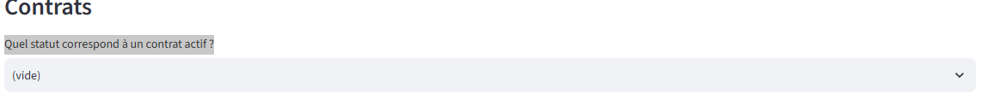


##### Étapes de reproduction

1. **Vérifier la source** : dans `data/output/dataClean_fusion/contrats`, les 446 contrats ont un statut renseigné (`ACTIF`, `SUSPENDU`, `RESILIE`, mais aussi `ACTIVE`, `SUSPENDED`, `TERMINATED`).

2. **Compter les statuts dans HDFS** :

```shell
docker exec -it pyspark-app python -c "from pyspark.sql import SparkSession; s=SparkSession.builder.master('local[1]').config('spark.hadoop.fs.defaultFS','hdfs://namenode:9000').getOrCreate(); s.read.parquet('hdfs://namenode:9000/data/kafka/contrats').groupBy('statut_contrat').count().show()"
```

Résultat : les 446 lignes ont `statut_contrat` à `NULL`.

```
+--------------+-----+
|statut_contrat|count|
+--------------+-----+
|          NULL|  446|
```

3. **Lire un message brut du topic Kafka** :

```shell
docker exec -it kafka /opt/kafka/bin/kafka-console-consumer.sh --bootstrap-server kafka:19092 --topic abassurance.contrats.v1 --from-beginning --max-messages 2
```

Résultat :

```
{"contrat_id":"AB-000001","client_id":"AB-1","type_assurance":"AUTO","code_produit":"","date_debut":"2023-12-16","date_fin":"2024-12-15","prime_annuelle":1808.77,"prime_mensuelle":,"statut_contrat":"ACTIF","agence_id":"20","code_courtier":""}
```

Le champ `"prime_mensuelle":,` n'a pas de valeur : ce n'est pas du JSON valide.

1. **Confirmer l'étendue du problème** : `docker exec -it pyspark-app python -c "from pyspark.sql import SparkSession; s=SparkSession.builder.master('local[1]').config('spark.hadoop.fs.defaultFS','hdfs://namenode:9000').getOrCreate(); d=s.read.parquet('hdfs://namenode:9000/data/kafka/contrats'); print('lignes:', d.count(), '| contrat_id non nul:', d.filter('contrat_id IS NOT NULL').count())"` sur `contrat_id IS NOT NULL` dans le Parquet HDFS : résultat de la commande lignes: 446 | contrat_id non nul: 0.

##### Origine

Les contrats AbAssurance n'ont qu'une prime annuelle et les contrats AssurePlus qu'une prime mensuelle. Pour chaque contrat, l'un des deux champs numériques est donc vide :

| Origine | Contrats | Champ vide dans le JSON |
|---|---|---|
| AbAssurance | 299 | `prime_mensuelle` |
| AssurePlus | 147 | `prime_annuelle` |

Le job Talaxie qui publie sur Kafka écrit alors la clé sans valeur, ce qui rend le message invalide. Dans `streaming_contrats.py`, `from_json` ne plante pas sur un message invalide : il renvoie une ligne dont **toutes** les colonnes sont `NULL`. Les 446 messages sont donc devenus 446 lignes vides dans HDFS.

Hypothèse écartée : une clé JSON mal nommée. Dans ce cas, seule la colonne concernée aurait été `NULL`, et le message montre que `statut_contrat` est correctement nommé.

##### Impact

* Toute la table `contrats` est inutilisable dans HDFS (statut, type, primes, dates), pas seulement le statut.
* Le nombre de lignes stockées correspond au nombre de lignes extraites (446), ce qui masque le problème dans la vérification de l'US 4.2. Seule la taille du fichier Parquet (2,7 Ko pour 446 lignes) était un indice.
* Les indicateurs du dashboard par statut de contrat (actifs, suspendus, résiliés) sont impossibles à calculer.
* Les topics `clients`, `paiements` et `sinistres` ne sont pas concernés : leurs champs numériques sont tous renseignés dans la fusion (0 valeur vide sur 1576 paiements et 98 sinistres).

##### Problème secondaire constaté

Les statuts de contrat sont un mélange de français et d'anglais (6 valeurs au lieu de 3), alors que `mapping_donnees.md` prévoit une harmonisation en français. La traduction `ACTIVE/SUSPENDED/TERMINATED` → `ACTIF/SUSPENDU/RESILIE` n'a pas été faite dans Talaxie à la fusion.

##### Critères d'acceptation

* [x] Le bug est reproduit.
* [x] Son origine est identifiée.
* [x] Son impact est documenté.
* [x] Les étapes de reproduction sont décrites.

#### US 8.2 — Corriger le bug

##### Démarche de recherche d'erreur

Le bug a été localisé en remontant la chaîne, étape par étape, pour éliminer les causes possibles :

| Étape contrôlée | Constat | Conclusion |
|---|---|---|
| Fichier de fusion Talaxie | 446 lignes, statuts renseignés | Source correcte |
| Parquet dans HDFS | 446 lignes, `statut_contrat` à `NULL` | Perte de données après la fusion |
| Script `streaming_contrats.py` | `from_json` associe les champs par nom, le schéma contient bien `statut_contrat` | Script correct |
| Message brut dans Kafka | `"prime_mensuelle":,` (JSON invalide) | **Origine trouvée : le job Talaxie de publication** |

##### Correctif

**1. Talaxie : publier un JSON valide**

Faire en sorte qu'une prime vide soit écrite `null` dans le JSON (ou `0`), au lieu de rien. Composant modifié : [À COMPLÉTER].

**2. Talaxie : harmoniser les statuts en français**

Ajouter la traduction dans le `tMap` de la fusion (à adapter au nom réel du flux) :

```java
"ACTIVE".equals(row1.statut_contrat) ? "ACTIF" :
"SUSPENDED".equals(row1.statut_contrat) ? "SUSPENDU" :
"TERMINATED".equals(row1.statut_contrat) ? "RESILIE" :
row1.statut_contrat
```

**3. Repartir d'un état propre**

Les anciens messages invalides restent dans le topic, et le streaming lit depuis le début (`startingOffsets: earliest`). Republier sans nettoyer donnerait 446 lignes vides en plus des 446 bonnes lignes. Il faut donc, dans cet ordre :

```shell
# a. Arrêter streaming_contrats.py (Ctrl+C dans son terminal)

# b. Supprimer le topic contrats (les messages invalides)
docker exec -it kafka /opt/kafka/bin/kafka-topics.sh --bootstrap-server kafka:19092 --delete --topic abassurance.contrats.v1

# c. Le recréer (la création automatique est désactivée dans le docker-compose)
docker exec -it kafka /opt/kafka/bin/kafka-topics.sh --bootstrap-server kafka:19092 --create --topic abassurance.contrats.v1 --partitions 1 --replication-factor 1

# d. Supprimer les données et le checkpoint HDFS des contrats uniquement
docker exec -it namenode hdfs dfs -rm -r -f /data/kafka/contrats /data/checkpoints/contrats
```

Adapter `--partitions` et `--replication-factor` à la configuration d'origine du topic si elle était différente.

**4. Republier et relancer**

* Relancer le job Talaxie de publication des contrats.
* Relancer `python streaming_topics/streaming_contrats.py`.

##### Vérification

```shell
docker exec -it pyspark-app python -c "from pyspark.sql import SparkSession; s=SparkSession.builder.master('local[1]').config('spark.hadoop.fs.defaultFS','hdfs://namenode:9000').getOrCreate(); d=s.read.parquet('hdfs://namenode:9000/data/kafka/contrats'); print('lignes:', d.count()); d.groupBy('statut_contrat').count().show()"
```

Résultat attendu : 446 lignes et 3 statuts (`ACTIF`, `SUSPENDU`, `RESILIE`).

Résultat obtenu :

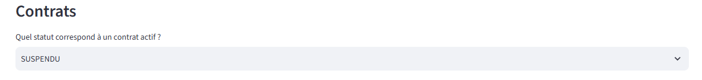

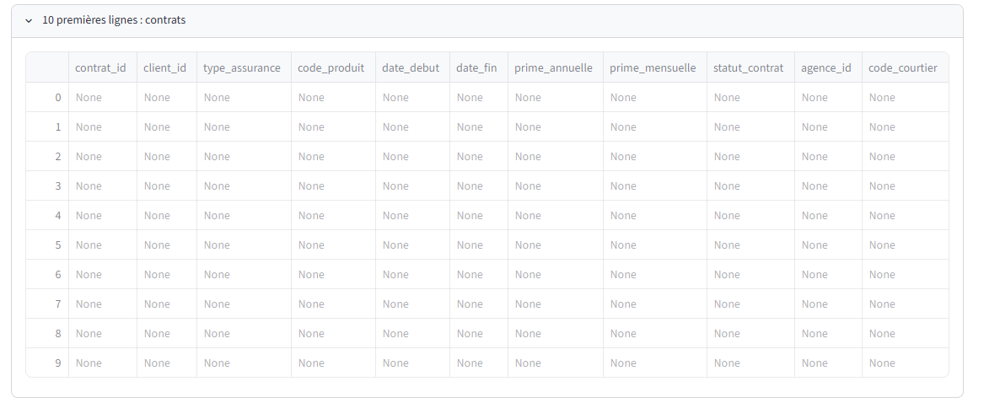

##### Non-régression

* Le nombre de lignes des topics `clients`, `paiements` et `sinistres` dans HDFS est inchangé.
* Le tableau de bord affiche le menu des statuts (Actif / Suspendu / Résilié) avec les bons comptages.
* Le dictionnaire de correspondance des statuts ajouté dans `app.py` reste en place comme garde-fou, il n'a plus d'effet une fois les données corrigées à la source.

##### Critères d'acceptation

* [ ] Le correctif est développé.
* [ ] Les fonctionnalités existantes continuent de fonctionner.
* [ ] Le correctif est documenté.

---

#### US 5.2 : Préparer les données pour la future IA

##### Objectif

L'objectif de cette User Story est de préparer les données nécessaires à l'entraînement du futur modèle de détection de fraude.

Construire **une ligne par sinistre**, avec des caractéristiques (features) susceptibles de révéler une fraude, et une cible (`est_suspect`) quand le score de fraude est connu. Le résultat est écrit dans HDFS, prêt à être relu par l'US 5.3 (entraînement du modèle).

---

##### Fichiers utilisés

Le traitement repose principalement sur deux fichiers :

* `src/pipeline/preparer_dataset_fraude.py` : il s'agit du script principal permettant de préparer le jeu de données.
* `nettoyage_donnees_ia.py` : ce fichier contient notamment les fonctions `nettoyer` et `harmoniser_statuts`.

Les données utilisées en entrée sont stockées dans HDFS aux emplacements suivants :

`hdfs://namenode:9000/data/kafka/{clients,contrats,paiements,sinistres}`

Ces fichiers au format Parquet sont produits à partir des données récupérées par Spark Streaming.

Le traitement produit ensuite deux jeux de données :

* `hdfs://namenode:9000/data/clean/dataset_fraude_entrainement`
* `hdfs://namenode:9000/data/clean/dataset_fraude_a_predire`


Le dictionnaire de données du dataset est disponible dans  /Documentations/dictionnaire_dataset.md
---

###### Fonctionnement du traitement

La préparation des données se déroule en plusieurs étapes.

###### Lecture et nettoyage des données

Le script commence par lire les quatre tables présentes dans HDFS : clients, contrats, paiements et sinistres.

Les données sont ensuite nettoyées grâce aux fonctions déjà développées dans l'US 5.1. Cette étape permet notamment :

* de supprimer les espaces inutiles ;
* de transformer les chaînes de caractères vides en valeurs `null` ;
* d'harmoniser les différents statuts utilisés dans les données ;
* de supprimer les doublons.

La déduplication doit être réalisée avec des identifiants adaptés afin de ne pas supprimer des données provenant de sources différentes.

###### Création d'un résumé des paiements

Les paiements sont regroupés par contrat afin de créer deux nouvelles informations :

* `nb_paiements` : nombre total de paiements associés au contrat ;
* `nb_paiements_echoues` : nombre de paiements dont le statut est `ECHOUE`.

Ces informations permettront ensuite au modèle d'avoir une vision plus complète de l'historique du contrat.

###### Regroupement des différentes données

Les tables sont ensuite regroupées grâce à des `left join` réalisés sur le champ `contrat_id`.

Pour chaque sinistre, le traitement récupère ainsi les informations concernant :

* le contrat associé ;
* les paiements effectués pour ce contrat ;
* les informations nécessaires à l'analyse du sinistre.

Le choix du `left join` permet de conserver tous les sinistres, même lorsqu'aucune information correspondante n'est disponible dans les autres tables.

###### Création de la variable `jours_avant_sinistre`

Une nouvelle variable appelée `jours_avant_sinistre` est calculée.

Elle correspond au nombre de jours entre la date de début du contrat (`date_debut`) et la date à laquelle le sinistre a été déclaré (`date_sinistre`).

Cette information peut être intéressante pour la détection de fraude. Par exemple, un sinistre déclaré très peu de temps après la souscription d'un contrat peut constituer un élément à prendre en compte par le modèle.

Lorsque certaines informations sont absentes, les valeurs de `nb_paiements`, `nb_paiements_echoues` et `montant_estime` sont remplacées par `0`.

###### Vérification de la cohérence des données

Certaines lignes sont supprimées lorsqu'elles ne correspondent pas aux critères attendus.

Le traitement conserve uniquement les sinistres pour lesquels :

* `montant_estime > 0` ;
* `jours_avant_sinistre >= 0`.

Cela permet d'éviter de transmettre au futur modèle des données incohérentes.

###### Sélection des informations utiles

Après les différentes étapes de préparation, seules les colonnes nécessaires au futur modèle sont conservées :

* `sinistre_id`
* `contrat_id`
* `montant_estime`
* `statut_sinistre`
* `type_assurance`
* `prime_annuelle`
* `jours_avant_sinistre`
* `nb_paiements`
* `nb_paiements_echoues`
* `fraud_score`

L'objectif est de conserver uniquement les informations utiles à l'analyse des sinistres.

###### Création des deux jeux de données

Le dataset final est séparé en deux parties.

**Le jeu d'entraînement** contient les sinistres pour lesquels le `fraud_score` est connu.

Une nouvelle variable appelée `est_suspect` est créée à partir de ce score :

* si `fraud_score >= 70`, alors `est_suspect = 1` ;
* sinon, `est_suspect = 0`.

Cette variable constitue la **cible que le modèle devra apprendre à prédire**.

**Le jeu de données à prédire** contient les sinistres pour lesquels le `fraud_score` n'est pas disponible.

Ces données seront utilisées ultérieurement par le modèle afin d'obtenir une prédiction.

---

##### Exécution du traitement

Le script de préparation n'est pas un traitement en continu comme le streaming Kafka/Spark.

Il s'agit d'un traitement ponctuel : il est lancé, prépare les données présentes dans HDFS, produit les deux datasets puis s'arrête.

Pour exécuter le script, les commandes suivantes sont utilisées :

```powershell
# Copier le script dans docker
docker cp src/pipeline/preparer_dataset_fraude.py pyspark-app:/app/src/pipeline/preparer_dataset_fraude.py
# Execution du script
docker exec -it pyspark-app python /app/src/pipeline/preparer_dataset_fraude.py
```

---

##### Résultats obtenus

Après l'exécution du traitement, les résultats suivants sont obtenus :

| Élément                           | Résultat |
| --------------------------------- | -------: |
| Sinistres présents dans HDFS      |       98 |
| Sinistres provenant d'AbAssurance |       61 |
| Sinistres provenant d'AssurePlus  |       37 |
| Lignes d'entraînement             |       37 |
| Sinistres suspects                |        7 |
| Sinistres non suspects            |       30 |
| Lignes à prédire                  |       61 |

Les **37 sinistres provenant d'AssurePlus** disposent d'un `fraud_score`, grâce au champ `AP_FRAUD_SCORE`. Ils peuvent donc être utilisés pour construire le jeu d'entraînement.

Les **61 sinistres provenant d'AbAssurance** ne possèdent pas ce score. Ils constituent donc le jeu de données qui sera utilisé pour effectuer les futures prédictions.

---

##### Problèmes rencontrés et solutions apportées

###### Problème de doublons entre les deux sources

Un problème est apparu lors de la déduplication.

Au départ, 98 sinistres étaient présents dans Kafka et HDFS, mais seulement 61 étaient conservés par le script. De plus, aucune ligne d'entraînement n'était obtenue.

La cause était liée aux identifiants utilisés par les deux sources.

AbAssurance et AssurePlus utilisent chacune des identifiants de sinistre commençant à `1`. Ainsi, deux sinistres différents pouvaient avoir le même `sinistre_id`.

Par exemple :

```text
AB-000006 → sinistre_id = 1
AP-000003 → sinistre_id = 1
```

Ces deux lignes correspondent pourtant à deux sinistres différents.

La commande suivante avait donc un problème :

```python
sinistres.dropDuplicates(["sinistre_id"])
```

Elle considérait les deux sinistres comme des doublons et en supprimait un. Dans ce cas, le sinistre provenant d'AssurePlus pouvait être supprimé alors qu'il contenait le `fraud_score` nécessaire à l'entraînement.

Pour résoudre ce problème, une clé de déduplication plus précise a été utilisée :

```python
clients = clients.dropDuplicates(["client_id", "email"])

contrats = contrats.dropDuplicates(["contrat_id", "client_id"])

paiements = paiements.dropDuplicates(["paiement_id", "contrat_id"])

sinistres = sinistres.dropDuplicates(["sinistre_id", "contrat_id"])
```

Le `contrat_id` permet notamment de distinguer les données provenant des différentes sources puisque les contrats possèdent des préfixes différents (`AB-` et `AP-`).

Grâce à cette modification, les **98 sinistres sont désormais conservés**, dont les **37 sinistres possédant un `fraud_score`**.

---

##### Vérifications effectuées

Plusieurs vérifications peuvent être réalisées afin de s'assurer que les données ont correctement été produites.

###### Vérification des offsets Kafka

```powershell
docker exec kafka /opt/kafka/bin/kafka-get-offsets.sh --bootstrap-server localhost:9092 --topic abassurance.sinistres.v1
```

###### Vérification des fichiers produits dans HDFS

```powershell
docker exec namenode hdfs dfs -ls /data/clean/dataset_fraude_entrainement

Found 2 items
-rw-r--r--   3 root supergroup          0 2026-10-02 06:41 /data/clean/dataset_fraude_entrainement/_SUCCESS
-rw-r--r--   3 root supergroup       4306 2026-10-02 06:41 /data/clean/dataset_fraude_entrainement/part-00000-83b34fad-63dc-435f-90e8-d2b29c565724-c000.snappy.parquet


docker exec namenode hdfs dfs -ls /data/clean/dataset_fraude_a_predire

Found 2 items
-rw-r--r--   3 root supergroup          0 2026-10-02 06:41 /data/clean/dataset_fraude_a_predire/_SUCCESS
-rw-r--r--   3 root supergroup       4607 2026-10-02 06:41 /data/clean/dataset_fraude_a_predire/part-00000-3ffcb227-b9da-480d-b6f8-b8d20506b051-c000.snappy.parquet
```

Ces commandes permettent notamment de vérifier que les datasets ont bien été créés dans HDFS.

---

##### Limites du jeu de données

Plusieurs limites doivent être prises en compte avant d'utiliser ces données pour entraîner le modèle.

###### Quantité limitée de données

Le jeu d'entraînement contient seulement **37 lignes**, dont **7 sinistres considérés comme suspects**.

Cette quantité de données est faible pour entraîner un modèle d'intelligence artificielle de manière fiable.

###### Seuil utilisé pour définir un sinistre suspect

Le seuil de `70` utilisé pour créer la variable `est_suspect` est actuellement défini de manière arbitraire.

Il devra être vérifié en fonction de la distribution réelle des `fraud_score` et éventuellement adapté.

###### Différence entre les deux sources

Le modèle sera entraîné à partir des données d'AssurePlus, puis utilisé sur les données d'AbAssurance.

Il existe donc un risque que les caractéristiques des deux sources soient différentes, par exemple concernant les montants des sinistres ou les délais entre la souscription et la déclaration.

Cette différence devra être prise en compte lors de l'évaluation du modèle.

###### Utilisation du `fraud_score`

Enfin, le `fraud_score` ne doit pas être utilisé comme variable d'entrée du modèle.

Il sert uniquement à créer la variable cible `est_suspect`.

Le modèle devra apprendre à identifier les sinistres suspects à partir des autres informations disponibles, puis utiliser ces informations pour effectuer ses propres prédictions.

##### US 5.3 : Entraîner un modèle de détection de fraude et l'afficher dans le dashboard

###### Objectif

L'objectif de cette User Story est de construire le modèle d'intelligence artificielle de détection de fraude, à partir des données préparées dans l'US 5.2.

Le modèle apprend sur les sinistres dont le niveau de fraude est connu (AssurePlus), puis estime une **probabilité de fraude** pour les sinistres qui n'ont pas de score (AbAssurance). Les résultats sont enregistrés dans HDFS et affichés dans une page dédiée du dashboard Streamlit.

---

###### Fichiers utilisés

* `src/prediction/entrainer_modele_fraude.py` : script qui entraîne, évalue et sauvegarde le modèle, puis calcule les prédictions.
* `detection_fraude.py` : page du dashboard Streamlit qui affiche les résultats et propose un simulateur.

Les données en entrée sont celles produites par l'US 5.2 :

* `hdfs://namenode:9000/data/clean/dataset_fraude_entrainement` (37 sinistres avec la cible `est_suspect`)
* `hdfs://namenode:9000/data/clean/dataset_fraude_a_predire` (61 sinistres sans score)

Le traitement produit trois éléments dans HDFS :

* `hdfs://namenode:9000/data/models/modele_fraude` : le modèle entraîné, sauvegardé pour être rechargé sans le réentraîner ;
* `hdfs://namenode:9000/data/clean/predictions_fraude` : la probabilité de fraude de chaque sinistre à prédire ;
* `hdfs://namenode:9000/data/clean/metriques_fraude` : les indicateurs de qualité du modèle (une seule ligne).

---

###### Choix du modèle : un arbre de décision

Le modèle utilisé est un **arbre de décision** (`DecisionTreeClassifier` de Spark ML).

Un arbre de décision fonctionne comme un questionnaire : « le montant dépasse-t-il tel seuil ? », puis « le sinistre est-il déclaré moins de X jours après la souscription ? », etc. Chaque réponse oriente vers une branche, et chaque extrémité (« feuille ») donne un verdict.

Ce choix a été fait pour trois raisons :

* **il est explicable** : on peut afficher les règles apprises et les expliquer à un conducteur de travaux ou à un jury, ce qui est impossible avec un réseau de neurones ;
* **il est adapté aux petits jeux de données** : avec 37 lignes, un modèle plus complexe apprendrait « par cœur » les exemples au lieu de généraliser ;
* **il est natif de Spark ML** : il s'intègre à la stack Big Data du projet sans dépendance supplémentaire.

---

###### Fonctionnement du traitement

###### Choix des caractéristiques (features)

Le modèle utilise cinq caractéristiques numériques :

| Caractéristique | Signification |
| --- | --- |
| `montant_estime` | montant estimé du sinistre (€) |
| `prime_annuelle` | prime annuelle du contrat (€) |
| `jours_avant_sinistre` | jours entre le début du contrat et le sinistre |
| `nb_paiements` | nombre de paiements du contrat |
| `nb_paiements_echoues` | dont paiements échoués |

Le `fraud_score` n'est **jamais** utilisé comme entrée : il sert uniquement à fabriquer la cible `est_suspect` (voir US 5.2). L'utiliser reviendrait à donner la réponse au modèle avant l'examen.

Seules des colonnes **numériques**, présentes dans les deux sources (AbAssurance et AssurePlus), ont été retenues. Les colonnes textuelles comme `type_assurance` et `statut_sinistre` ne sont donc pas utilisées.

Avant l'entraînement, une étape de préparation (`preparer`) force ces cinq colonnes au type nombre décimal (`double`) et remplace les valeurs vides par `0`, car Spark ML n'accepte pas de valeurs manquantes dans le vecteur d'entrée.

###### Construction du pipeline

Le traitement est un `Pipeline` Spark ML en deux étapes :

1. **`VectorAssembler`** : rassemble les cinq colonnes en une seule colonne `features`, car Spark ML attend un vecteur en entrée. L'ordre des colonnes est important : c'est pourquoi la même liste est utilisée dans le script d'entraînement et dans la page du dashboard.
2. **`DecisionTreeClassifier`** : l'arbre lui-même, avec deux réglages importants :
   * `maxDepth=3` : l'arbre ne peut poser que 3 questions successives. Une profondeur limitée évite le surapprentissage, c'est-à-dire un arbre qui retient les 37 exemples par cœur au lieu de comprendre ce qui distingue une fraude.
   * `weightCol="poids"` : chaque sinistre a un poids. Comme il y a seulement 7 suspects contre 30 non suspects, les cas suspects reçoivent un poids plus fort. Sans cela, le modèle pourrait répondre « non suspect » à chaque fois et avoir raison dans 81 % des cas, tout en étant inutile.

Le poids d'un sinistre suspect est égal au nombre de non-suspects divisé par le nombre de suspects (30 / 7 ≈ 4,3), et celui d'un non-suspect vaut 1. Un suspect « compte » donc environ quatre fois plus qu'un non-suspect, ce qui rééquilibre les deux groupes.

Un garde-fou arrête le script si le jeu d'entraînement ne contient pas à la fois des suspects et des non-suspects, car l'arbre ne pourrait rien apprendre.

###### Évaluation du modèle

Avec seulement 37 lignes, il n'est pas possible de mettre de côté un jeu de test classique sans que celui-ci devienne trop petit pour être significatif.

L'évaluation utilise donc une **validation croisée à 5 plis** (fonction `evaluer`).

Concrètement :

1. les 37 sinistres sont répartis en 5 paquets (les « plis ») d'environ 7 ou 8 lignes ;
   On coupe les 37 lignes en 5 paquets (les 5 plis), d'environ 7 ou 8 lignes chacun.
    Tour 1 : on entraîne sur les plis 2, 3, 4 et 5, et on teste sur le pli 1.
    Tour 2 : on entraîne sur les plis 1, 3, 4 et 5, et on teste sur le pli 2.
2. pour chaque pli, le modèle est entraîné sur les 4 autres plis, puis testé sur le pli mis de côté ;
3. à la fin, chaque sinistre a été prédit par un modèle qui ne l'avait jamais vu, et toutes ces prédictions sont rassemblées pour calculer :

* la **précision (suspects)** : parmi les sinistres que le modèle signale comme suspects, quelle part l'est réellement ? C'est la mesure des « fausses alertes » ;
* le **rappel (suspects)** : parmi les vrais sinistres suspects, quelle part le modèle a-t-il trouvée ? C'est la mesure des fraudes « qui passent entre les mailles ».

Les suspects étant très rares (7 sur 37), un tirage au hasard pourrait mettre tous les suspects dans le même pli, et certains plis de test n'en contiendraient aucun. Les suspects et les non-suspects sont donc numérotés **séparément**, puis répartis à égalité entre les 5 plis (numéro de la ligne modulo 5). Chaque pli contient ainsi 1 ou 2 suspects. Le tirage utilise une graine fixe (`rand(42)`), ce qui rend l'évaluation reproductible, et `cache()` fige la numérotation pour qu'elle ne change pas entre deux utilisations.

Ces deux indicateurs sont enregistrés dans `metriques_fraude`, avec le nombre de lignes et le nombre de suspects.

###### Entraînement final et prédictions

Une fois l'évaluation faite, le modèle est entraîné une dernière fois sur les 37 sinistres, puis :

* il est sauvegardé dans `/data/models/modele_fraude` ;
* il est appliqué aux 61 sinistres d'AbAssurance ;
* la probabilité de la classe « suspect » est extraite dans une colonne `proba_fraude`, et le verdict de l'arbre (0 ou 1) dans une colonne `suspect` ;
* le résultat est enregistré dans `predictions_fraude` avec `sinistre_id`, `contrat_id` et les cinq caractéristiques, ce qui permet de retrouver chaque sinistre.

---

###### Page du dashboard « Détection de fraude »

La page lit les résultats dans HDFS et se compose de quatre parties :

1. **Qualité du modèle** : nombre de sinistres d'entraînement, nombre de suspects, précision et rappel, accompagnés d'un avertissement rappelant que les chiffres sont indicatifs.
2. **Sinistres à surveiller** : un curseur règle le seuil de probabilité ; le tableau affiche les sinistres au-dessus du seuil, triés du plus suspect au moins suspect, avec un export CSV (séparateur `;`, ouvrable directement dans Excel).
3. **Ce que le modèle a appris** : un graphique de l'importance de chaque caractéristique et les règles de l'arbre en texte.
4. **Simulateur** : l'utilisateur saisit les cinq caractéristiques d'un sinistre fictif et obtient sa probabilité de fraude, calculée par le modèle sauvegardé.

Deux choix techniques permettent à la page de rester fluide :

* `@st.cache_resource` garde la session Spark et le modèle en mémoire, au lieu de les recréer à chaque clic ;
* `@st.cache_data` mémorise la lecture des résultats dans HDFS. Un bouton « Recharger depuis Hadoop » dans la barre latérale vide ces mémoires lorsque le modèle a été réentraîné.

Si les fichiers sont absents de HDFS, la page affiche un message d'erreur explicite et indique les scripts à lancer.

La conversion des résultats Spark vers un tableau pandas est faite avec `.collect()` plutôt que `.toPandas()`, pour éviter les problèmes de compatibilité entre PySpark et pandas 3 (voir l'avertissement affiché au lancement de Spark).

---

##### Exécution du traitement

Comme pour l'US 5.2, il s'agit d'un traitement ponctuel : il est lancé, produit les résultats, puis s'arrête.

```powershell
# 1. Copier le script dans docker
docker cp src/prediction/entrainer_modele_fraude.py pyspark-app:/app/src/prediction/entrainer_modele_fraude.py
Successfully copied 9.22kB to pyspark-app:/app/src/prediction/entrainer_modele_fraude.py

# 2. Exécuter l'entraînement
docker exec -it pyspark-app python /app/src/prediction/entrainer_modele_fraude.py

Entraînement :  37 lignes dont 7 suspects
26/10/02 15:25:26 WARN SparkStringUtils: Truncated the string representation of a plan since it was too large. This behavior can be adjusted by setting 
26/10/02 15:25:30 WARN DecisionTreeMetadata: DecisionTree reducing maxBins from 32 to 30 (= number of training instances)
26/10/02 15:25:36 WARN DecisionTreeMetadata: DecisionTree reducing maxBins from 32 to 29 (= number of training instances)
26/10/02 15:25:41 WARN DecisionTreeMetadata: DecisionTree reducing maxBins from 32 to 29 (= number of training instances)
26/10/02 15:25:46 WARN DecisionTreeMetadata: DecisionTree reducing maxBins from 32 to 30 (= number of training instances)
26/10/02 15:25:51 WARN DecisionTreeMetadata: DecisionTree reducing maxBins from 32 to 30 (= number of training instances)
Précision (suspects) : 0.12                                                     
Rappel (suspects)    : 0.29
Règles apprises (feature 0 = montant_estime, 1 = prime_annuelle, etc.) :        
DecisionTreeClassificationModel: uid=DecisionTreeClassifier_482c0a03bd94, depth=3, numNodes=7, numClasses=2, numFeatures=5
  If (feature 4 <= 0.5)
   Predict: 0.0
  Else (feature 4 > 0.5)
   If (feature 4 <= 2.5)
    If (feature 3 <= 1.5)
     Predict: 0.0
    Else (feature 3 > 1.5)
     Predict: 1.0
   Else (feature 4 > 2.5)
    Predict: 0.0
Modèle sauvegardé : hdfs://namenode:9000/data/models/modele_fraude

Le raisonnement :
Question 1 : le client a-t-il 0 paiement échoué ?
 ├─ OUI → pas suspect
 └─ NON → Question 2 : a-t-il 1 ou 2 paiements échoués ?
           ├─ OUI → Question 3 : a-t-il au moins 2 paiements au total ?
           │         ├─ NON (0 ou 1) → pas suspect
           │         └─ OUI → SUSPECT
           └─ NON (3 échoués ou plus) → pas suspect

# 3. Vérifier les fichiers produits dans HDFS
docker exec namenode hdfs dfs -ls /data/clean/
Found 4 items
drwxr-xr-x   - root supergroup          0 2026-10-02 15:21 /data/clean/dataset_fraude_a_predire
drwxr-xr-x   - root supergroup          0 2026-10-02 15:21 /data/clean/dataset_fraude_entrainement
drwxr-xr-x   - root supergroup          0 2026-10-02 15:25 /data/clean/metriques_fraude
drwxr-xr-x   - root supergroup          0 2026-10-02 15:25 /data/clean/predictions_fraude

docker exec namenode hdfs dfs -ls /data/models/
Found 1 items
drwxr-xr-x   - root supergroup          0 2026-10-02 15:25 /data/models/modele_fraude
```

Après l'exécution, `predictions_fraude` et `metriques_fraude` doivent apparaître dans `/data/clean/`, et `modele_fraude` dans `/data/models/`. Il suffit ensuite de cliquer sur « Recharger depuis Hadoop » dans le dashboard.

---

##### Résultats obtenus

| Élément | Résultat |
| --- | -------: |
| Sinistres d'entraînement | 37 |
| dont suspects | 7 |
| Précision (suspects) | 12% |
| Rappel (suspects) | 29% |
| Sinistres prédits (AbAssurance) | 61 |
| Sinistres au-dessus du seuil de 0,5 | 0|

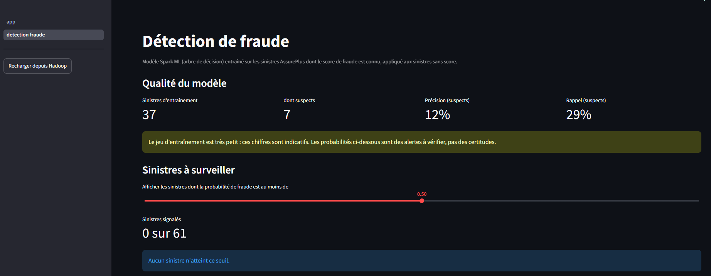

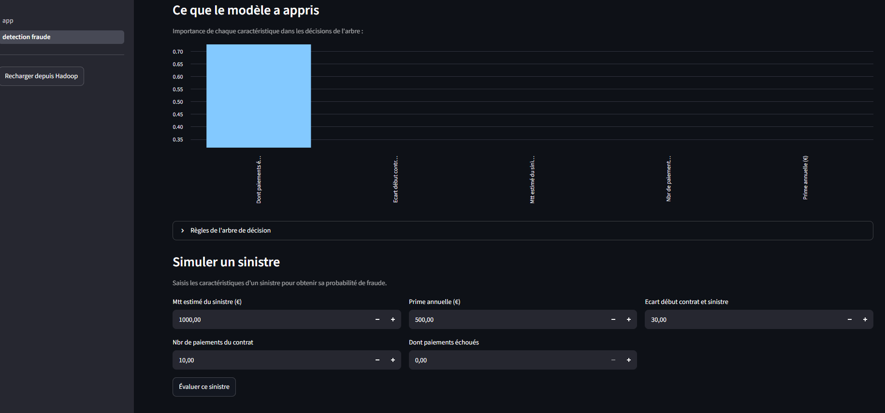

---

##### Problèmes rencontrés et solutions apportées

###### Erreur de nom de paramètre dans le classifieur

Lors du premier lancement, le script d'entraînement s'est arrêté avec l'erreur suivante :

```text
TypeError: DecisionTreeClassifier.__init__() got an unexpected keyword argument 'featureCol'
```

Le paramètre de Spark ML s'appelle `featuresCol` (avec un **s**), alors que `labelCol` et `weightCol` s'écrivent au singulier. Une lettre en trop ou en moins suffit à faire échouer l'appel.

```python
# Avant (erreur)
DecisionTreeClassifier(featureCol="features", ...)

# Après
DecisionTreeClassifier(featuresCol="features", ...)
```

###### Page du dashboard en erreur « PATH_NOT_FOUND »

Pendant que le script d'entraînement était en échec, la page du dashboard affichait :

```text
AnalysisException: [PATH_NOT_FOUND] Path does not exist: hdfs://namenode:9000/data/clean/predictions_fraude
```

Ce n'était pas un bug de la page : elle cherchait des résultats que le script n'avait jamais pu écrire. Un `hdfs dfs -ls /data/clean/` a permis de le confirmer, puisque seuls les deux datasets de l'US 5.2 étaient présents. Après correction du script et relance de l'entraînement, la page fonctionne.

---

##### Limites du modèle

Cette US met en place la chaîne complète (données, modèle, dashboard), mais les résultats ne doivent pas être pris pour des certitudes.

###### Un jeu d'entraînement très petit

Le modèle apprend sur **37 sinistres, dont 7 suspects**. Avec si peu de cas positifs, un seul suspect mal classé fait varier le rappel d'environ 14 points (1 sur 7), et chaque pli de test ne contient que 1 ou 2 suspects. Les indicateurs affichés sont donc très instables et ne servent qu'à donner un ordre de grandeur.

###### Un modèle entraîné sur une source et appliqué à une autre

Le modèle apprend sur AssurePlus mais prédit sur AbAssurance. Si les deux assureurs ont des habitudes différentes (montants moyens, délais de déclaration, primes), les règles apprises peuvent ne pas se transposer correctement. C'est la limite la plus importante du projet.

###### Aucune vérité pour valider les prédictions

Les 61 sinistres d'AbAssurance n'ont pas de `fraud_score`. Il est donc impossible de savoir si les prédictions sont justes : les métriques affichées mesurent uniquement la qualité sur AssurePlus.

###### Un seuil de suspicion arbitraire

La cible `est_suspect` repose sur le seuil `fraud_score >= 70`, défini sans analyse de la distribution des scores (limite déjà identifiée dans l'US 5.2). Changer ce seuil changerait les données d'entraînement et donc le modèle.

###### Des probabilités peu nuancées

Avec un arbre de profondeur 3, le modèle ne peut produire qu'un petit nombre de valeurs de probabilité différentes (une par feuille). Le curseur de seuil du dashboard produit donc des paliers, plutôt qu'un classement fin des sinistres.

Pour ces raisons, les résultats affichés doivent être lus comme des **alertes à faire vérifier par un humain**, et non comme des décisions automatiques.

---

##### Pistes d'amélioration

* collecter davantage de sinistres étiquetés, ou obtenir des scores de fraude côté AbAssurance ;
* comparer l'arbre à d'autres modèles (forêt aléatoire, régression logistique) lorsque le volume de données le permettra ;
* ajuster le seuil de 70 après analyse de la distribution des `fraud_score` ;
* comparer les distributions des variables entre AssurePlus et AbAssurance pour mesurer l'écart entre les deux sources.

##### US 6.1 : Ne jamais couper les applications existantes

Limite assumée : « Le projet étant une simulation sans système en production, ces mesures sont décrites mais n'ont pas pu être testées en conditions réelles. »

Imaginons :

Les anciennes bases (Oracle, SQL Server) ne sont jamais modifiées ni arrêtées. Le pipeline ne fait que les lire. L'ancien et le nouveau système tournent en parallèle pendant la transition.

* Plan de secours : comme l'ancien système reste intact, le retour en arrière consiste à continuer de l'utiliser et à couper le pipeline.
On peut aussi relancer l'extraction depuis la source, car les checkpoints Spark et les topics Kafka permettent de rejouer les données.

* Tests après chaque étape : après chaque étape (extraction, Kafka, Hadoop), on vérifie que les applications existantes répondent encore, avec des contrôles de comptage.
